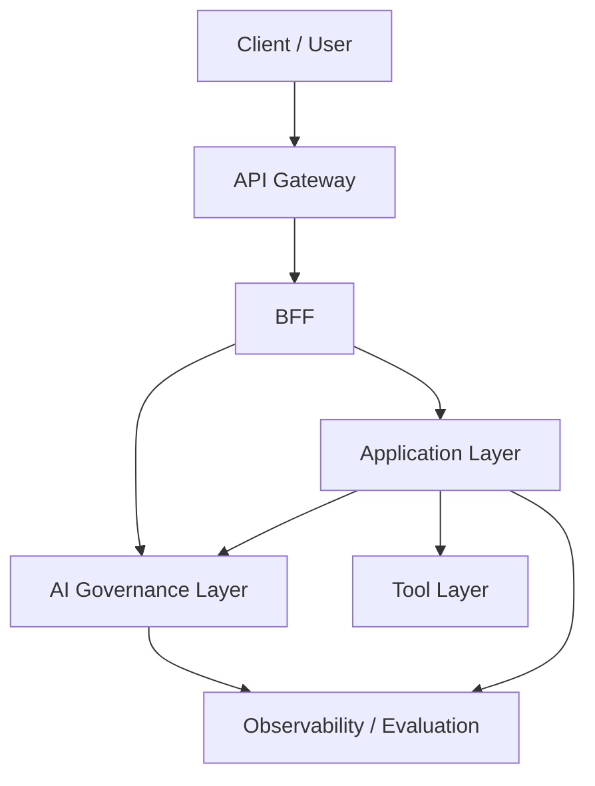

# AIエージェントの業務適用を見据えた生成AIガバナンス層の検討

---

## Part 0. Executive Summary

### 0.1 本提言の結論

生成AIの業務適用を安全かつ継続的に進めるには、Application 層や Tool 層とは別に、企業共通の AI ガバナンス層を定義する必要がある。

このレイヤーは、単なるセキュリティ製品の置き場ではなく、次の責務を横断的に担う。

* 入出力の Guardrails
* モデル利用と Tool 実行の統制
* trace_id を軸にした Traceability / Observability
* 評価と停止判断の運用
* 事故時の封じ込めと監査可能性

### 0.2 従来の API 保護だけでは不足する理由

従来の API Gateway / WAF / IAM は、決定論的な HTTP 境界の防御を主目的としている。一方、生成AIでは、自然言語入力、長文コンテキスト、Tool 呼び出し、モデル選択、人間承認を跨いだ意味論的な統制が必要になるため、入口保護だけでは不足する。

### 0.3 提案アーキテクチャの要点

* API Gateway は JWT 検証、WAF、レート制限などの決定論的防御を担う
* BFF は trace_id の確定、Fast Track / Slow Track の分岐、状態管理 DB との I/O、通知を担う
* AI ガバナンス層は自然言語入出力、モデル利用、Tool 呼び出し、評価、監査の共通統制を担う
* Application 層は業務ロジックと AI エージェントの実行主体を担う
* Tool 層は DB / API / ファイルなどの外界作用を抽象化する

---

## Part 1. Why: 背景と問題設定

### 1.1 セキュリティ・パラダイムの変化

従来の業務システムでは、認証されたユーザーが許可された API を呼ぶことが主な統制対象だった。生成AIでは、正規ユーザーであっても自然言語経由で危険な操作や情報漏えいを誘発し得るため、守るべき対象が変わる。

### 1.2 生成AI活用における新たな脅威

* プロンプトインジェクション
* 間接インジェクション
* PII / 機密情報の漏えい
* ハルシネーションに起因する誤判断
* 高権限ツールの誤実行
* 品質・コストの不安定化

### 1.3 従来 API セキュリティとの違い

従来 API セキュリティが HTTP リクエストの妥当性を扱うのに対し、AI ガバナンスは意味論的な妥当性と運用上の説明責任を扱う。この違いが、独立したレイヤーとして定義すべき理由になる。

### 1.4 なぜ全社横断のガバナンスレイヤーが必要か

各アプリが個別に Guardrails や評価を実装すると、ポリシーの重複、不整合、監査不能が起きやすい。企業として共通の統制基準を持つために、横断レイヤーが必要である。

---

## Part 2. What: 必須機能と要求定義

### 2.1 AI ガバナンスで満たすべき必須機能

* 入力・出力の Guardrails
* モデル選択、利用経路、予算の統制
* Tool 実行権限の統制
* trace_id による追跡可能性
* 評価と改善サイクル
* HITL / Kill Switch / 監査対応

### 2.2 要求の整理

要求は次の 4 つに整理できる。

* 安全性: PII、禁則表現、危険操作、注入耐性
* 統制性: 誰がどのモデル・ツールを使ったかを制御できること
* 追跡可能性: trace_id を軸に入力から出力、評価まで辿れること
* 運用性: 停止、再開、評価、改善が継続できること

### 2.3 従来 API 保護との比較

| 観点 | 従来 API Gateway / WAF | AI ガバナンス層 |
| --- | --- | --- |
| 主対象 | HTTP / API | 自然言語、モデル、ツール、評価 |
| 判定方式 | 決定論的ルール | ルール + モデル + 運用判断 |
| ログの意味 | 通信監査 | 意味論的な実行説明 |
| 停止判断 | 通信遮断 | HITL、評価、キルスイッチ |

### 2.4 導入オプションとロードマップ

* 最小導入: モデル集約とログ取得を先行
* 標準導入: Guardrails、Tool 統制、評価を追加
* 高度化: リスクベース停止、継続評価、運用 UI まで拡張

---

## Part 3. Conceptual Architecture

### 3.1 AI ガバナンスレイヤーの位置づけ

AI ガバナンス層は、Application 層と Tool 層の間だけに閉じるものではなく、north 境界からモデル利用、観測、評価、運用までを横断して効く共通統制レイヤーである。

### 3.2 AI ガバナンスレイヤーの定義

AI ガバナンス層は、次の責務を持つ。

* 自然言語入出力の統制
* モデル利用の統制
* Tool 実行の統制
* 追跡、評価、運用の共通化

### 3.3 全体構成図

### 3.4 各レイヤーの責務分担

* API Gateway: 決定論的な入口防御
* BFF: trace_id 確定、状態 I/O、通知、同期 / 非同期境界の制御
* AI ガバナンス層: Guardrails、モデル / Tool 統制、観測、評価、停止判断
* Application 層: 業務ロジック、エージェント実行、HITL の業務組み込み
* Tool 層: 外界作用の抽象化と実行単位の分離

### 3.5 評価と責任分界

評価は 1 つの仕組みに集約するのではなく、Application 層内の業務固有評価と、AI ガバナンス層の共通評価基盤を分けて考える。

* **Application 層内の評価ユニット**: 業務ユースケース固有の品質保証を担う。期待する出力形式、業務ルール適合性、次の経路選択や再実行判断など、業務フローに閉じた評価を扱う。
* **AI ガバナンス層の共通評価基盤**: 複数アプリケーションを横断して、安全性、根拠性、ポリシー適合性、品質劣化を監視する。低スコア時の HITL、停止判断、ポリシー改善に接続する。

組織的な責任分界も、同じくこの境界に沿って整理する。

* **開発部門**: 業務ユニットと Application 層内の評価ユニットの精度に責任を持つ
* **IT / ガバナンス部門**: 共通評価基盤、Guardrails、監査可能性、停止判断の運用に責任を持つ
* **ユーザー**: 最終出力と業務上の最終判断に責任を持つ

この責務分界により、Application 層は業務成果物の品質に集中し、AI ガバナンス層は企業共通の守りと継続運用を担う。

### 3.6 north 境界における API Gateway と BFF の責務分担

north 境界は、次の 3 段で分けて捉える。

1. API Gateway: JWT 検証、WAF、レート制限、TLS 終端、経路制御などの共通防御
2. BFF: trace_id の確定、Fast Track / Slow Track の振り分け、状態管理 DB との I/O、SSE / WebSocket 通知、Cancel / Resume 受付
3. AI Request ガバナンス Gateway: 自然言語入力の検査、出力マスキング、Risk-Adaptive HITL などの意味論的統制

この分担により、外縁の決定論的防御、業務状態を伴う入口オーケストレーション、意味論的ガバナンスを分離して進化させられる。

---

## Part 4. 実現方式の参照先

本書は Why / What / Conceptual Architecture を正本とし、実装方式は別文書へ分離する。

* AI ガバナンス層の実現方式: [../02_アーキテクチャ実現方式/02_AIガバナンス層の実現方式.md](../02_アーキテクチャ実現方式/02_AIガバナンス層の実現方式.md)
* 全体実現方式: [../02_アーキテクチャ実現方式/00_生成AI基盤のコンポーネント配置と実装・運用原則.md](../02_アーキテクチャ実現方式/00_生成AI基盤のコンポーネント配置と実装・運用原則.md)
* Application 層の実現方式: [../02_アーキテクチャ実現方式/04_アプリケーション層の実現方式.md](../02_アーキテクチャ実現方式/04_アプリケーション層の実現方式.md)