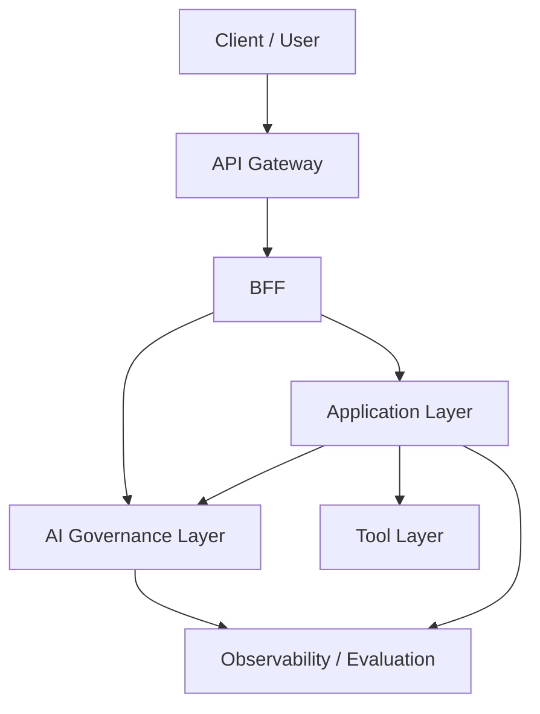

# AIエージェントの業務適用を見据えた生成AIガバナンスレイヤーの提言

## Part 0. Executive Summary

### 0.1 本提言の結論

生成AIエージェントを業務適用する際の本質的な課題は、従来のAPI保護や認証認可だけでは、自然言語による指示、LLMの確率的な出力、エージェントの自律的なツール実行を十分に統制できない点にあります。
通信経路やIDが正しくても、プロンプトインジェクション、機密情報の漏洩、不適切なツール操作、品質劣化、暴走によるコスト増大といった新しい失敗モードは防げません。

本提言では、生成AIアプリケーションの外側に **AIガバナンスレイヤー** を配置し、入力、出力、モデル呼び出し、ツール実行を横断的に統制するアーキテクチャを提案します。
AIガバナンスレイヤーは、Guardrails による入力・出力の安全化、Proxy によるアクセス制御と経路固定、Docker 等による実行隔離、Observability による追跡と監査、Evaluation による継続的な品質監視を一体として提供します。

### 0.2 従来のAPI保護だけでは不足する理由

生成AIでは、従来システムのように「正しい経路」「正しいID」「正しいスキーマ」を満たしていても、意味論のレベルで誤動作が発生します。
そのため、API Gateway や IAM による入口防御だけでは不十分であり、入出力、ツール実行、モデル呼び出し、運用監視まで含めた統制点が必要です。

### 0.3 提案アーキテクチャの要点

本アーキテクチャの狙いは、生成AI固有のリスクに対して、場当たり的な個別実装ではなく、全社横断で再利用可能な統制点を設けることです。
これにより、各業務アプリケーションは安全性、追跡性、評価可能性を共通基盤に委譲でき、アプリごとに安全策を作り直す必要がなくなります。

PoC 段階では、まず全コンポーネントを `trace_id` で串刺し検索できること、Guardrails と Proxy による最小限の統制が成立すること、異常時に Kill Switch や HITL へ退避できることを優先します。

## Part 1. Why: 背景と問題設定

### 1.1 セキュリティ・パラダイムの変化

従来のシステムセキュリティは「通信経路」や「ID」を制御するものでしたが、生成AIの登場により、
**「意味論（セマンティクス）の制御」**という新たな防御領域が出現しました。

* **従来のセキュリティ（NW・ID・暗号化）**
* **NWアクセス制御 (FW/SG):** 正しいIP/ポートからの通信か？
* **認証・認可 (IAM):** 正しい権限を持つユーザーか？
* **限界:** 通信経路が正規であれば、その中身が「業務命令」であろうと「機密情報の持ち出し命令（プロンプトインジェクション）」であろうと、**ネットワーク層はすべて「正常な通信」として通してしまう。**


* **生成AI時代のセキュリティ（意味論・確率論）**
* **入力の意味理解:** 正規ユーザーからの通信だが、**AIへの攻撃（脱獄）**を含んでいないか？
* **出力の事実確認:** 回答データの中に、**嘘（ハルシネーション）やバイアス**が含まれていないか？
* **振る舞いの統制:** エージェントが自律的に**不適切なツール操作**を行っていないか？

---

### 1.2 生成AI活用における新たな脅威
# AIエージェントの業務適用を見据えた生成AIガバナンス層の検討

---

## Part 0. Executive Summary

### 0.1 本提言の結論

生成AIの業務適用を安全かつ継続的に進めるには、Application層やTool層とは別に、企業共通の AI ガバナンス層を定義する必要がある。

このレイヤーは、単なるセキュリティ製品の置き場ではなく、次の責務を横断的に担う。

* 入出力の Guardrails
* モデル利用と Tool 実行の統制
* trace_id を軸にした Traceability / Observability
* 評価と停止判断の運用
* 事故時の封じ込めと監査可能性

### 0.2 従来の API 保護だけでは不足する理由

従来の API Gateway / WAF / IAM は、決定論的な HTTP 境界の防御を主目的としている。一方、生成AIでは、自然言語入力、長文コンテキスト、Tool 呼び出し、モデル選択、人間承認を跨いだ意味論的な統制が必要になるため、入口保護だけでは不足する。

### 0.3 提案アーキテクチャの要点

* API Gateway は JWT 検証、WAF、レート制限などの決定論的防御を担う
* BFF は trace_id の確定、Fast Track / Slow Track の分岐、状態管理 DB との I/O、通知を担う
* AI ガバナンス層は自然言語入出力、モデル利用、Tool 呼び出し、評価、監査の共通統制を担う
* Application 層は業務ロジックと AI エージェントの実行主体を担う
* Tool 層は DB / API / ファイルなどの外界作用を抽象化する

---

## Part 1. Why: 背景と問題設定

### 1.1 セキュリティ・パラダイムの変化

従来の業務システムでは、認証されたユーザーが許可された API を呼ぶことが主な統制対象だった。生成AIでは、正規ユーザーであっても自然言語経由で危険な操作や情報漏えいを誘発し得るため、守るべき対象が変わる。

### 1.2 生成AI活用における新たな脅威

* プロンプトインジェクション
* 間接インジェクション
* PII / 機密情報の漏えい
* ハルシネーションに起因する誤判断
* 高権限ツールの誤実行
* 品質・コストの不安定化

### 1.3 従来 API セキュリティとの違い

従来 API セキュリティが HTTP リクエストの妥当性を扱うのに対し、AI ガバナンスは意味論的な妥当性と運用上の説明責任を扱う。この違いが、独立したレイヤーとして定義すべき理由になる。

### 1.4 なぜ全社横断のガバナンスレイヤーが必要か

各アプリが個別に Guardrails や評価を実装すると、ポリシーの重複、不整合、監査不能が起きやすい。企業として共通の統制基準を持つために、横断レイヤーが必要である。

---

## Part 2. What: 必須機能と要求定義

### 2.1 AI ガバナンスで満たすべき必須機能

* 入力・出力の Guardrails
* モデル選択、利用経路、予算の統制
* Tool 実行権限の統制
* trace_id による追跡可能性
* 評価と改善サイクル
* HITL / Kill Switch / 監査対応

### 2.2 要求の整理

要求は次の 4 つに整理できる。

* 安全性: PII、禁則表現、危険操作、注入耐性
* 統制性: 誰がどのモデル・ツールを使ったかを制御できること
* 追跡可能性: trace_id を軸に入力から出力、評価まで辿れること
* 運用性: 停止、再開、評価、改善が継続できること

### 2.3 従来 API 保護との比較

| 観点 | 従来 API Gateway / WAF | AI ガバナンス層 |
| --- | --- | --- |
| 主対象 | HTTP / API | 自然言語、モデル、ツール、評価 |
| 判定方式 | 決定論的ルール | ルール + モデル + 運用判断 |
| ログの意味 | 通信監査 | 意味論的な実行説明 |
| 停止判断 | 通信遮断 | HITL、評価、キルスイッチ |

### 2.4 導入オプションとロードマップ

* 最小導入: モデル集約とログ取得を先行
* 標準導入: Guardrails、Tool 統制、評価を追加
* 高度化: リスクベース停止、継続評価、運用 UI まで拡張

---

## Part 3. Conceptual Architecture

### 3.1 AI ガバナンスレイヤーの位置づけ

AI ガバナンス層は、Application 層と Tool 層の間だけに閉じるものではなく、north 境界からモデル利用、観測、評価、運用までを横断して効く共通統制レイヤーである。

### 3.2 AI ガバナンスレイヤーの定義

AI ガバナンス層は、次の責務を持つ。

* 自然言語入出力の統制
* モデル利用の統制
* Tool 実行の統制
* 追跡、評価、運用の共通化

### 3.3 全体構成図



### 3.4 各レイヤーの責務分担

* API Gateway: 決定論的な入口防御
* BFF: trace_id 確定、状態 I/O、通知、同期 / 非同期境界の制御
* AI ガバナンス層: Guardrails、モデル / Tool 統制、観測、評価、停止判断
* Application 層: 業務ロジック、エージェント実行、HITL の業務組み込み
* Tool 層: 外界作用の抽象化と実行単位の分離

### 3.5 north 境界における API Gateway と BFF の責務分担

north 境界は、次の 3 段で分けて捉える。

1. API Gateway: JWT 検証、WAF、レート制限、TLS 終端、経路制御などの共通防御
2. BFF: trace_id の確定、Fast Track / Slow Track の振り分け、状態管理 DB との I/O、SSE / WebSocket 通知、Cancel / Resume 受付
3. AI Request ガバナンス Gateway: 自然言語入力の検査、出力マスキング、Risk-Adaptive HITL などの意味論的統制

この分担により、外縁の決定論的防御、業務状態を伴う入口オーケストレーション、意味論的ガバナンスを分離して進化させられる。

---

## Part 4. 実現方式の参照先

本書は Why / What / Conceptual Architecture を正本とし、実装方式は別文書へ分離する。

* AI ガバナンス層の実現方式: [../02_アーキテクチャ実現方式/02_AIガバナンス層の実現方式.md](../02_アーキテクチャ実現方式/02_AIガバナンス層の実現方式.md)
* 全体実現方式: [../02_アーキテクチャ実現方式/00_生成AI基盤のコンポーネント配置と実装・運用原則.md](../02_アーキテクチャ実現方式/00_生成AI基盤のコンポーネント配置と実装・運用原則.md)
* Application 層の実現方式: [../02_アーキテクチャ実現方式/04_アプリケーション層の実現方式.md](../02_アーキテクチャ実現方式/04_アプリケーション層の実現方式.md)
* **検知が確率的（FP/FN）**で、業務要件に対し「なぜ止めた/通したか」を一貫して説明しづらい
* **入力→参照（RAG）→ツール実行→出力**までのE2E統制（相関ログ・権限・根拠・評価）が、単一製品で完結しにくい
* 攻撃がコンテキスト依存（prompt/indirect injection等）で、**静的ルールだけでは陳腐化が早い**

したがって「今すぐ業務適用したい」現場に対しては、製品選定以前に、まず **統制点（Control Point）をアーキテクチャとして確保**し、
そこにポリシー適用・ログ取得・評価を一元化して載せていく必要がある。

将来的にAPIM等が進化し、意味論ガードが標準機能としてオフロード可能になる可能性はある。
しかし「今すぐ業務適用したい」現場に対しては、統制点（Control Point）としてのプロキシを実装し、ポリシー適用・ログ取得・評価を一元化する以外に現実的な選択肢がない。

**プロキシ不在時の「スパゲッティ化」問題 (O(n×m) Problem)**

* **ガバナンスの分散:** 人事アプリはAzure、CSアプリはAWS…とセキュリティ基準がバラバラになり、全社統制が効かない。
* **ベンダーロックイン:** アプリ内に特定のモデル（OpenAI等）のコードが埋め込まれ、より高性能・安価なモデルへの切り替え時に改修コストが発生する。
* **ログの散逸:** 誰がどのAIをどう使っているか、統合的に監視できない。

### 5.2 API Gateway / LiteLLM / Tool Proxy の役割分担

ガバナンス Proxyを「ハブ」として配置することで、複雑性を解消し、持続可能な基盤とする。

1. **抽象化 (Abstraction):**
* アプリはプロキシと話すだけ。裏側のモデルがGPT-4からClaude 3.5に変わっても、アプリ改修は不要。


2. **一元強制 (Centralized Enforcement):**
* 「全社共通の禁止用語」や「PIIマスキング」をプロキシで一括適用。開発者のスキルに依存しない安全性を担保。


3. **完全な可観測性 (Unified Observability):**
* すべての入出力・思考ログを一箇所（Langfuse等）に集約し、監査可能にする。

---

## Part 6. How-3: サンドボックスと実行隔離

### 6.1 Kubernetesサイドカー構成と実行隔離

アプリケーション（WF/SV）とガバナンス Proxyを**同一Pod内のサイドカー**として配置し、ネットワークポリシーで「脱出不能なサンドボックス」を形成する。

* **物理的な強制力 (Physical Enforcement):**
* **Network Policy:** アプリコンテナから外部への直接通信を遮断（Deny All）。
* **Localhost Binding:** アプリは必ず隣のProxy (`localhost`) を経由しないと外部（LLM/DB）と通信できない。


* **OSS選定 (Best of Breed):**
* **Control:** LiteLLM (Multi-Model Proxy)
* **Guard:** NVIDIA NeMo Guardrails (Dialog Control)
* **Eval/Log:** Ragas + Langfuse (Audit & Evaluation)


## Part 10. PoC to Production

### 10.1 構築ロードマップ (3 Phase Approach)

セキュリティと機能を段階的に拡張する。

1. **Phase 1: Foundation (基盤構築)**
* **目標:** 「見えない・止められない」恐怖の排除。
* **実装:** k8sサイドカー構成、LiteLLMによるモデル集約、Langfuseによるログ完全取得。


2. **Phase 2: Logic & Grounding (業務適用)**
* **目標:** 業務データの安全な連携。
* **実装:** Ragasによるハルシネーション検知、Semantic Layerによるデータ出典付与。


3. **Phase 3: Operations (運用・継続改善)**
* **目標:** 人間とAIの協働。
* **実装:** スコア低下時のHITL（人間介入）フロー、品質劣化（Drift）の自動検知アラート。


### 10.2 SIerとしての提供価値

本提案は、単なるツールの導入ではなく、**「AIガバナンスをコード化（Policy as Code）し、インフラレベルで強制するアーキテクチャ」**の提供である。

* **安全性:** 3方向プロキシによる完全包囲。
* **拡張性:** OSS採用によるベンダーロックイン回避。
* **信頼性:** 出典提示（Citation）＋自動評価（Faithfulness等）により、検証可能性（Verifiability）を担保。

これにより、貴社のAI活用を「実験」から「実業務」へと昇華させる。


ご提示いただいた懸念点（「将来の製品で代替可能では？」「ボトルネックになるのでは？」）は、システムアーキテクチャ提案において非常に鋭く、かつ必ず聞かれるポイントです。

これらに対しては、**「プロキシを置くこと自体が、将来の製品移行をスムーズにするための投資である」** という逆転のロジックで整理できます。

---

### 10.3 将来の変化に備える「資産としてのインターフェース」

「優れた製品が出てきたら、このプロキシは無駄になるのではないか？」という懸念に対する回答。
プロキシは「実装」ではなく**「制御点（Control Point）」**として維持することで、将来の製品導入をむしろ加速させる。

#### 10.3.1 インターフェースと実装の分離 (Separation of Concerns)

* **現状 (Day 1):** プロキシ内部で「OSSの自前ロジック（Python）」を動かし、セキュリティを担保する。
* **将来 (Day 2):** 優れたSaaS（例: AWSの新型ガードレール）が登場した場合、プロキシは**「自前ロジックを捨て、そのSaaSへリクエストを転送するだけ」**の役割に切り替える。

#### 10.3.2 ストラングラー・パターンによる漸進的移行

* アプリケーション側は「プロキシ」とだけ通信していれば良いため、裏側でガードレール製品を入れ替えても、**アプリ側のコード修正は一切発生しない**。
* これにより、ベンダーロックインを回避しつつ、常に最新・最高の技術コンポーネントを即座に取り込める体制を維持できる。

**補足**

* 「作る」と言っても、巨大なモノリスを作るわけではありません。**「将来、より良い製品が出てきたときに、アプリを改修せずにその製品へ乗り換えるための『アダプター』」**を今のうちに挟んでおく、という戦略です。

---

### 10.4 「邪魔にならない」パススルー・アーキテクチャ

「プロキシがボトルネックや障害点になるのではないか？」という懸念に対する回答。
プロキシは機能単位でON/OFFが可能であり、不要な場合は**土管（Pass-through）**として振る舞う設計とする。

#### 10.4.1 機能のモジュール化とバイパス (Feature Toggling)

* プロキシ内の各機能（PII検知、ハルシネーションチェック等）は独立したモジュールとして実装される。
* 業務要件やパフォーマンス要件に応じて、**「特定の機能だけをOFF（パススルー）」**にする設定が可能。
* *例: 「社内Q&AなのでPIIチェックはスキップし、ログだけ取る」*


#### 10.4.2 最小限のオーバーヘッド (Low Latency Design)

* 全機能をOFFにした場合、プロキシは単なる「リクエストの中継とログ記録」のみを行うため、オーバーヘッドはミリ秒単位に収まる。
* したがって、将来的にOSレベルでセキュリティが担保される時代が来ても、**「監査ログ収集ポイント」**としての価値は残り続け、システムの邪魔にはならない。

**補足**

* 「要らなくなったら捨てられる」ように作ります。しかし、実際には「誰がいつ使ったか（監査ログ）」のニーズはなくならないため、**「透明な土管」**として残り続け、ガバナンスの最後の砦として機能します。


---

## Part 8. How-5: Evaluationと運用監視

### 8.1 評価と停止のモード設計（Risk-based ガバナンス）

生成AIの品質評価は「測る」だけでなく「いつ止めるか（止められるか）」が本質である。

1. **Synchronous Gate（応答前に停止）**
* 対外回答、法務表現、個人情報を扱う業務など。
* 応答を返す前に、PII/禁則/根拠整合性などの判定で **拒否・マスク・HITL** に分岐する。

2. **Async Monitor（応答後に監視）**
* 社内検索、草案生成など（誤りが修正可能）向け。
* 返答後にRagas等で採点し、低スコア時はアラート、改善学習、次回のポリシー更新に繋げる。

3. **Shadow Eval（影評価）**
* 本番影響なしで、モデル/プロンプト/ナレッジ更新の回帰評価に使う。
* 「変更が常態化する」生成AIの運用において、意思決定の証跡（Evidence）になる。

---

## Part 9. How-6: 運用管理とインシデント対応

### 9.1 事故を前提にした封じ込め可能性の設計

生成AIは誤りをゼロにできないため、事故時に **止められる／追える／戻せる** ことが重要となる。
ガバナンスレイヤーにより以下を標準化する。

* **Kill Switch（封じ込め）**：特定モデル／特定ツール／特定業務の一括停止（即時の被害拡大防止）
* **相関IDでの追跡（フォレンジック）**：入力→参照→ツール→出力→ポリシー判定→評価結果を一気通貫で追跡
* **ポリシー変更の統制（再発防止）**：承認・回帰テスト・ロールバックを **Policy as Code + CI** として運用可能にする

---

### 9.2 全体ストーリー上の位置づけ

このロジックを入れることで、以下のようなストーリー展開になります。

1. **課題整理:** 直結するとスパゲッティ化して管理不能になる。
2. **解決方針:** プロキシを置いて整理し、O(n+m) 型の構成へ寄せる。
3. **将来対応:** 将来もっと良い製品が出るからこそ、今は乗り換え用のアダプタとして統制点を確保する。
4. **性能設計:** 重くなる懸念に対しては、不要機能を OFF にできるパススルー設計で対処する。

## Part 4. How-1: Guardrailsの実現方式

### 4.1 実装補足
ガバナンスレイヤーの「具体的な実装」にフォーカスし、コードレベルや設定ファイルレベルに近い解像度で解説します。

全体像としては、**「既存のOSS部品（LiteLLM, NeMo, Langfuse）をPython製の軽量プロキシ（FastAPI等）で接着剤のように繋ぎ合わせる」**のが、最も現実的で拡張性の高い実装です。

以下に、3つの主要コンポーネントの実装イメージを提示します。

---

### 4.2 AI Request ガバナンス Gateway（入口のGuardrails）

既存のAPI/HTTP Gateway（Kong, Nginx, AWS APIGW など）は**「統合エンドポイント（入口）」**としてそのまま維持します。
その直下に、生成AI向けの **「HTTP内容検査・統制（Input/Output Guard）」** を担うコンポーネント（AI Request ガバナンス Gateway）を置き、Webアプリ（MCP含む）へ渡す前にリクエスト/レスポンスをチェックします。

* **役割:** 既存のAPI/HTTP Gatewayと連携して認証（OIDC）・レート制限を適用しつつ、**HTTP内容レベルのAI特有フィルタ（PII/禁則/インジェクション兆候）**を実施。
* **実装パターン:**
* **Kongの場合:** `AI Proxy` プラグインを使用し、Azure OpenAI等へのルーティング設定を行う。
* **Nginxの場合:** `ngx_http_lua_module` または Pythonサイドカーを使い、リクエストボディ内のPII（クレジットカード番号、電話番号）を正規表現で検知・置換する。


**実装イメージ (Kong Configuration Example):**

```yaml
plugins:
  - name: ai-proxy
    config:
      route_type: "llm/v1/chat"
      auth:
        header_name: "Authorization"
        header_value: "Bearer <OPENAI_API_KEY>"
      # ここで簡易的なログ出力やヘッダー制御を行う
  - name: rate-limiting
    config:
      minute: 100 # AI専用のレート制限

```
---

## Part 5. How-2: アクセス制御とProxy

### 5.3 ガバナンス Proxy（中核：サイドカー実装）

ここが最も重要です。**「Python製の軽量Webサーバー（FastAPI）」**として実装し、Kubernetesのサイドカーとしてデプロイします。
内部では、**LiteLLM（モデル通信）**と**NVIDIA NeMo Guardrails（対話制御）**をライブラリとして呼び出します。

* **役割:** 3方向（User/Data/Model）のインターセプトとロジック実行。
* **技術スタック:**
* **Language:** Python 3.11+
* **Framework:** FastAPI (非同期処理に強いため)
* **Core Libs:** `litellm` (モデル抽象化), `nemoguardrails` (制御), `langfuse` (ログ)


**実装コードイメージ (main.py):**

```python
from fastapi import FastAPI, Request, HTTPException
from litellm import completion
from nemoguardrails import LLMRails, RailsConfig
import langfuse

app = FastAPI()

# 1. NeMo Guardrailsの初期化（対話ルールの読み込み）
config = RailsConfig.from_path("./config")
rails = LLMRails(config)

@app.post("/v1/chat/completions")
async def proxy_chat(request: Request):
    body = await request.json()
    messages = body.get("messages", [])

    # --- Phase 1: Input Guard (NeMo) ---
    # プロンプトインジェクションやトピック逸脱をチェック
    # NeMoが「暴力的な表現」などを検知すると、ここで拒否レスポンスを返す
    guard_res = await rails.generate(messages=messages)
    if guard_res.blocked:
        return {"error": "Policy Violation", "detail": guard_res.reason}

    # --- Phase 2: Model Routing & Logging (LiteLLM + Langfuse) ---
    # 予算管理やモデルの切り替え（例: GPT-4 -> Claude 3.5）を透過的に行う
    response = completion(
        model="azure/gpt-4o",  # アプリ側はモデルを知らなくて良い
        messages=messages,
        callbacks=[langfuse.LiteLLMCallback()] # 全ログをLangfuseへ送信
    )
    
    # --- Phase 3: Output Verification (Async) ---
    # レスポンスを返しつつ、裏でRagas評価ジョブをキューに投げる（後述）
    background_tasks.add_task(evaluate_response, response)

    return response

```

**NeMoの設定イメージ (config/rails.co):**

```colang
define user ask about competitors
  "御社の競合他社について教えて"
  "A社の製品と比べてどう？"

define bot refuse competitors
  "申し訳ありませんが、他社製品との比較については回答できません。"

define flow
  user ask about competitors
  bot refuse competitors
  stop

```

---

## Part 7. How-4: ObservabilityとTraceability

### 7.1 Observabilityの目的

生成AIエージェントは、従来のWebアプリケーションに比べて、実行時間が長い、不確実な停止と再開がある、結果の正しさが確率的である、事故原因が多層的である、といった特性を持ちます。
そのため、単にサーバーが動いているかを見るだけでは不十分であり、**止められる・追える・説明できる** 運用監視基盤が必要です。

### 7.2 観測対象（何を測るか）

* **可用性と性能:** API成功率、p95/p99レイテンシ、Event Bus のバックログ、DLQ 発生数、ワーカー異常終了率
* **正しさと安全性:** ガードレール遮断率、LLM-as-a-Judge / Ragas の評価スコア、HITL の発生率と滞留時間
* **コストと資源:** テナント別トークン消費量、モデル別コスト、1 `trace_id` あたりの平均/最大コスト

### 7.3 BFFを north 境界の制御点として置く理由

非同期で状態が遷移するエージェント基盤では、BFF は単なる HTTP 中継ではなく、**入口で業務状態を確定する制御点**になります。

* **入口正規化:** API Gateway を通過したリクエストを、Application / Event Bus / ガバナンスレイヤーが扱いやすい標準形式へ整形する
* **経路制御:** 即時応答できる処理は Fast Track として同期的に通し、長時間処理や HITL を伴う処理は Slow Track として Event Bus へ委譲する
* **状態の正本管理:** フロントエンドに見せるジョブ状態、思考履歴、各種 ID マッピングは BFF が状態管理 DB に集約する
* **外部境界の隠蔽:** Event Bus やベンダー固有 API をフロントエンドから直接見せず、再試行、Cancel、Resume を一つの入口契約に閉じ込める

この制御点を north 境界に置くことで、API Gateway は決定論的防御に専念でき、AI ガバナンスレイヤーは意味論的統制と観測に集中できる。

### 7.4 相関ID（trace_id）中心設計

すべての監視の起点は、**BFF が最終的に確定する `trace_id`** です。
API Gateway が `traceparent` を補完できる構成であっても、BFF がその値を受理・再利用するか、不足時に生成するかを決め、以後の全レイヤーへ一貫して伝播させます。

* **同期通信:** HTTP ヘッダ (`traceparent`) を通して LiteLLM Proxy や MCP ツールへ伝播する
* **非同期通信:** Event Bus のメッセージ属性、ジョブペイロード、ワーカー実行文脈へ伝播する
* **永続化層:** 状態管理 DB、監査ログ、トレース DB の共通キーとして利用する
* **製品差異の吸収:** `thread_id`, `workflow_run_id` など製品固有 ID は BFF が `trace_id` と紐付ける

これにより、BFF の受付、Event Bus の通過、エージェントの思考プロセス、外部 API のエラー、HITL の停止と再開を同一キーで追跡できます。

### 7.5 状態管理DBとトレースDBの役割分担

状態管理と監査証跡を同じストアに押し込むと、UI 復元と詳細解析の要件が衝突します。
そのため本提言では、状態管理 DB とトレース DB を明確に分離する。

* **状態管理DB:** ユーザー向け UI が表示する現在状態のスナップショット、思考履歴の配列、Cancel / Resume の状態、ID マッピングを保持する
* **トレースDB:** Langfuse 等により、プロンプト履歴、トークン消費、ツール呼び出し順序、判定理由、評価スコアを保持する
* **書き込み主権:** 状態管理 DB への読み書きは BFF が担い、Application 層やワーカーは Event Bus 経由で状態変化を通知する

両者は `trace_id` でリンクし、運用者は「今の状態」と「過去の詳細履歴」を迷わず引き当てられるようにします。

### 7.6 同期/非同期境界とユーザー通知

BFF は north 境界で、ユーザー体験と内部実行モデルの差を吸収する。

* **Fast Track:** 単純なチャットや検索は BFF から同期的に後段へ流し、SSE でそのままストリーミング応答する
* **Slow Track:** エージェント実行、HITL、長時間処理は BFF が `202 Accepted` を返した上で Event Bus へ委譲する
* **Session Recovery:** ブラウザ再接続時は Event Bus を検索せず、BFF が状態管理 DB から最新スナップショットを返す
* **Cancel / Resume:** 停止要求や承認再開は BFF が受け付け、状態管理 DB と Event Bus の双方へ一貫して反映する

### 7.7 トレース・ログ・メトリクスの設計と棲み分け

* **トレース:** BFF 受付、Event Bus Publish、キュー待機、Application 実行、LLM 呼び出し、MCP ツール呼び出しを Span として取得する
* **ログ:** `trace_id`, `user_id`, `tenant_id`, `component`, `action`, `status`, `policy_decision` を必須項目とし、PII は平文で残さない
* **メトリクス:** レイテンシ、失敗率、ガードレール遮断率、評価スコア、コスト、HITL 滞留時間を運用の判断軸とする

## Part 8. How-5: Evaluationと運用監視

### 8.1 Evaluationを運用に組み込む理由

生成AIは、測らないとモデルの劣化やポリシーの不整合に気づけません。
そのため、評価はPoCだけの検証作業ではなく、運用監視の一部として継続的に組み込む必要があります。

### 8.2 Ragas / LLM-as-a-Judge 基盤 (Async Worker)

Proxy が「止める」処理を行うのに対し、バックエンドは「測る」「裏付ける」処理を非同期で行います。
ユーザーを待たせないため、評価プロセスは **非同期ワーカー（Celery + Redis）** で実装します。

* **Queue:** Redis (Proxy が「回答ログ ID」と「内容」を PUSH)
* **Worker:** Python Worker (Ragas を実行)

**動作:**

1. Proxy がレスポンスを返した後、評価リクエストを Queue に入れる。
2. Worker が取り出し、`ragas.evaluate()` を実行する。
3. Faithfulness と Answer Relevance を採点し、スコアを **Langfuse** に書き戻す。
4. スコアが低い場合は、Slack 等にアラートを飛ばし、HITL やポリシー更新の判断材料とする。

### 8.3 Shadow Eval / Async Monitor / Synchronous Gate

* **Shadow Eval:** 本番レスポンスに影響を与えない影評価として使う
* **Async Monitor:** 応答後に採点し、低スコア時にアラートと改善サイクルへ接続する
* **Synchronous Gate:** 対外送信や高リスク操作では、応答前に拒否・マスク・HITL へ分岐させる

### 8.4 Groundingと権限制御を支えるSemantic Layer

アプリがDBを直接SQLで叩くのを防ぐための、**「意味論（セマンティック）データアクセス層」**です。

* **実装:** GraphQLサーバー (Hasura等) または FastAPIで作ったラッパーAPI。
* **役割:** 生データではなく、**「コンテキスト（意味）」と「出典メタデータ」**をセットで返す。
* **レスポンス例:**

```json
{
  "data": "A社の2025年度売上は100億円です。",
  "metadata": {
    "source_id": "doc_12345",
    "source_name": "2025年度決算報告書.pdf",
    "page": 12,
    "access_level": "confidential" // Proxyがこれを見てアクセス権チェックを行う
  }
}

```

## Part 9. How-6: 運用管理とインシデント対応

### 9.3 運用・管理者UI（最低限必要な機能）

1. **横断検索:** `trace_id` または `user_id` を入力し、Langfuse と状態管理 DB の情報を一元表示する
2. **HITL 滞留ダッシュボード:** `PAUSED_FOR_HITL` のまま放置されているジョブを検知する
3. **DLQ 管理画面:** デッドレターメッセージの一覧、原因ログ、再実行を提供する
4. **コストアラート:** 異常なトークン消費を検知し、キルスイッチへ接続する

### 9.4 アンチパターン集

* `trace_id` が BFF、Event Bus、ワーカー間で分断され、障害時にログが迷子になる
* HITL 待ちをログだけで追跡し、現在状態をクエリで再計算しようとする
* コスト上限（Budget）と停止装置（Kill Switch）がなく、週末に課金暴走する
* 評価を PoC で止めてしまい、本番での精度劣化に気づけない
* 運用者に生ログだけを見せ、トレース UI を用意しない

---

## Appendix

### A. PoC構成例とSIerとして提案すべき構成品目

この実装イメージに基づき、顧客に提示するシステム構成品目は以下のようになります。

1. **API/HTTP Gateway Container:** Kong + Custom Plugin (またはNginx)
2. **ガバナンス Proxy Container:** Python (FastAPI + LiteLLM + NeMo Guardrails)
3. **Evaluation Worker Container:** Python (Celery + Ragas)
4. **Message Queue:** Redis
5. **Observability DB:** Langfuse (PostgreSQL)

これらを**Kubernetes Manifest (Helm Chart)** としてパッケージ化し、「御社専用のAIガバナンス基盤」として納品するイメージです。


ご提示いただいた論旨は、技術的な洞察として非常に深く、経営層にとっても「投資の妥当性」と「出口戦略」の両方を納得させる強力なストーリーです。

これをPPTの**「将来展望（Future Roadmap）」**または**「クロージング（Conclusion）」**のパートとして配置する構成案を作成しました。

---

## Part 10. PoC to Production

### 10.5 将来展望：ガバナンスレイヤーの進化と「今」取り組む意義

本アーキテクチャ（プロキシ構成）は、AIモデルの未熟さとエコシステムの不足を補うための**「過渡期の技術（Bridge Technology）」**である。
しかし、その**「責務」**は恒久的であり、今構築することが将来の競争優位に直結する。

#### 10.5.1 将来、ガバナンスレイヤーはどう進化するか？

技術の成熟に伴い、「外付けのプロキシ」という形態は姿を消し、インフラやモデルそのものに溶け込んでいく（Invisible ガバナンス）。

| フェーズ | 形態 | ガバナンスの所在 | 我々のアクション（出口戦略） |
| --- | --- | --- | --- |
| **Phase 1: Proxy**<br />(現在〜2026) | **物理的な中間層**<br />(Sidecar Proxy) | **外付けアプリ**<br />(NeMo / LiteLLM) | **自前構築:**<br />未成熟なモデルを外部から補完し、ログ資産を蓄積する。<br />*(本提案の範囲)* |
| **Phase 2: Mesh**<br />(2027〜2028) | **通信基盤への統合**<br />(Service Mesh) | **インフラ機能**<br />(Istio for AI / AWS Native) | **オフロード:**<br />PII検知や暴言フィルター等の「汎用的な防御」はクラウド標準機能へ移譲し、プロキシを軽量化する。 |
| **Phase 3: Native**<br />(2029〜) | **モデル/OSへの内包**<br />(Built-in) | **モデル内部 & プロトコル** | **特化:**<br />ガバナンスレイヤーは純粋な**「業務ロジック（社内規定・顧客対応ルール）」**の管理に特化する。 |

#### 10.5.2 それでも今このレイヤーを作るべき理由

たとえ実装形態が変わろうとも、以下の2点は企業固有の資産として残り続けるため、今すぐ着手する必要がある。

1. **文脈（Context）の注入場所として不可欠:**
* 将来のAIがどれほど賢くなっても、「一般常識」は知っていても**「当社の最新の社内規定」や「今日の在庫状況」**は知り得ない。
* ビジネス要件をAIに注入する「ゲートウェイ」の役割は永遠に残る。


2. **ログデータ＝将来の教師データ:**
* 今、プロキシ経由で蓄積される「人間が修正したログ（HITL）」や「ハルシネーションの検知パターン」は、
将来**自社専用モデル（SLM）を作るための最も貴重な教師データ**となる。

#### 10.5.3 結論

> 「プロキシ」という実装形態は**暫定的**かもしれないが、
> **『AIの出力を監視し、ビジネス要件と照合する』という責務（ガバナンス）**は恒久的に不可欠である。
> したがって、今このレイヤーを定義し、データを蓄積し始めることが、
> 将来の技術革新に追随するための**最短ルート**となる。

---

### B. 補足メモ（説明時のヒント）

* **SSLアクセラレータの例え話:**
* 「かつてインターネット黎明期には、『SSLアクセラレータ』という専用の高価なハードウェアがありました。
今はWebサーバーの標準機能になり、専用機は消えましたが、『暗号化する』という責務はより重要になっています。今回のプロキシもそれと同じです。」

* **「捨てる」前提の設計:**
* 「我々が作るのは巨大なモノリスではありません。将来、AWSやAzureが同等の機能を標準提供し始めたら、即座にそちらへ乗り換えられるよう、疎結合なアーキテクチャ（Sidecar）を採用しています。」

* **データの価値:**
* 「ツールは陳腐化しますが、データ（ログ）は陳腐化しません。今プロキシを通さずにAIを使っている企業は、将来の競争力の源泉（ログ）をドブに捨てているのと同じです。」