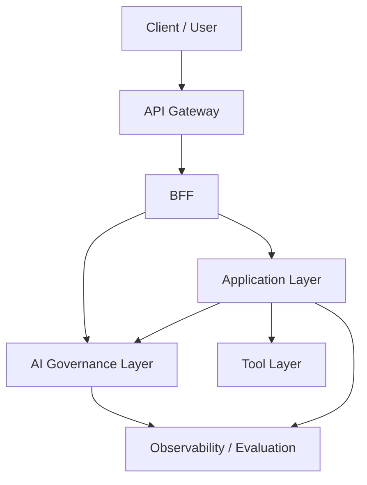

# AIエージェントの業務適用を見据えた生成AIガバナンス層の検討

---

## 0. サマリー

### 0.1 本提言の結論

生成AIの業務適用を安全かつ継続的に進めるには、Application層やTool層とは別に、企業共通の「AIガバナンス層」を独立して定義する必要がある。
このレイヤーは、単なるセキュリティ製品の置き場ではなく、次の責務を横断的に担う。

* 入出力の Guardrails（意味論的ガードレール）
* モデル利用と Tool 実行の統制
* `trace_id` を軸にした Traceability / Observability（追跡・観測性）
* 評価と停止判断の運用（キルスイッチ・HITL）
* 事故時の封じ込めと監査可能性（Auditability）

### 0.2 従来の API 保護だけでは不足する理由
従来の API Gateway / WAF / IAM は、決定論的な HTTP 境界の防御を主目的としている。一方、生成AIでは、自然言語入力、長文コンテキスト、Tool 呼び出し、モデル選択、人間承認を跨いだ「意味論的な統制」が必要になるため、入口保護だけでは不足する。
この必要性は、2023年以降のAIエージェント技術の発展の中で明確になった。完全自律一辺倒の構成では長時間タスクや動的なTool実行を安全に扱えず、実務では WF型 / SV型 / 自律型 を使い分ける「ハイブリッド構成」が前提となった。AIガバナンス層は、この新しい実務構成に対して、横断的な統制を提供するための必須レイヤーである。

### 0.3 提案アーキテクチャの要点
* **API Gateway**: JWT検証、WAF、レート制限などの「決定論的防御」を担う。
* **BFF**: `trace_id` の確定、Fast / Slow Track の分岐、状態管理DBとのI/O、通知を担う。
* **AI ガバナンス層**: 自然言語入出力、モデル利用、Tool呼び出し、評価、監査の「共通統制」を担う。
* **Application 層**: 業務ロジックと AI エージェントの実行主体（推論・計画）を担う。
* **Tool 層**: DB / API / ファイルなどの外界作用を抽象化する。

本書は、このうち AI ガバナンス層を中心に、なぜ必要か、何を責務として持つべきか、どこまでを共通レイヤーとして定義すべきかを整理する文書である。具体的な構成方式、統制点の実装、PoC での立ち上げ手順は、それぞれ [../02_アーキテクチャ実現方式/02_AIガバナンス層の実現方式.md](../02_アーキテクチャ実現方式/02_AIガバナンス層の実現方式.md) と [../03_PoC手順/04_AIガバナンス層実装方針.md](../03_PoC手順/04_AI%E3%82%AC%E3%83%90%E3%83%8A%E3%83%B3%E3%82%B9%E5%B1%A4%E5%AE%9F%E8%A3%85%E6%96%B9%E9%87%9D.md) で扱う。

---

## 1. 背景と問題設定

### 1.1 セキュリティ・パラダイムの変化
従来の業務システムでは、認証されたユーザーが許可されたAPIを呼ぶことが主な統制対象だった。生成AIでは、正規ユーザーであっても自然言語経由で危険な操作や情報漏えいを誘発し得るため、守るべき対象と境界が変わる。

### 1.2 生成AI活用における新たな脅威

* プロンプトインジェクション / ジェイルブレイク
* 間接インジェクション（外部サイト経由の攻撃）
* PII（個人情報）/ 機密情報の漏えい
* ハルシネーションに起因する誤判断
* 高権限ツールの誤実行（意図しない発注・削除等）
* 品質・コストの不安定化

### 1.3 従来 API セキュリティとの違い
従来APIセキュリティが「HTTPリクエストの妥当性」を扱うのに対し、AIガバナンスは「意味論的な妥当性と運用上の説明責任」を扱う。この性質の違いが、独立したレイヤーとして定義すべき最大の理由である。

### 1.4 なぜ全社横断のガバナンスレイヤーが必要か
各アプリが個別にGuardrailsや評価を実装すると、ポリシーの重複、不整合、監査不能が起きやすい。WF型での再現性の担保、SV型での非同期HITLと状態追跡、自律型での権限隔離、ハイブリッド構成での状態引継ぎなどをアプリごとの作り込みに任せると、企業全体としての説明責任を果たしにくくなるため、全社共通の横断レイヤーが必要となる。

---

## 2. 必須機能と要求定義

### 2.1 AI ガバナンスで満たすべき必須機能
* 入力・出力の Guardrails（マスキング、トピック制限）
* モデル選択、利用経路、予算（FinOps）の統制
* Tool 実行権限の認可と統制
* `trace_id` によるエンドツーエンドの追跡可能性
* 評価（LLM-as-a-Judge等）と改善サイクル
* HITL（人間介在） / Kill Switch（強制停止） / 監査対応

### 2.2 要求の整理
要件は次の4つの次元に整理できる。
* **安全性**: PII、禁則表現、危険操作、注入耐性の確保。
* **統制性**: 誰がどのモデル・ツールを使ったかを一元制御できること。
* **追跡可能性**: `trace_id` を軸に入力から出力、評価までを事後に辿れること。
* **運用性**: 停止、再開、評価、改善が継続的に実施できること。

### 2.3 従来 API 保護との比較表

| 観点 | 従来 API Gateway / WAF | AI ガバナンス層 |
| :--- | :--- | :--- |
| **主対象** | HTTP / API リクエスト | 自然言語、モデル、ツール実行、評価 |
| **判定方式** | 決定論的ルール（シグネチャ等） | ルール + 意味論的モデル判定 + 運用判断 |
| **ログの意味** | 通信の監査 | 意味論的な実行プロセスと説明責任 |
| **停止判断** | 通信レイヤーでのパケット遮断 | HITLへのエスカレーション、キルスイッチ |

### 2.4 導入オプションとロードマップ
* **最小導入**: AI Gatewayによるモデル集約と利用ログの取得を先行。
* **標準導入**: Guardrails、Tool実行統制、共通評価基盤の追加。
* **高度化**: リスクベースの動的停止（Risk-Adaptive HITL）、継続評価、運用UIまでの拡張。

---

## 3. 概念アーキテクチャと責務分界

### 3.1 AI ガバナンスレイヤーの位置づけ
AI ガバナンス層は、Application層とTool層の間にのみ存在する局所的なコンポーネントではなく、North境界（入り口）からモデル利用、観測、評価、運用までを横断して効く**「共通統制の背骨」**である。

### 3.2 AI ガバナンスレイヤーの定義
AI ガバナンス層は、企業共通の守りとして以下の基本責務を持つ。
* 自然言語入出力の意味論的統制
* モデル利用経路とコストの統制
* 外界へ作用するTool実行の認可統制
* 追跡（Observability）、評価、運用判断の共通化

### 3.3 全体像（概念図）

以下の図は、各レイヤーの責務境界と主な相互関係を示す概念図である。通信方式、配置形態、導入製品を確定するものではなく、どこで何を統制するかを把握するための見取り図として用いる。

### 3.4 各レイヤーの責務分担
* **API Gateway**: 決定論的な入口防御。
* **BFF**: `trace_id` 確定、状態I/O、通知、同期/非同期境界の制御。
* **AI ガバナンス層**: Guardrails、モデル/Tool統制、観測、評価、停止判断。
* **Application 層**: 業務ロジック、エージェント実行（推論と計画）、HITLの業務組み込み。
* **Tool 層**: DB/API等の外界作用の抽象化と実行単位の分離。

### 3.5 評価と責任分界

評価と停止判断は1つの仕組みに集約するのではなく、Application層内の「業務固有評価」と、AIガバナンス層の「共通評価基盤」に分けて設計する。

* **Application 層内の評価ユニット**: 期待する出力形式、業務ルール適合性、次の経路選択など、業務フローに閉じた品質保証と一時停止（人間承認待ち）を扱う。
* **AI ガバナンス層の共通評価基盤**: 複数アプリケーションを横断し、安全性、根拠性、企業ポリシー適合性を監視する。低スコア時の強制停止（キルスイッチ）や経路遮断を判断する。

これに伴う組織的な責任分界は以下の通りとなる。
* **開発部門**: 業務ユニットとApplication層内の評価精度に責任を持つ。
* **IT / ガバナンス部門**: 共通評価基盤、Guardrails、監査可能性、強制停止の運用に責任を持つ。
* **ユーザー**: 最終出力と業務上の最終判断に責任を持つ。

### 3.6 型に応じて変わる統制要求
制御フローの委譲度（WF/SV/自律型）が上がるほど、AI ガバナンス層が担う統制要求も強くなる。本書では、型ごとの差異を個別実装の違いとしてではなく、ガバナンス上の要求水準の違いとして捉える。

* **WF 型**: 再現性、固定経路の監査、入出力統制が重視される。
* **SV 型**: 承認、状態遷移、再開可能性、役割分離が重視される。
* **自律型**: 権限最小化、行動上限、封じ込め可能性が重視される。
* **ハイブリッド構成**: 型の切り替え時にも一貫した追跡可能性と責務分界が維持されることが重視される。

ここで重要なのは、どの型を採るかによって「必要な統制の濃さと種類」が変わる点である。各型に対してどの構成要素でこれを実現するかは、[../02_アーキテクチャ実現方式/02_AIガバナンス層の実現方式.md](../02_アーキテクチャ実現方式/02_AIガバナンス層の実現方式.md) で扱う。

### 3.7 North境界と追跡可能性の原則
AI ガバナンス層を成立させる上では、North境界において決定論的防御、業務状態の制御、意味論的統制を分けて扱えることが重要である。また、入口で受けた要求が最終出力と評価に至るまで一貫して追跡できることも、共通統制の前提となる。

特に、要求を横断して結び付ける識別子を入口で確定し、Application層、AIガバナンス層、Tool層、評価基盤まで伝播させる設計原則は、監査可能性と改善サイクルの基盤になる。

これらをどのようなコンポーネント分担と通信方式で実装するかは、概念論ではなく実現方式の論点であるため、具体構成は [../02_アーキテクチャ実現方式/02_AIガバナンス層の実現方式.md](../02_アーキテクチャ実現方式/02_AIガバナンス層の実現方式.md) に委ねる。

