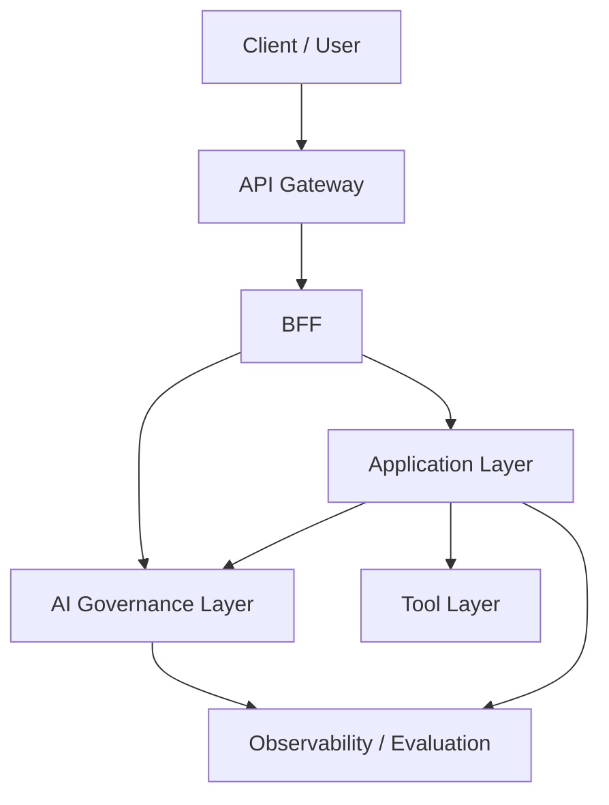

# AIエージェントの業務適用を見据えた生成AIガバナンス層の進化と設計背景

*(※ 本資料は、アプリケーション層・ツール層とは独立した「AIガバナンス層」の設計妥当性を証明するための歴史的背景と、具体的なアーキテクチャ方針を定義したものである。)*

---

## 1. 生成AIガバナンス技術の進化の歴史（2023年〜2026年現在）

生成AIの業務適用において、セキュリティとガバナンスのパラダイムは「通信の保護」から「意味と振る舞いの統制」へと劇的なシフトを遂げた。この進化は、LLMの脅威の高度化と、それに追従する防衛アーキテクチャの歴史である。

### 第1期：決定論的防御の限界と「プロンプトインジェクション」の衝撃（2023年）

ChatGPTの登場直後、業界は「従来のセキュリティ（WAFやIAM）がLLMに対して全く無力である」という事実に直面した。WAFはSQLやXSSなどの決定論的な文字列を防ぐことはできたが、「自然言語（意味論的な要求）」による攻撃を防御できなかったからである。OWASPが異例のスピードで [**『OWASP Top 10 for Large Language Model Applications』**](https://owasp.org/www-project-top-10-for-large-language-model-applications/) を策定し、LLM特有の脆弱性を世界に定義した。

### 第2期：「AIゲートウェイ」と「意味論的ガードレール」の誕生（2023年末〜2024年）

決定論的防御の限界を克服するため、API Gatewayの奥に「LLMの入出力を意味的に監視する専用レイヤー」を配置するアーキテクチャが生まれた。NVIDIAの [**『NeMo Guardrails』**](https://github.com/NVIDIA/NeMo-Guardrails)（2023）などに代表されるように、手前で別の軽量モデルがトピック逸脱やPII（個人情報）を判定する**「Guardrails（意味論的ガードレール）」**の概念が実装標準となった。

### 第3期：「Agenticな脅威」への対応と観測基盤（Observability）の確立（2024年〜2025年）
LLMが外部システムを操作する「AIエージェント（Tool層の利用）」へと進化すると、脅威は「不適切な回答」から「DBの不正削除」や「外部APIの不正実行」という物理的・システム的な破壊行為へと跳ね上がった。これに対抗するため、LangSmithなどに代表される **「LLM Observability（観測基盤）」** が台頭した。1つのリクエストを `trace_id` で串刺しにして追跡し、事故時の監査と原因究明を可能にするための「ブラックボックスの解明」が必須要件となった。

### 第4期：AIエージェントの社会実装と「継続的監視・ハイブリッドガバナンス」の定着（2026年）

現在、ガバナンスの焦点は「入口の防御」だけでなく「継続的な評価と運用判断」に移っている。
2026年3月末に改定された日本政府の [**『AI事業者ガイドライン（第1.2版）』**](https://www.meti.go.jp/press/2024/04/20240419004/20240419004.html) において、「AIエージェント」の定義が新設され、自律的な動作が引き起こすリスクに対する「業務遂行に必要な最小限の権限設定」と「継続的な監視体制」が明記された。これに呼応する形で、学術論文 [**『Judging LLM-as-a-Judge』**](https://arxiv.org/abs/2306.05685) 等を用いた「AIのリスクレベルに応じたHITL（人間介在）へのエスカレーション」や「キルスイッチ（強制停止）」を動的に切り替えるRisk-Adaptiveなガバナンスアーキテクチャがエンタープライズのデファクトスタンダードとなっている。

---

## 2. 歴史的背景と本システム・アーキテクチャの関係

第1章の進化史は、本システムがなぜ「North境界を3段構成（APIGW / BFF / AI Gov）に分離」し、「評価の責務を開発部門とガバナンス部門で分割」したのかという必然性を完全に裏付けている。当アーキテクチャは、以下の通り公的ガイドラインおよび学術的要件をシステム構造として直接的に充足している。

**① 決定論（APIGW）と意味論（AI Gov）の分離による未知の脅威対策**
従来のWAFが自然言語の脅威に無力であるという教訓から、API GatewayにJWTやWAF等の「決定論的防御」を任せ、その奥に自然言語やモデル利用を統制する「AIガバナンス層（Guardrails）」を独立して配置している。
* **準拠する要件・参考文献**: 『OWASP Top 10 for LLM Applications』, NVIDIA 『NeMo Guardrails』アーキテクチャ設計要件

**② `trace_id` を軸としたObservability（透明性・追跡可能性の確保）**
エージェントの自律化に伴うブラックボックス化を防ぐため、確定した `trace_id` を全レイヤーに伝播させ、AIガバナンス層で一元的に観測・監査する基盤（第6.5項）を構築している。
* **準拠する要件・参考文献**: 経済産業省 『AI事業者ガイドライン（第1.2版）』, NIST 『AI RMF 1.0』 (Measure機能群)

**③ 最小権限と評価・監視の責任分界（エージェント暴走への安全装置）**
「業務固有の品質（Application層）」と「企業共通の安全性・ポリシー適合性（AIガバナンス層）」の評価を分離（第6.3項）した。これにより、自律型エージェントへの最小権限の付与、およびガバナンス部門による独立した監視と停止判断（キルスイッチ等の継続運用）をシステム構造として担保している。
* **準拠する要件・参考文献**: 経済産業省 『AI事業者ガイドライン（第1.2版）』, OWASP 『OWASP Top 10』 (LLM08), NIST 『AI RMF 1.0』, 学術論文 『Judging LLM-as-a-Judge』

---

## 3. サマリー（本提言の結論と提案アーキテクチャ）

前述の歴史的背景を踏まえ、生成AIの業務適用を安全かつ継続的に進めるには、Application層やTool層とは別に、企業共通の**「AIガバナンス層」**を独立して定義する必要がある。

### 3.1 従来の API 保護だけでは不足する理由
従来の API Gateway / WAF / IAM は、決定論的な HTTP 境界の防御を主目的としている。一方、生成AIでは、自然言語入力、長文コンテキスト、Tool 呼び出し、モデル選択、人間承認を跨いだ「意味論的な統制」が必要になるため、入口保護だけでは不足する。
完全自律一辺倒の構成では長時間タスクや動的なTool実行を安全に扱えず、実務では WF型 / SV型 / 自律型 を使い分ける「ハイブリッド構成」が前提となった。AIガバナンス層は、この新しい実務構成に対して、横断的な統制を提供するための必須レイヤーである。

### 3.2 提案アーキテクチャの要点
* **API Gateway**: JWT検証、WAF、レート制限などの「決定論的防御」を担う。
* **BFF**: `trace_id` の確定、Fast / Slow Track の分岐、状態管理DBとのI/O、通知を担う。
* **AI ガバナンス層**: 自然言語入出力、モデル利用、Tool呼び出し、評価、監査の「共通統制」を担う。
* **Application 層**: 業務ロジックと AI エージェントの実行主体（推論・計画）を担う。
* **Tool 層**: DB / API / ファイルなどの外界作用を抽象化する。

*(※ 具体的な構成方式、統制点の実装等は `../02_アーキテクチャ実現方式/02_AIガバナンス層の実現方式.md` にて扱う。)*

---

## 4. 背景と問題設定

### 4.1 セキュリティ・パラダイムの変化
従来の業務システムでは、認証されたユーザーが許可されたAPIを呼ぶことが主な統制対象だった。生成AIでは、正規ユーザーであっても自然言語経由で危険な操作や情報漏えいを誘発し得るため、守るべき対象と境界が変わる。

### 4.2 生成AI活用における新たな脅威
* プロンプトインジェクション / ジェイルブレイク
* 間接インジェクション（外部サイト経由の攻撃）
* PII（個人情報）/ 機密情報の漏えい
* ハルシネーションに起因する誤判断
* 高権限ツールの誤実行（意図しない発注・削除等）
* 品質・コストの不安定化

### 4.3 なぜ全社横断のガバナンスレイヤーが必要か
各アプリが個別にGuardrailsや評価を実装すると、ポリシーの重複、不整合、監査不能が起きやすい。WF型での再現性の担保、SV型での非同期HITLと状態追跡、自律型での権限隔離、ハイブリッド構成での状態引継ぎなどをアプリごとの作り込みに任せると、企業全体としての説明責任を果たしにくくなるため、全社共通の横断レイヤーが必要となる。

---

## 5. 必須機能と要求定義

### 5.1 AI ガバナンスで満たすべき必須機能
* 入力・出力の Guardrails（マスキング、トピック制限）
* モデル選択、利用経路、予算（FinOps）の統制
* Tool 実行権限の認可と統制
* `trace_id` によるエンドツーエンドの追跡可能性
* 評価（LLM-as-a-Judge等）と改善サイクル
* HITL（人間介在） / Kill Switch（強制停止） / 監査対応

### 5.2 従来 API 保護との比較表
| 観点 | 従来 API Gateway / WAF | AI ガバナンス層 |
| :--- | :--- | :--- |
| **主対象** | HTTP / API リクエスト | 自然言語、モデル、ツール実行、評価 |
| **判定方式** | 決定論的ルール（シグネチャ等） | ルール + 意味論的モデル判定 + 運用判断 |
| **ログの意味** | 通信の監査 | 意味論的な実行プロセスと説明責任 |
| **停止判断** | 通信レイヤーでのパケット遮断 | HITLへのエスカレーション、キルスイッチ |

---

## 6. 概念アーキテクチャと責務分界

### 6.1 AI ガバナンスレイヤーの位置づけ
AI ガバナンス層は、Application層とTool層の間にのみ存在する局所的なコンポーネントではなく、North境界（入り口）からモデル利用、観測、評価、運用までを横断して効く**「共通統制の背骨」**である。

### 6.2 全体像（概念図）

### 6.3 評価と責任分界

評価と停止判断は1つの仕組みに集約するのではなく、Application層内の「業務固有評価」と、AIガバナンス層の「共通評価基盤」に分けて設計する。

* **Application 層内の評価ユニット**: 期待する出力形式、業務ルール適合性、次の経路選択など、業務フローに閉じた品質保証と一時停止（人間承認待ち）を扱う。
* **AI ガバナンス層の共通評価基盤**: 複数アプリケーションを横断し、安全性、根拠性、企業ポリシー適合性を監視する。低スコア時の強制停止（キルスイッチ）や経路遮断を判断する。

これに伴う組織的な責任分界は以下の通りとなる。
* **開発部門**: 業務ユニットとApplication層内の評価精度に責任を持つ。
* **IT / ガバナンス部門**: 共通評価基盤、Guardrails、監査可能性、強制停止の運用に責任を持つ。
* **ユーザー**: 最終出力と業務上の最終判断に責任を持つ。

### 6.4 型に応じて変わる統制要求
制御フローの委譲度（WF/SV/自律型）が上がるほど、AI ガバナンス層が担う統制要求も強くなる。
* **WF 型**: 再現性、固定経路の監査、入出力統制が重視される。
* **SV 型**: 承認、状態遷移、再開可能性、役割分離が重視される。
* **自律型**: 権限最小化、行動上限、封じ込め可能性が重視される。
* **ハイブリッド構成**: 型の切り替え時にも一貫した追跡可能性と責務分界が維持されることが重視される。

### 6.5 North境界と追跡可能性の原則
AI ガバナンス層を成立させる上では、入口で受けた要求が最終出力と評価に至るまで一貫して追跡できることが共通統制の前提となる。要求を横断して結び付ける識別子（`trace_id`）をBFF等で確定し、Application層、AIガバナンス層、Tool層、評価基盤まで伝播させる設計原則は、監査可能性と改善サイクルの基盤になる。

---

## 7. 生成AIガバナンス層に関する参考文献一覧

### I. 公的ガイドライン・標準フレームワーク（コンプライアンス要件の根拠）
**1. 経済産業省・総務省『AI事業者ガイドライン（第1.2版）』 (2026年3月31日改定)**
* **リンク**: [https://www.meti.go.jp/press/2024/04/20240419004/20240419004.html](https://www.meti.go.jp/press/2024/04/20240419004/20240419004.html)
* **概要**: 日本政府が定めるAIガイドラインの最新版。「AIエージェント」と「フィジカルAI」の定義が追加され、自律的動作のリスク（意図しない注文や削除等）が明示された。
* **アーキテクチャとの関係**: 自律型AIに対して求める「適切な権限設定」「操作履歴の確認」「継続的な監視体制」を満たすためのバイブルである。

**2. NIST『AI Risk Management Framework (AI RMF 1.0)』 (2023年1月)**
* **リンク**: [https://www.nist.gov/itl/ai-risk-management-framework](https://www.nist.gov/itl/ai-risk-management-framework)
* **概要**: 米国国立標準技術研究所（NIST）が発行したAIリスク管理の標準フレームワーク。
* **アーキテクチャとの関係**: 第6.3項における組織的な責任分界（Govern）と、独立した監視・停止機能（Measure/Manage）の設計根拠となる。

### II. セキュリティ基準・脅威モデリング（防御要件の根拠）
**3. OWASP『OWASP Top 10 for Large Language Model Applications』**
* **リンク**: [https://owasp.org/www-project-top-10-for-large-language-model-applications/](https://owasp.org/www-project-top-10-for-large-language-model-applications/)
* **概要**: LLM特有の重大な脆弱性トップ10。「プロンプトインジェクション」や「過剰なエージェンシー」などが定義されている。
* **アーキテクチャとの関係**: WAFに代わり、AIガバナンス層という「意味論的な境界」および「Tool実行権限の統制」が必須であることの国際的な技術証明となる。

**4. MITRE『ATLAS (Adversarial Threat Landscape for AI Systems)』**
* **リンク**: [https://atlas.mitre.org/](https://atlas.mitre.org/)
* **概要**: AIシステムに対する脅威モデリング。
* **アーキテクチャとの関係**: エージェントが外部Webを読み込んだ際に暴走する「間接インジェクション」などへの対策要件を定義するインプットとなる。

### III. アーキテクチャと評価手法の学術・技術論文（実装の根拠）
**5. NeMo Guardrails: A GUI-Based and Programmable Guardrails System (NVIDIA)**
* **リンク**: [https://github.com/NVIDIA/NeMo-Guardrails](https://github.com/NVIDIA/NeMo-Guardrails)
* **概要**: NVIDIAが提唱したガードレールの概念実装。
* **アーキテクチャとの関係**: 「入力・出力のGuardrails」をApplication層から外出しし、AIガバナンス層として横断適用する設計の正当性を担保する。

**6. Judging LLM-as-a-Judge with MT-Bench and Chatbot Arena (arXiv:2306.05685)**
* **リンク**: [https://arxiv.org/abs/2306.05685](https://arxiv.org/abs/2306.05685)
* **概要**: LLMを用いて別のLLMの出力を評価する手法の妥当性を実証した論文。
* **アーキテクチャとの関係**: 共通評価基盤が品質と安全性を自動監視・採点する仕組みが、学術的に裏付けられたアプローチであることを示す。

### IV. 実装基盤およびObservability（観測性）のベストプラクティス
**7. Langfuse: Open Source LLM Engineering Platform**
* **リンク**: [https://langfuse.com/docs](https://langfuse.com/docs)
* **概要**: LLMアプリケーションのトレース、評価を行うObservabilityプラットフォーム。
* **アーキテクチャとの関係**: `trace_id` を用いて一連の動作を可視化・監査するための実装リファレンス。

**8. Ragas: Automated Evaluation of RAG Pipelines**
* **リンク**: [https://docs.ragas.io/](https://docs.ragas.io/)
* **概要**: LLM-as-a-Judgeの手法を用いてAIの出力を定量評価するフレームワーク。
* **アーキテクチャとの関係**: 「継続的評価」の指標定義、および低スコア時のHITLエスカレーションの閾値設計の根拠となる。

**9. LiteLLM: LLM Gateway**
* **リンク**: [https://docs.litellm.ai/](https://docs.litellm.ai/)
* **概要**: 100以上のLLM APIを統一規格でルーティングし、予算管理やガードレール連携を行うAI Gateway。
* **アーキテクチャとの関係**: 全社のモデル利用を単一のゲートウェイで統制・監視する「モデル利用統制」の実装基盤としての妥当性を担保する。

**10. NeMo Guardrails: Programmable Guardrails for Conversational AI**

* **リンク**: [https://docs.nvidia.com/nemo/guardrails/](https://docs.nvidia.com/nemo/guardrails/)
* **概要**: LLMの入出力に対し、自然言語によるポリシー定義を用いて制御するツールキット。
* **アーキテクチャとの関係**: WAFでは防げないプロンプトインジェクション等を、意味論的に検知・マスキング・遮断する「ガードレール機能」の具体的な実装リファレンス。

**11. Google Vertex AI: Grounding and Citation**
* **リンク**: [https://cloud.google.com/vertex-ai/docs/generative-ai/grounding/overview](https://cloud.google.com/vertex-ai/docs/generative-ai/grounding/overview)
* **概要**: 自社データや信頼できるソースとLLMの回答を紐づけ、ハルシネーションを抑制するセマンティックレイヤーの仕組み。
* **アーキテクチャとの関係**: 出力結果が「どの規程やデータに基づいているか」をトレースバック可能にすることで、AIガバナンスにおける「根拠性の担保」を実装レベルで証明する。