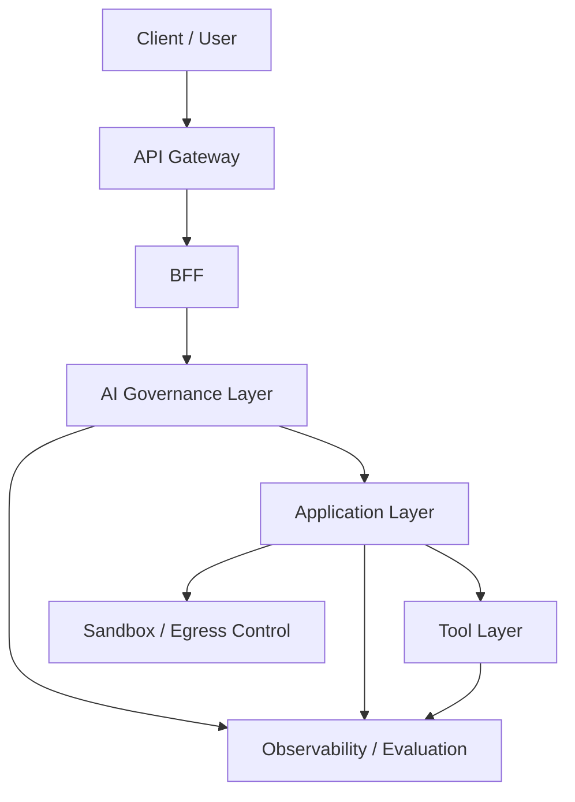

  # AIエージェントの業務適用を見据えた生成AIガバナンス層の進化と設計背景

*(※ 本資料は、Application層・Tool層とは独立した「AIガバナンス層」について、歴史的背景を踏まえた設計妥当性、統制原則、および関連レイヤーとの境界を定義したものである。具体的な実現方式は別紙にて扱う。)*

---

## 1. 生成AIガバナンス技術の進化の歴史（2023年〜2026年現在）

生成AIの業務適用において、セキュリティとガバナンスのパラダイムは「通信の保護」から「意味と振る舞いの統制」へと劇的なシフトを遂げた。この進化は決して独立して起きたものではない。**AIが「推論（脳）」「ツール実行（手足）」「自律ループ」という新たな能力を獲得するたびに、全く新しい次元の脅威が生まれ、それを封じ込めるためにガバナンスアーキテクチャが進化を余儀なくされた**という、能力と統制の「表裏一体の歴史」である。

### 第1期：AIの「脳」の獲得と、決定論的防御の限界（2023年）
**【能力の獲得】**

AIが高度な自然言語処理能力（推論エンジン）を獲得した。

**【脅威とガバナンスの進化】**

ChatGPTの登場直後、業界は「従来のセキュリティ（WAFやIAM）がLLMに対して全く無力である」という事実に直面した。WAFはSQLやXSSなどの決定論的な文字列を防ぐことはできたが、ユーザーが悪意ある指示でAIを騙す「プロンプトインジェクション」等の自然言語（意味論的な要求）による攻撃を防御できなかったからである。
これを防ぐため、API Gatewayの奥に、入出力を意味的に監視する専用レイヤーを配置するアーキテクチャが生まれた。Metaの『[Llama Guard](https://arxiv.org/abs/2312.06674)』やNVIDIAの『[NeMo Guardrails](https://docs.nvidia.com/nemo/guardrails/)』に代表されるように、**小型のLLMをファイアウォールとして配置し「意味論的ガードレール」として機能させるアプローチ**は重要な実装選択肢となった。一方で、特定製品をそのまま標準採用できるかは、認証境界の置き方、クライアント契約、状態管理契約との整合を個別に評価する必要がある。

### 第2期：ハルシネーションの実害と「説明責任」の確立（2023年末〜2024年）
**【能力の獲得】**

AIが社内文書やWeb検索を組み合わせて、もっともらしい長文回答（RAG等）を生成するようになった。

**【脅威とガバナンスの進化】**

AIの「ハルシネーション（もっともらしい嘘）」が実務で致命傷になるリスクが露呈した。スタンフォード大学等の論文（[*Evaluating Verifiability in Generative Search Engines*](https://arxiv.org/abs/2304.09848), 2023）により、AIが生成した文章のうち「引用（サイテーション※1）によって完全に裏付けられているものはわずか51.5%に過ぎない」ことが実証された。
AIに単に「引用元を出せ」と指示するだけでは不十分であり、業務被害を防ぎ説明責任（Accountability）を果たすためには、**システム基盤側で強制的に社内事実と紐づける「グラウンディング（根拠付け）」と「サイテーションの明示」**が必須要件としてガバナンス層に統合された。

※1 ここでのサイテーションとはSEOの分野で使われる日本独特の意味(他のウェブサイトなどで名前を言及されること）を指すものではなく、「出典明示」「引用」といった英語本来の意味を指す。

### 第3期：エージェントの「手足」の獲得と、情報漏洩・破壊の恐怖（2024年〜2025年）
**【能力の獲得】**

AIが自律的に外部システムやファイル操作を行う「エージェント（Tool利用）」へと進化した。

**【脅威とガバナンスの進化】**

脅威は「不適切な発言」から「物理的な破壊と情報漏洩」へと次元が変わった。攻撃者が外部のWebサイト等に罠を仕掛け、それを読み込んだエージェントを乗っ取る「間接プロンプトインジェクション」が実証された（[*Not what you've signed up for: Compromising Real-World LLM-Integrated Applications with Indirect Prompt Injection*](https://arxiv.org/abs/2302.12173), 2023）。乗っ取られたエージェントが機密データを外部URLに密かに送信してしまう脅威に対し、プロンプトでの防御は無意味であった。
これによりガバナンス要件はインフラレベルへと拡張され、ネットワークのアウトバウンド通信（Egress）やファイルシステムを物理的に遮断する「使い捨てのサンドボックス」が必須となった。

**同時に、エージェントの行動は複数ステップ（Multi-Turn）に及ぶため、事故が起きた際に「どの時点の推論やツール実行が原因だったのか」を事後追跡することが極めて困難になった。このブラックボックス化問題を解決するため、エージェントの一連の思考と行動の軌跡（Trajectory）を分析する手法が提唱され（[*AgentBoard: An Analytical Evaluation Board of Multi-Turn LLM Agents*](https://arxiv.org/abs/2401.13178), 2024）、システム実装としてはすべてのリクエストを `trace_id` で串刺しにして記録する「観測基盤（Observability）」が必須のインフラとして定着した。**

### 第4期：自律ループによるカスケード障害と「スケーラブルな監督」（2025年〜2026年）
**【能力の獲得】**

AIが目標に向けて「思考→行動→観察」のループを自律的に回し続けるようになった。

**【脅威とガバナンスの進化】**

自律ループの最大のリスクは、微小な誤認識がループを通じて致命的なシステム破壊へと指数関数的に拡大する**「カスケード障害（Error Compounding）」**である。実環境ベンチマーク（[*WebArena: A Realistic Web Environment for Building Autonomous Agents*](https://arxiv.org/abs/2307.13854), 2023等）により、初期ステップの些細なミスが連鎖的破綻を招くことが実証され、この実行時の予測不可能性は、入口のWAFやガードレールでは防げないことが判明した。

しかし、機械の速度で稼働するエージェントの全ログを人間が目視監視することは不可能である（スケーラブルな監督の限界）。この構造的欠陥に対する最終的なシステム解として、強力なLLMを用いて出力の忠実性等を自動採点する「LLM-as-a-Judge（[*RAGAS: Automated Evaluation of Retrieval Augmented Generation*](https://arxiv.org/abs/2309.15217) 等）」がインフラに組み込まれた。
さらに、**LLMが自身の不確実性（Uncertainty）を評価できる特性（[*Language Models (Mostly) Know What They Know*](https://arxiv.org/abs/2207.05221), 2022等）を応用し**、LLM裁判官による監視を自動化し、スコアが低下した（自信を失った）瞬間にのみ人間の承認（HITL）へエスカレーションする、あるいは処理を強制遮断する**「Risk-Adaptive（リスク適応型）ガバナンス」**がデファクトスタンダードとなった。2026年3月の日本政府『[AI事業者ガイドライン（第1.2版）](https://www.meti.go.jp/press/2024/04/20240419004/20240419004.html)』における「AIエージェントに対する継続的な監視体制」の要求は、このシステム工学的な限界と解決策を社会ルールとして追認したものである。

### 第5期：マルチエージェント化による East-West リスクと内部ゼロトラスト（2025年〜2026年）
**【能力の獲得】**

AIが単体で推論・実行するだけでなく、複数のエージェントが役割分担し、相互に依頼・委譲・合議しながらタスクを遂行するようになった。

**【脅威とガバナンスの進化】**

マルチエージェント構成では、従来の North-South 境界だけを守っても不十分であることが明らかになった。低権限エージェントが汚染された指示や外部コンテンツを受け取り、その内容を高権限エージェントへ委譲することで、古典的な Confused Deputy に類似した権限昇格が発生し得ることは、[*Taming Various Privilege Escalation in LLM-Based Agent Systems: A Mandatory Access Control Framework*](https://arxiv.org/abs/2601.11893) でも整理されている。また、1つのエージェントが踏んだ悪性コンテンツや逸脱した文脈が、共有 State や agent-to-agent handoff を介して他のエージェントへ伝播し、単体では局所的だった逸脱が系全体へ感染的に拡大するリスクも、[*Agent Smith: A Single Image Can Jailbreak One Million Multimodal LLM Agents Exponentially Fast*](https://arxiv.org/abs/2402.08567) により実証された。さらに、複数エージェント間の相互依存は、不要な合議や再帰的ブロッキングを生み、API コストと計算資源を枯渇させる新たな Denial of Wallet 系リスクを生み、この種の攻撃は [*CORBA: Contagious Recursive Blocking Attacks on Multi-Agent Systems Based on Large Language Models*](https://arxiv.org/abs/2502.14529) で示されている。
これにより、ガバナンスは North 境界の入口防御だけでなく、**エージェント間通信（East-West）に対するゼロトラスト統制**へと拡張された。具体的には、委譲時の権限コンテキスト検証、共有 State の浄化、エージェント間メッセージへの軽量 Guardrails、セッション単位の予算・ループ監視、複数エージェントの相互作用を前提とした runtime monitoring が必須要件となった。

---

## 2. 歴史的背景と本システム・アーキテクチャの関係

第1章の進化史は、本システムがなぜ「North境界を3段構成（APIGW / BFF / AI Gov）に分離」し、「使い捨てのサンドボックスを必須」とし、「評価の責務を開発部門とガバナンス部門で分割」したのかという必然性を完全に裏付けている。当アーキテクチャは、以下の通り公的ガイドラインおよび学術的要件をシステム構造として直接的に充足している。

**① 決定論と意味論の分離、および「説明責任」のシステム化**
従来のWAFが自然言語の脅威に無力であるという教訓（第1期）から、API Gatewayに「決定論的防御」を任せ、その奥に自然言語を統制する「AIガバナンス層（Guardrails）」を独立配置している。さらに、AIの自己引用能力の限界（第2期の教訓）を踏まえ、グラウンディングやサイテーションの機能を本層に統合することで、ハルシネーションリスクをインフラレベルで低減し、エンタープライズ水準の説明責任（Accountability）を物理的に担保している。
* **準拠する要件・参考文献**: 『[OWASP Top 10 for Large Language Model Applications](https://owasp.org/www-project-top-10-for-large-language-model-applications/)』, 『[Evaluating Verifiability in Generative Search Engines](https://arxiv.org/abs/2304.09848)』, NVIDIA 『[NeMo Guardrails](https://docs.nvidia.com/nemo/guardrails/)』, Google Vertex AI 『[Grounding and Citation](https://cloud.google.com/vertex-ai/docs/generative-ai/grounding/overview)』

**② Trajectory を軸とした Observability（透明性・追跡可能性の確保）**
エージェントの自律化に伴うブラックボックス化を防ぐため、本アーキテクチャでは最終結果だけでなく、思考、判断、ツール実行、状態遷移からなる一連の軌跡（Trajectory）そのものを観測・監査の対象として扱う。その実装手段として、入口で確定した `trace_id` を全レイヤーへ伝播させ、各ステップの因果関係を串刺しにして記録・再構成できる基盤を構築している。これにより、事後の原因究明と監査可能性を、単なるログ集約ではなく「どのステップで何を根拠に判断し、どの行動が結果を招いたか」というプロセス単位で保証する。
* **準拠する要件・参考文献**: 経済産業省 『[AI事業者ガイドライン（第1.2版）](https://www.meti.go.jp/press/2024/04/20240419004/20240419004.html)』, NIST 『[AI Risk Management Framework (AI RMF 1.0)](https://www.nist.gov/itl/ai-risk-management-framework)』 (Measure機能群), 『[AgentBoard: An Analytical Evaluation Board of Multi-Turn LLM Agents](https://arxiv.org/abs/2401.13178)』, 『[Langfuse](https://langfuse.com/docs)』

**③ サンドボックスによる「情報漏洩・物理破壊」の物理的遮断**
間接プロンプトインジェクションによる情報漏洩や、エージェントの暴走によるファイル破壊（第3期の教訓）は、プロンプトの指示（ソフトウェア的制御）では防ぎきれない。当アーキテクチャでは、Application層における自律的な思考やコード実行を、Docker等のコンテナ技術を用いたエフェメラル（使い捨て）なサンドボックス内に物理的に隔離している。さらに、ネットワークのアウトバウンド通信（Egress）を遮断し、外界への作用を最小権限のTool層（MCP）経由のみに絞ることで、万が一エージェントが乗っ取られても被害をコンテナ内部に封じ込める（Blast Radiusの極小化）設計を実現している。
* **準拠する要件・参考文献**: 『[Not what you've signed up for: Compromising Real-World LLM-Integrated Applications with Indirect Prompt Injection](https://arxiv.org/abs/2302.12173)』, 『[SWE-agent: Agent-Computer Interfaces Enable Automated Software Engineering](https://arxiv.org/abs/2405.15793)』

**④ カスケード障害の抑止と「スケーラブルな監督」の実装**
自律型エージェントの最大のリスクである「ループによるカスケード障害（微小なエラーの連鎖的拡大）」を防ぐため、実行時の継続的な監視をアーキテクチャに組み込んでいる。しかし、人間の認知限界（監視のスケーラビリティ問題：第4期）を克服するため、「企業共通のポリシー適合性・忠実性」の評価をガバナンス部門が管轄する「LLM-as-a-Judge」へ委譲した。これにより、機械の速度で稼働する自律型エージェントに対し、スコア低下時のみ人間（HITL）を介入させるという、論理的に破綻しない「スケーラブルな監督体制とキルスイッチ」をシステム構造として実現している。
* **準拠する要件・参考文献**: 学術論文 『[Measuring Progress on Scalable Oversight for Large Language Models](https://arxiv.org/abs/2211.03540)』, 『[RAGAS: Automated Evaluation of Retrieval Augmented Generation](https://arxiv.org/abs/2309.15217)』, 『[Judging LLM-as-a-Judge with MT-Bench and Chatbot Arena](https://arxiv.org/abs/2306.05685)』, 経済産業省 『[AI事業者ガイドライン（第1.2版）](https://www.meti.go.jp/press/2024/04/20240419004/20240419004.html)』

**⑤ エージェント間通信に対するゼロトラスト統制の導入**
マルチエージェント化が進むと、リスクの中心は単一エージェントの入出力から、エージェント間の委譲・共有 State・再帰的な合議へ広がる。このため当アーキテクチャでは、North 境界の統制に加え、Application層内部の agent-to-agent handoff に対しても、権限コンテキスト検証、State Scrubbing、セッション予算監視、runtime monitoring を適用する前提を置く。これにより、単一エージェント向けのサンドボックスや入口 Guardrails では捉えきれない Confused Deputy 型の権限昇格、汚染伝播、再帰的ブロッキングを多層統制として扱う。
* **準拠する要件・参考文献**: 『[Taming Various Privilege Escalation in LLM-Based Agent Systems: A Mandatory Access Control Framework](https://arxiv.org/abs/2601.11893)』, 『[Agent Smith: A Single Image Can Jailbreak One Million Multimodal LLM Agents Exponentially Fast](https://arxiv.org/abs/2402.08567)』, 『[CORBA: Contagious Recursive Blocking Attacks on Multi-Agent Systems Based on Large Language Models](https://arxiv.org/abs/2502.14529)』, 『[TrinityGuard: A Unified Framework for Safeguarding Multi-Agent Systems](https://arxiv.org/abs/2603.15408)』

---

## 3. 1章の脅威に応答するアーキテクチャ

1章で整理した脅威は、いずれも単一コンポーネントでは防ぎきれない。したがって本システムでは、North境界の3段構成、AIガバナンス層、Application層、Tool層、サンドボックス、Observability を組み合わせ、予防・検知・追跡・封じ込めを分担させる。マルチエージェント構成を採る場合は、これに加えて Application層内部の agent-to-agent handoff と共有 State に対する統制を組み込み、North-South だけでなく East-West の通信経路も監査・評価の対象に含める。

AIガバナンス層の役割は、この全体アーキテクチャの中で、自然言語入出力、モデル利用、根拠付け、横断監査、評価、停止判断に関する企業共通の統制ルールを定義し適用することである。AIガバナンス層は業務ロジックや個別ツール実装を持たず、Application層の代わりに推論せず、Tool層の代わりに外界接続も持たない。あくまで全社共通で守るべき安全性、説明責任、追跡可能性を横断的に担保する「意味論的な共通統制レイヤー」として位置付ける。

*(※ 具体的な構成方式、統制点の実装等は [docs/02_アーキテクチャ実現方式/04_生成AIガバナンス層の実現方式.md](../02_アーキテクチャ実現方式/04_生成AIガバナンス層の実現方式.md) にて扱う。)*

### 3.1 脅威と統制機構の対応表

| 1章の脅威 | 主な統制機構 | 主担当レイヤー | 防御種別 | 補足 |
| :--- | :--- | :--- | :--- | :--- |
| **プロンプトインジェクション** | 入出力 Guardrails、許容トピック制御、モデル利用経路固定 | AIガバナンス層 | 予防・検知 | APIGW ではなく意味論的統制で抑止する。 |
| **ハルシネーション** | リアルタイム・グラウンディング、サイテーション強制、同期検証、共通評価基盤 | AIガバナンス層 + Application層 | 予防・検知・追跡 | 回答品質の業務妥当性は Application層、共通根拠性と検証ルールは AIガバナンス層が担う。 |
| **検証不可能性** | 出典メタデータ付与、同期検証でのサイテーション有無確認、Trajectory ベース監査、事後評価 | AIガバナンス層 + Application層 | 予防・検知・追跡 | 単なる引用要求ではなく、根拠付けをシステムで強制し、欠落時は次ステップへ進ませない。 |
| **間接プロンプトインジェクション** | 外部コンテンツ検査、Egress 制御、使い捨てサンドボックス、Tool 経路固定 | AIガバナンス層 + Application層 + インフラ | 予防・封じ込め・追跡 | AIガバナンス層単独ではなく、サンドボックスとネットワーク遮断が前提になる。 |
| **情報漏洩** | 出口 Guardrails、Tool利用上限制御、ユーザー権限継承、Egress 遮断 | AIガバナンス層 + Tool層 + インフラ | 予防・封じ込め・追跡 | 機密情報の外送信はプロンプトだけでは防げないため、物理的な通信制御を併用する。 |
| **ファイル破壊** | 高リスク Tool の分離、Dry Run、承認、サンドボックス隔離、Kill Switch | AIガバナンス層 + Tool層 + Application層 | 予防・封じ込め・停止 | 副作用を伴う操作は Tool 層の実装責務と AI ガバナンス層の上位統制を分離する。 |
| **カスケード障害** | 行動上限、予算上限、同期検証の関所、事後評価の LLM-as-a-Judge、Risk-Adaptive HITL、Kill Switch | AIガバナンス層 + Application層 | 検知・停止・追跡 | 入口検査だけでは防げず、各ステップ直前の関所と非同期監視の両方が必要になる。 |
| **マルチエージェント間の権限昇格・汚染伝播・再帰的ブロッキング** | 委譲時ポリシー検証、State Scrubbing、agent-to-agent Guardrails、セッション予算監視、Trajectory 連結監査 | AIガバナンス層 + Application層 + 観測基盤 | 予防・検知・停止・追跡 | 単一エージェントの入口検査だけでは不十分であり、エージェント間通信そのものをゼロトラストで扱う必要がある。 |
| **スケーラブルな監督限界** | Trajectory 中心の Observability、共通評価基盤、管理者UI | AIガバナンス層 + BFF + 観測基盤 | 検知・追跡 | 人間が全ログを読む前提を捨て、自動評価と検索可能な監査に置き換える。 |

### 3.2 アーキテクチャの読み方

上表が示す通り、本アーキテクチャは「AIガバナンス層がすべてを解決する構成」ではない。脅威への応答は以下の3種類に分かれる。

* **AIガバナンス層が主担当となる統制**: Guardrails、モデル利用統制、グラウンディング、サイテーション、共通評価、停止判断。
* **他層との協調で成立する統制**: Trajectory 再構成のための trace_id 伝搬、非同期 HITL、ユーザー権限継承、Tool の実行制約、agent-to-agent handoff の検証。
* **インフラ前提で初めて成立する統制**: サンドボックス、Egress 制御、Blast Radius の極小化。

この切り分けを明示しておくことが、3章以降の設計説明と実装責務の混同を防ぐ前提になる。特にマルチエージェント構成では、AIガバナンス層が単独で全通信を処理するのではなく、Application層のオーケストレーション実装と協調しながら、委譲・共有 State・監査の共通ルールを課す構造として捉える必要がある。

---

## 4. 脅威対応を支える統制原則

前章の対応表をアーキテクチャとして成立させるため、本システムでは次の統制原則を採用する。ここで重要なのは、従来の API 保護を否定することではなく、それだけでは 1章で整理した脅威を扱えないため、意味論的統制と実行時監督を追加することである。

### 4.1 決定論的防御と意味論的統制の分離

API Gateway / WAF は、JWT 検証、レート制限、TLS 終端、シグネチャベースの遮断など、決定論的防御を担う。一方、プロンプトインジェクション、ハルシネーション、高権限 Tool の誤利用は、通信レイヤーのルールだけでは判定できない。そのため、North境界の後段に AI ガバナンス層を独立配置し、自然言語、モデル利用、根拠性、評価を扱う。

### 4.2 説明責任をプロンプトではなくシステムで担保する

ハルシネーションと検証不可能性に対しては、「AI に引用を出させる」だけでは不十分である。企業が信頼するデータソースへ回答を接続するグラウンディングと、出典メタデータを監査可能な形で残すサイテーション強制を、共通基盤として持つ必要がある。説明責任は回答文面ではなく、どのデータに基づき、どの判定を経て出力されたかというシステム証跡で成立する。

### 4.3 権限最小化と封じ込めを同時に成立させる

間接プロンプトインジェクション、情報漏洩、ファイル破壊に対しては、自然言語上の禁止だけでは不十分である。Tool 利用の上限制御、Read 系と Write 系の分離、Dry Run、承認、ユーザー権限継承を設けた上で、最終的にはサンドボックスと Egress 制御によって物理的な封じ込めを行う。これは「許さない」と「起きても閉じ込める」を両立させるための原則である。

### 4.4 Trajectory を軸にした追跡可能性を全層に通す

追跡対象の中心は個別のログ片ではなく、思考、判断、ツール実行、状態遷移からなる一連の Trajectory である。`trace_id` はその Trajectory を横断的に束ねる実装上のキーとして、BFF で確定後に Application層、Tool層、評価基盤、通知経路まで一貫して伝播させる。これにより、人間が個別ログを寄せ集めなくても、一連のリクエストをプロセス単位で検索・再構成できる状態を作る。

### 4.5 人間の目視監査を前提にしない Risk-Adaptive 監督

自律型エージェントに対する最大の制約は、人間が機械速度のループを監督できないことである。そのため、共通安全性、根拠性、ポリシー適合性の一次判定は LLM-as-a-Judge に委譲し、閾値を下回るケース、高リスク Tool 実行、暴走兆候が出たケースのみ HITL や Kill Switch に接続する。これがスケーラブルな監督の前提になる。

### 4.6 経路別に統制強度を切り替える原則

Fast Track / Slow Track の経路設計そのものは、BFF や Application層が担うアプリケーションアーキテクチャ上の責務である。一方で AIガバナンス層に必要なのは、**どの経路にどの統制強度を適用するかを定義すること**である。

* **Fast Track に対する統制**: WF型のような短時間・同期応答中心の処理では、低レイテンシを維持しながら、定型 Guardrails、固定経路、軽量な同期検証を適用する。
* **Slow Track に対する統制**: 自律型エージェントのような長時間・非同期実行では、状態管理、継続監視、HITL、予算監視、Kill Switch を含む重い統制を適用する。

要するに、本原則の主眼は「経路を分けること」そのものではなく、「経路の性質に応じて過不足のない統制を選ぶこと」にある。グラウンディングとサイテーションに対する同期検証、事後評価、マルチエージェント時の handoff 検証は、この統制強度の切り替えの上で実装される。

### 4.7 エージェント間通信に対するゼロトラスト統制

マルチエージェント構成では、他エージェントから受け取った要求や共有 State を「内部通信だから安全」と見なしてはならない。委譲要求、中間生成物、共有メモリ、合議結果は、外部入力と同様に汚染され得るため、権限コンテキスト、許可された操作種別、状態の完全性、セッション予算との整合を都度検証する必要がある。

この原則は、4.3 の権限最小化を agent-to-agent handoff にまで拡張し、4.4 の Trajectory ベース追跡を複数エージェント間の因果追跡へ広げ、4.5 の Risk-Adaptive 監督を単一ループだけでなく複数エージェント間の相互作用へ適用するものである。すなわち、内部委譲を信頼せず、必要最小限の権限、浄化済み State、監査可能な handoff だけを通すことが、East-West 統制の前提になる。

---

## 5. AIガバナンス層が提供する統制機構

前章の統制原則を実装判断へ落とすため、AIガバナンス層が提供する共通機構を整理する。各機構は単独で完結するのではなく、予防・検知・追跡・停止のどこに効くかを明示して設計する必要がある。

### 5.1 入出力 Guardrails

自然言語入力やモデル出力に対し、PII、禁則表現、インジェクション兆候、許容トピック、出力形式逸脱を意味論的に検査する。

* **主な効能**: プロンプトインジェクション、PII 漏洩、不適切出力に対する予防と検知。
* **設計上の注意**: 外部コンテンツ由来の間接インジェクションも対象に含めるが、これだけで完全防御とはみなさない。
* **実装選定上の注意**: NeMo Guardrails のような専用実装は有力候補だが、クライアント API キーの扱いがサーバー側認証へ寄りやすいこと、Colang 利用時に `thread_id` などの状態管理契約をクライアントへ要求しやすいことから、本アーキテクチャで標準採用するかは継続検討とする。

### 5.2 モデル選択・利用経路・予算統制

どのモデルをどの業務で使えるか、どの Proxy を経由しなければならないか、どの程度のコストまで許容するかを共通ルールとして管理する。

* **主な効能**: 高リスクモデルの無秩序利用抑止、コスト暴走抑止、監査対象経路の固定。
* **設計上の注意**: 予算統制はコスト管理だけでなく、自律ループの暴走抑止にも使う。

### 5.3 Tool 利用の上限制御

AIガバナンス層は、個別 Tool の権限モデルを実装するのではなく、「どの業務がどの Tool 群と操作種別を使えるか」という上位ポリシーを管理する。

* **主な効能**: 高権限 Tool の誤実行、不要な Write 操作、外部送信経路の抑止。
* **設計上の注意**: 利用者本人の権限確認は Tool層で行い、その上に AI ガバナンス層が上限を課す二層構造とする。

### 5.4 グラウンディングとサイテーション

AI の出力を、企業が信頼する事実へ接続し、かつ出力に出典メタデータを紐付ける処理は、事後評価ではなく生成プロセスの内部で同期的に実施する。

* **主な効能**: ハルシネーションと検証不可能性の予防、次ステップ進行前の根拠確保、事後検証の容易化。
* **設計上の注意**: グラウンディング対象の選定や意味付けは共通基盤で整備し、業務固有の検索戦略や整形は Application層で補う。

#### 5.4.1 同期検証

同期検証は、グラウンディングとサイテーションが付与された結果を次のステップへ進ませる前に確認する軽量な検証であり、根拠不十分な判断がそのまま Tool 実行へ連鎖することを防ぐための絶対的な関所である。

* **主な効能**: サイテーション欠落時の即時遮断、根拠不十分な Tool 実行のブロック、再試行誘導。
* **設計上の注意**: ここでは、サイテーション有無の決定論的チェック、根拠データと実行パラメータの対応確認、Tool 実行前の Dry Run など、低レイテンシで済む検証に限定する。

#### 5.4.2 事後評価

事後評価は、同期検証を通過したグラウンディング済み出力やサイテーション付き実行ログを対象に、根拠の意味妥当性や文脈破綻を非同期で評価する仕組みである。

* **主な効能**: 高度なハルシネーションの検知、サイテーションの意味逸脱検知、ポリシー改善、動的キルスイッチへの接続。
* **設計上の注意**: 事後評価は主に非同期で動作し、同期検証の代替にはならない。LLM-as-a-Judge は、低スコア時に HITL と Kill Switch へ接続するための前段機構として用いる。

### 5.5 エージェント間 Guardrails と State Scrubbing

マルチエージェント構成では、AIガバナンス層はエージェント間メッセージそのものを業務ロジックとして生成するのではなく、agent-to-agent handoff に適用する共通検査ルールを提供する。具体的には、委譲先に渡す指示、中間成果物、共有 State に対して、禁則表現、過剰権限要求、不要な外部参照、汚染された文脈、予算超過を検査し、必要に応じて削除・要約・マスキング・拒否を行う。

* **主な効能**: Confused Deputy 型の権限昇格抑止、汚染文脈の伝播抑止、無限合議や再帰的ブロッキングの早期検知。
* **設計上の注意**: 共有 State の意味付けや要約の実装は Application層が担う一方、何を handoff してよいか、どの属性を削るべきか、どの時点で停止すべきかは AIガバナンス層の共通ポリシーとして定義する。

### 5.6 Trajectory 中心の Observability

North境界で開始された1リクエストの Trajectory を、入力、根拠データ取得、出力、Tool 実行、評価結果、停止判断まで一気通貫で記録する。その際、各ステップの相関付けには `trace_id` を用いる。

* **主な効能**: 事後追跡、インシデント解析、監査証跡の一元化。
* **設計上の注意**: 防御の主役は Trajectory 全体の観測と再構成可能性であり、`trace_id` はそれを実装するための識別子である。マルチエージェント構成では、親子の handoff 関係、委譲元・委譲先エージェント ID、共有 State の版、予算消費履歴も Trajectory の一部として追跡対象に含める必要がある。

---

## 6. 実行時ガバナンスパイプライン

AIガバナンス層の価値は、個別の機構名ではなく、実行時にどの順序で効くかにある。ここでは、1章の脅威を踏まえた標準的なパイプラインを整理する。

### 6.1 入口受理と事前遮断

API Gateway で認証、レート制限、WAF を通した後、BFF が trace_id を確定し、Fast Track / Slow Track の経路と状態管理上の単位を決定する。その後 AI ガバナンス層が入力 Guardrails を実施し、PII、禁則表現、インジェクション兆候、高リスク要求を検査する。

この段階は、主にプロンプトインジェクションや明白なポリシー違反に対する予防が目的であり、自律ループ由来のリスクをここだけで抑えることは想定しない。

### 6.2 実行前の権限・経路制御

モデル選択、経由 Proxy、利用可能 Tool 群、予算上限、反復回数上限を AI ガバナンス層が確定する。副作用を伴う Tool 実行は、必要に応じて Dry Run または承認待ちへ分岐させる。

この段階は、高権限 Tool の誤実行、不要な外部送信、自律ループの無制限拡大を抑える予防統制に相当する。

### 6.3 実行中のリアルタイム・グラウンディング

Application層が回答生成やエージェント実行を行う際、根拠データは信頼済みデータソースまたはセマンティックレイヤー経由で取得し、出典メタデータを付与した状態で思考結果や次アクションを生成する。すなわち、グラウンディングとサイテーションは「後で付ける情報」ではなく、各ステップの生成そのものに同期的に組み込まれる。

この段階で重要なのは、AI ガバナンス層が「何を許すか」を定義し、Application層が「根拠付きで何を生成するか」を実装し、インフラが「どこまでしか到達できないか」を物理的に制約することである。間接プロンプトインジェクション、情報漏洩、ファイル破壊への対策はここで成立する。

### 6.4 Governance Node による同期検証

自律型エージェントでは、Agent Node と Tool Node の間に Governance Node を物理的に挟み、次の行動へ進む直前に同期検証を行う。ここでは少なくとも、サイテーション欠落の有無、呼び出そうとしている Tool の許可状態、必須パラメータの充足、Dry Run の結果、軽量 Guardrails による危険判定を同期的に確認する。

同期検証で NG となった場合は、その場で Tool 実行を止め、HITL へエスカレーションするか、エージェントへエラーを返して再思考を促す。これにより、「根拠が不十分なまま次の破壊的アクションへ進む」連鎖を実行時に断ち切る。

マルチエージェント構成では、この同期検証を Tool 実行直前だけでなく、Agent A から Agent B への handoff 直前にも適用する。具体的には、委譲先エージェントが受け取ってよい権限範囲か、共有 State に汚染された文脈や不要な機密情報が含まれていないか、セッション全体の予算・反復回数上限を超過していないか、委譲理由と次アクションが整合しているかを確認する。これにより、外界へ出る前の危険操作だけでなく、内部委譲による権限昇格や汚染伝播も実行時に断ち切る。

### 6.5 事後評価と介入

レスポンス後またはバックグラウンドで、観測基盤へ蓄積された Trajectory を共通評価基盤が読み込み、忠実性、サイテーション妥当性、安全性、ポリシー適合性を採点する。低スコア時には HITL、明白な危険兆候時には Kill Switch を発火させる。

ここでのポイントは、LLM-as-a-Judge が主に高度な文脈破綻の検知を担い、HITL と Kill Switch が判断確定と停止を担うことである。Judge 自体を最終権威と見なさず、運用ポリシーへ接続する前段機構として設計する。

### 6.6 防御種別の整理

1章の脅威と照らすと、各機構の役割は次のように整理できる。

* **予防が主目的の機構**: Guardrails、モデル利用統制、Tool 利用上限制御、リアルタイム・グラウンディング、State Scrubbing。
* **検知が主目的の機構**: 同期検証、LLM-as-a-Judge、異常スコア監視、HITL トリガー、セッション予算監視。
* **事後追跡が主目的の機構**: Trajectory、`trace_id`、観測基盤、監査証跡。
* **封じ込めと停止が主目的の機構**: サンドボックス、Egress 制御、Kill Switch。

この区別を明確にすることで、`trace_id` を Trajectory そのものと取り違えて過大評価したり、Guardrails に封じ込めまで期待したり、事後評価だけでリアルタイム安全性を担保できると誤認したりする設計誤解を避けられる。

---

## 7. 他層との責務分界と優先順位

AI ガバナンス層を強くし過ぎると、Application層やTool層の責務を侵食し、逆に弱くし過ぎると共通統制として機能しない。したがって、他層との責務分界は「何を担当するか」だけでなく、「競合したときに何を優先するか」まで明記する必要がある。

### 7.1 North境界における3段責務分離

North境界は単一のゲートウェイで閉じず、次の3段で責務分離する。

| 構成要素 | 主な責務 | 備考 |
| :--- | :--- | :--- |
| **API Gateway** | JWT 検証、WAF、レート制限、TLS 終端などの決定論的防御 | AI ガバナンス層そのものではなく前段レイヤー |
| **BFF** | trace_id の確定、Fast / Slow Track の振り分け、状態管理DBとの I/O、通知制御 | 業務状態と外部契約の制御点 |
| **AIガバナンス層** | Guardrails、モデル利用統制、根拠付け、共通評価、停止判断 | 意味論的な共通統制 |

### 7.2 全体像

### 7.3 Application層との責務分界

| 機能 | 主担当 | 理由・設計思想 |
| :--- | :--- | :--- |
| **業務固有の品質評価** | **Application層** | 期待出力形式、業務ルール適合性、次経路選択は業務文脈に依存するため。 |
| **リアルタイム・グラウンディング生成** | **Application層** | 思考や回答を生成するプロセスの内部で、根拠と出力を同期的に結び付ける必要があるため。 |
| **他エージェントへの委譲と共有 State の整形** | **Application層** | どのエージェントへ、どの粒度の文脈を渡すかは業務フロー設計と状態機械に依存するため。 |
| **共通安全性・根拠性評価** | **AIガバナンス層** | 安全性、ポリシー適合性、サイテーション妥当性は全社共通基準で統一すべきため。 |
| **Pause / Resume・非同期 HITL の状態管理** | **Application層** | 業務フロー上の保留と再開は状態永続化を伴うため。 |
| **Governance Node の同期検証ルール** | **AIガバナンス層** | 各 Agent 実装に埋め込まず、横断ポリシーとして統一するため。 |
| **agent-to-agent handoff のポリシー検証** | **AIガバナンス層** | 内部委譲も外部入力と同様にゼロトラストで扱う必要があるため。 |
| **強制停止の判定基準** | **AIガバナンス層** | 横断的リスク統制であり、個別アプリへ委譲しないため。 |

安全性評価と業務品質評価が競合した場合は、AI ガバナンス層の安全性判断を優先する。業務的に望ましい出力でも、安全性、説明責任、ポリシー適合性を満たさない限り、本番実行の正当化には使えない。

### 7.4 Tool層との責務分界

| 機能 | 主担当 | 理由・設計思想 |
| :--- | :--- | :--- |
| **ユーザー権限継承** | **Tool層** | バックエンド固有の権限モデルに依存するため。 |
| **Tool 利用ポリシーの上限制御** | **AIガバナンス層** | どの業務がどの Tool 群を利用できるかは横断ルールとして統一するため。 |
| **他エージェントへ委譲できる操作種別の上限制御** | **AIガバナンス層** | 利用者権限があっても、内部委譲で無制限に拡散させないため。 |
| **Dry Run と差分計算** | **Tool層** | 対象システム固有の実装詳細に依存するため。 |
| **高リスク操作時の承認・遮断条件** | **AIガバナンス層** | 全社基準で同一の介入条件を定めるため。 |
| **局所的な Rate Limiting** | **Tool層** | 個別バックエンド保護はツール側で持つのが自然なため。 |
| **横断的な監査・追跡** | **AIガバナンス層** | Trajectory 単位で全レイヤーを串刺しにする必要があるため。 |

優先順位は「Tool層が利用者本人の権限を確認し、その上で AI ガバナンス層が上限制御を課す」とする。すなわち、利用者が持つ権限より広い権限を AI ガバナンス層が付与することはなく、逆に利用者権限があっても横断ポリシー上禁止なら実行させない。

### 7.5 型ごとに要求される統制強度

| 型 | 必須統制 | 重視点 |
| :--- | :--- | :--- |
| **WF型** | 入出力 Guardrails、固定経路、監査ログ完全性 | 再現性、定義済みフローの逸脱防止 |
| **SV型** | WF型の統制 + 非同期 HITL、状態遷移追跡、リアルタイム・グラウンディング、委譲時の状態整形 | 承認、保留、再開を含む監査可能性 |
| **自律型** | SV型の統制 + Governance Node、Tool 上限制御、行動上限、サンドボックス、同期検証、事後評価、Kill Switch、セッション予算監視 | 暴走検知、封じ込め、即時停止 |
| **ハイブリッド構成** | 型切替点での Trajectory 連続性維持、trace_id 維持、責務分界の継続、agent-to-agent handoff の検証 | 監査単位の分断防止と権限・状態の不正伝播防止 |

制御フローの委譲度が上がるほど、AI ガバナンス層の統制は「入出力チェック」から「実行時監督」へ重心を移す。

### 7.6 組織的な責任分界

* **開発部門**: Application層の業務ロジック、業務固有評価、運用フローとの整合に責任を持つ。
* **IT / ガバナンス部門**: 共通評価基盤、Guardrails、監査可能性、停止判断基準、ポリシー運用に責任を持つ。
* **Tool / 基盤管理部門**: バックエンド権限モデル、Dry Run、局所的な保護、サンドボックス運用に責任を持つ。
* **ユーザー**: 業務判断としての最終承認、HITL 時の意思決定に責任を持つ。

---

## 8. 1章の脅威に対するアーキテクチャ適合性チェック

本章では、1章で整理した脅威に対して、本アーキテクチャがどこまで応答できているかを確認する。

| 脅威 | 適合性評価 | 根拠 | 残余リスク |
| :--- | :--- | :--- | :--- |
| **プロンプトインジェクション** | **対応済み** | AI ガバナンス層の Guardrails と North境界 3段構成で、決定論的防御と意味論的統制を分離できている。 | Guardrails のルール更新や誤検知調整は継続運用が必要。 |
| **ハルシネーション** | **概ね対応済み** | リアルタイム・グラウンディング、サイテーション、同期検証、共通評価基盤を組み込む前提が明示されている。 | 業務固有の妥当性評価と検索品質は Application層側の実装品質に依存する。 |
| **検証不可能性** | **対応済み** | 出典メタデータ、同期検証でのサイテーション確認、Trajectory ベース監査、共通評価により、説明責任をシステム証跡として残せる。 | サイテーションの意味妥当性は 事後評価 の閾値設計と監査運用に依存する。 |
| **間接プロンプトインジェクション** | **多層前提で対応** | Guardrails に加え、サンドボックス、Egress 制御、Tool 経路固定を前提にしている。 | サンドボックスやネットワーク制御が未実装なら防御は成立しない。 |
| **情報漏洩** | **多層前提で対応** | 出口 Guardrails、Tool 上限制御、権限継承、Egress 遮断を組み合わせている。 | Tool 側の認可不備や例外経路があると抜け道になる。 |
| **ファイル破壊** | **多層前提で対応** | 高リスク Tool の分離、Dry Run、承認、Kill Switch、サンドボックスを前提にしている。 | Tool 実装にロールバック不能操作がある場合は運用手順の補完が必要。 |
| **カスケード障害** | **概ね対応済み** | Governance Node を介した同期検証、Judge を用いた事後評価、HITL、予算上限、行動上限、Kill Switch による実行時監督を設計に含めている。 | 同期検証の関所が軽すぎる、または 事後評価 の閾値設計が不適切だと検知遅れが生じる。マルチエージェント化した場合は相互依存による増幅を別途監視する必要がある。 |
| **マルチエージェント間の権限昇格・汚染伝播・再帰的ブロッキング** | **多層前提で対応** | 委譲時ポリシー検証、State Scrubbing、セッション予算監視、Trajectory 連結監査を追加することで、単体エージェントでは見えない内部リスクを扱える。 | Application層の handoff 実装が粗い、または共有 State の浄化が弱い場合、内部通信が抜け道になる。 |
| **スケーラブルな監督限界** | **対応済み** | Trajectory 中心の Observability と共通評価基盤により、人間の全件目視を前提にしない構成になっている。 | 管理者 UI やアラート運用が弱いと監督能力が形骸化する。 |

以上より、本アーキテクチャは 1章の脅威に対して概ね整合している。ただし、その整合は AI ガバナンス層単体ではなく、North境界 3段構成、Application層、Tool層、サンドボックス、Observability を含む多層統制として成立する。したがって今後の詳細設計では、「どの脅威にどの層が効くか」を曖昧にせず、特にサンドボックス、権限継承、Judge の閾値運用、Kill Switch の停止粒度を実装側で具体化する必要がある。

---

## 生成AIガバナンス層に関する参考文献一覧

本アーキテクチャの妥当性と、ガバナンス・セキュリティ要件の設計根拠となる主要な公的ガイドラインおよび学術論文を示す。

### I. 公的ガイドライン・標準フレームワーク（コンプライアンス要件の根拠）

**1. 経済産業省・総務省『AI事業者ガイドライン（第1.2版）』 (2026年3月31日改定)**
* **リンク**: [https://www.meti.go.jp/press/2024/04/20240419004/20240419004.html](https://www.meti.go.jp/press/2024/04/20240419004/20240419004.html)
* **概要**: 日本政府が定めるAIガイドラインの最新版。「AIエージェント」と「フィジカルAI」の定義が追加され、自律的動作のリスク（意図しない注文や削除等）が明示された。
* **アーキテクチャとの関係**: 自律型AIに対して求める「適切な権限設定」「操作履歴の確認」「継続的な監視体制」をシステムレベルで満たすためのバイブルである。

**2. NIST『AI Risk Management Framework (AI RMF 1.0)』 (2023年1月)**
* **リンク**: [https://www.nist.gov/itl/ai-risk-management-framework](https://www.nist.gov/itl/ai-risk-management-framework)
* **概要**: 米国国立標準技術研究所（NIST）が発行したAIリスク管理の標準フレームワーク。
* **アーキテクチャとの関係**: ガバナンス部門による組織的な責任分界（Govern）と、LLM-as-a-Judgeを用いた独立した監視・停止機能（Measure/Manage）の設計根拠となる。

**3. NIST AI 600-1: Artificial Intelligence Risk Management Framework Generative AI Profile (2024年7月)**
* **リンク**: [https://nvlpubs.nist.gov/nistpubs/ai/NIST.AI.600-1.pdf](https://nvlpubs.nist.gov/nistpubs/ai/NIST.AI.600-1.pdf)
* **概要**: 2023年のNIST AI RMFをベースに、ハルシネーションやエージェントの自律的脅威など、生成AIに特有の12のリスクに対する具体的な管理手法を定義した公式プロファイル。
* **アーキテクチャとの関係**: LLM-as-a-Judgeを用いた継続的評価パイプラインの構築が、米国政府標準の最新のエンタープライズ要件を満たしていることの証明となる。

### II. セキュリティ基準とエージェント脅威モデリング（防御要件の根拠）

**4. OWASP『OWASP Top 10 for Large Language Model Applications』**
* **リンク**: [https://owasp.org/www-project-top-10-for-large-language-model-applications/](https://owasp.org/www-project-top-10-for-large-language-model-applications/)
* **概要**: LLM特有の重大な脆弱性トップ10。「プロンプトインジェクション」や「過剰なエージェンシー」などが定義されている。
* **アーキテクチャとの関係**: WAFに代わり、AIガバナンス層という「意味論的な境界」が必須であることの国際的な技術証明となる。

**5. Llama Guard: LLM-based Input-Output Safeguard for Human-AI Conversations (arXiv:2312.06674)**
* **リンク**: [https://arxiv.org/abs/2312.06674](https://arxiv.org/abs/2312.06674)
* **概要**: プロンプトインジェクション等を検知するため、ルールベースではなく「安全性分類に特化して学習されたLLM」をガードレールとして用いるアーキテクチャの有効性を実証した論文。
* **アーキテクチャとの関係**: AIガバナンス層において、小型LLM（AIによる監視）をファイアウォールとして配置する設計の実装根拠となる。

**6. Not what you've signed up for: Compromising Real-World LLM-Integrated Applications with Indirect Prompt Injection (arXiv:2302.12173)**
* **リンク**: [https://arxiv.org/abs/2302.12173](https://arxiv.org/abs/2302.12173)
* **概要**: エージェントが読み込んだ外部Webページ等の「罠」によって乗っ取られ、機密データを外部URLに密かに送信（情報漏洩）してしまう「間接プロンプトインジェクション」の脅威を実証した記念碑的論文。
* **アーキテクチャとの関係**: ネットワークのアウトバウンド通信（Egress）を物理的に制限した**「サンドボックス環境」**と、通信を仲介するAIガバナンス層が必須であることの最強の論理的根拠となる。

**7. Risk Taxonomy, Mitigation, and Assessment Benchmarks of Large Language Model Agents (arXiv:2405.00497)**
* **リンク**: [https://arxiv.org/abs/2405.00497](https://arxiv.org/abs/2405.00497)
* **概要**: 「AIエージェント」特有のリスク（ツール実行を通じた間接プロンプトインジェクション、過剰な自律性による破壊的行動等）を体系的に分類した論文。

### III. 説明責任と自動評価に関する学術・技術論文（品質保証の根拠）

**8. Evaluating Verifiability in Generative Search Engines (arXiv:2304.09848)**
* **リンク**: [https://arxiv.org/abs/2304.09848](https://arxiv.org/abs/2304.09848)
* **概要**: 生成AIが作成した文章のうち「引用によって完全に裏付けられているものはわずか51.5%に過ぎない」ことを暴いたスタンフォード大学等の論文。
* **アーキテクチャとの関係**: AIの自律的な引用能力の限界を示し、ガバナンス層において「グラウンディング（物理的な根拠付け）」をシステム的に強制するアーキテクチャの必須性を証明する。

**9. Enabling Large Language Models to Generate Text with Citations (arXiv:2305.14627)**
* **リンク**: [https://arxiv.org/abs/2305.14627](https://arxiv.org/abs/2305.14627)
* **概要**: AIが「検証可能な引用（Citation）」を伴って回答を生成する能力を評価するベンチマーク（ALCE）を提唱した論文。
* **アーキテクチャとの関係**: AIの出力に対する「説明責任（Accountability）」を果たすため、サイテーションの確実性をガバナンスの監視要件に組み込む理論的根拠となる。

**10. RAGAS: Automated Evaluation of Retrieval Augmented Generation (arXiv:2309.15217)**
* **リンク**: [https://arxiv.org/abs/2309.15217](https://arxiv.org/abs/2309.15217)
* **概要**: 人間の代わりにLLMを裁判官として用い（LLM-as-a-Judge）、出力の「忠実性（ハルシネーションの有無）」などを自動評価するフレームワーク（Ragas）を確立した論文。
* **アーキテクチャとの関係**: 人間による目視監視ではなく、自動化されたパイプラインによる継続的監視と「スコアに応じた動的停止（キルスイッチ）」を実現するための学術的裏付けとなる。

**11. Judging LLM-as-a-Judge with MT-Bench and Chatbot Arena (arXiv:2306.05685)**
* **リンク**: [https://arxiv.org/abs/2306.05685](https://arxiv.org/abs/2306.05685)
* **概要**: 強力なLLMを用いた自動評価（LLM-as-a-Judge）が、人間の評価と高い相関（一致）を持つことを実証した論文。
* **アーキテクチャとの関係**: 自動評価基盤を用いたガバナンス統制が、企業の実務（人間の判断の代替）として十分に信頼に足るアプローチであることを証明するエビデンスとなる。

**12. Measuring Progress on Scalable Oversight for Large Language Models (arXiv:2211.03540)**
* **リンク**: [https://arxiv.org/abs/2211.03540](https://arxiv.org/abs/2211.03540)
* **概要**: AIの能力が人間の監視能力を超えつつある中で、人間がAIを安全に制御し続けるための「スケーラブルな監督（Scalable Oversight）」という概念の重要性を説いたAIアライメントの記念碑的論文。
* **アーキテクチャとの関係**: 「なぜ人間が直接エージェントのログをすべて監視してはいけないのか」という、LLM-as-a-Judgeを挟んだハイブリッドガバナンスの根本的な論理的根拠（Why）を提供する。

### IV. 実装基盤およびObservability（観測性）のベストプラクティス

**13. Langfuse: Open Source LLM Engineering Platform**
* **リンク**: [https://langfuse.com/docs](https://langfuse.com/docs)
* **概要**: LLMアプリケーションの Trajectory と評価結果を可視化する Observability プラットフォーム。 `trace_id` 等を用いて一連の動作を相関づけ、監査可能にするための実装リファレンス。

**14. LiteLLM: LLM Gateway**
* **リンク**: [https://docs.litellm.ai/](https://docs.litellm.ai/)
* **概要**: 全社のモデル利用を単一のゲートウェイで統制・監視し、予算管理やガードレール連携を行う「モデル利用統制」の実装基盤。

**15. NeMo Guardrails: Programmable Guardrails for Conversational AI**
* **リンク**: [https://docs.nvidia.com/nemo/guardrails/](https://docs.nvidia.com/nemo/guardrails/)
* **概要**: LLMの入出力に対し、自然言語によるポリシー定義を用いて制御するツールキット。インジェクション等を意味論的に検知・遮断する具体的な実装リファレンス。

**16. Google Vertex AI: Grounding and Citation**
* **リンク**: [https://cloud.google.com/vertex-ai/docs/generative-ai/grounding/overview](https://cloud.google.com/vertex-ai/docs/generative-ai/grounding/overview)
* **概要**: 自社データや信頼できるソースとLLMの回答を紐づけ、ハルシネーションを抑制するセマンティックレイヤーの仕組み。AIガバナンスにおける「根拠性の担保」を実装レベルで証明するリファレンス。

**17. SWE-agent: Agent-Computer Interfaces Enable Automated Software Engineering (arXiv:2405.15793)**
* **リンク**: [https://arxiv.org/abs/2405.15793](https://arxiv.org/abs/2405.15793)
* **概要**: エージェントに高度な自律的システム操作を行わせる際、ホスト環境を破壊させないためにDockerベースの隔離された「Agent-Computer Interface（ACI）」を提供する手法を確立した論文。
* **アーキテクチャとの関係**: ガバナンス層・Application層において、ファイルシステムや実行環境がホストから完全に隔離された**使い捨てのサンドボックス**を用意しなければならないという、インフラ設計要件の学術的裏付けとなる。

### V. ハイブリッドマルチエージェント特有の脅威とゼロトラスト統制（内部通信統制の根拠）

**18. Taming Various Privilege Escalation in LLM-Based Agent Systems: A Mandatory Access Control Framework (arXiv:2601.11893)**
* **リンク**: [https://arxiv.org/abs/2601.11893](https://arxiv.org/abs/2601.11893)
* **概要**: LLMベースのエージェントシステムにおける権限昇格を、最小権限を超える行動として定式化し、とくにマルチエージェント環境における Confused Deputy 類似のシナリオを含む複数の攻撃パターンを整理したうえで、MAC/ABAC ベースの防御フレームワークを提案した論文。
* **アーキテクチャとの関係**: 単一エージェントのサンドボックス化だけでは不十分であり、agent-to-agent handoff や agent-to-tool interaction に対しても、権限属性と情報フローを検証する上限制御が必要であることの設計根拠となる。

**19. Agent Smith: A Single Image Can Jailbreak One Million Multimodal LLM Agents Exponentially Fast (arXiv:2402.08567)**
* **リンク**: [https://arxiv.org/abs/2402.08567](https://arxiv.org/abs/2402.08567)
* **概要**: 1つのマルチモーダル LLM エージェントが悪性画像で jailbreak された場合、その逸脱が多エージェント環境で感染的に伝播し得ることを、大規模な模擬環境で示した論文。
* **アーキテクチャとの関係**: 共有 State やエージェント間メッセージに対して、生の文脈をそのまま渡さず、State Scrubbing や軽量 Guardrails を挟む必要性の裏付けとなる。

**20. CORBA: Contagious Recursive Blocking Attacks on Multi-Agent Systems Based on Large Language Models (arXiv:2502.14529)**
* **リンク**: [https://arxiv.org/abs/2502.14529](https://arxiv.org/abs/2502.14529)
* **概要**: マルチエージェントシステムにおいて、見かけ上は無害な指示でも、再帰的なブロッキング状態を誘発し、相互作用を通じて計算資源や API コストを枯渇させる攻撃を示した論文。
* **アーキテクチャとの関係**: ループ回数や API コストを単一エージェント単位ではなくセッション全体で監視し、異常時に停止できる予算統制とキルスイッチの必要性を裏付ける。

**21. TrinityGuard: A Unified Framework for Safeguarding Multi-Agent Systems (arXiv:2603.15408)**
* **リンク**: [https://arxiv.org/abs/2603.15408](https://arxiv.org/abs/2603.15408)
* **概要**: LLMベースのマルチエージェントシステムに対し、単体エージェント脆弱性、エージェント間通信リスク、システムレベルの創発的危険を含む多層のリスク分類と、評価・監視を統合した包括的フレームワークを提案した論文。
* **アーキテクチャとの関係**: 複数エージェントの相互作用を前提にした評価基盤と runtime monitoring を、North境界だけでなく内部通信にも拡張して設計する妥当性の裏付けとなる。

**24. AgentBoard: An Analytical Evaluation Board of Multi-Turn LLM Agents (arXiv:2401.13178)**
* **発表**: 2024年1月
* **リンク**: [https://arxiv.org/abs/2401.13178](https://arxiv.org/abs/2401.13178)
* **概要**: エージェントが複数回にわたって環境と相互作用する（Multi-Turn）際、「最終的にタスクに成功したか・失敗したか」という結果だけを見ても意味がなく、**「どのステップの思考やツール実行で間違えたのか」という詳細なプロセス（Trajectory：軌跡）を記録・可視化・分析する基盤**が不可欠であることを実証した論文。
* **アーキテクチャとの関係**: システム全体で1つのリクエストの Trajectory を再構成できるよう、`trace_id` で各ステップを相関づけて記録する**「Observability（観測基盤）」**が、単なる運用上の便利ツールではなく、自律型エージェントのデバッグと評価（LLM-as-a-Judge）を成立させるための**学術的・構造的な必須要件**であることを証明する。

**25. WebArena: A Realistic Web Environment for Building Autonomous Agents (arXiv:2307.13854)**
* **発表**: Carnegie Mellon University 等 (2023年7月)
* **リンク**: [https://arxiv.org/abs/2307.13854](https://arxiv.org/abs/2307.13854)
* **概要**: 複雑な実業務（ECサイト管理やCMS操作など）をエージェントに自律実行させた際、最先端のモデルであっても成功率が10%台に低迷することを実証した論文。その最大の失敗原因が**「Error Compounding（初期ステップでの些細なミスが、後続のツール実行の前提を狂わせ、連鎖的に破綻していく現象＝カスケード障害）」**であることをデータで証明した。
* **アーキテクチャとの関係**: 「なぜエージェントを最後まで放置してはいけないのか」「なぜループの途中で（リアルタイムに）評価とキルスイッチを挟まなければならないのか」という、カスケード障害に対するガバナンス介入の絶対的な正当性を提供する。

**26. Language Models (Mostly) Know What They Know (arXiv:2207.05221) および関連する "Active Learning / Selective Generation" 研究群**
* **発表**: Anthropic 等
* **リンク**: [https://arxiv.org/abs/2207.05221](https://arxiv.org/abs/2207.05221)
* **概要**: LLMは自身の出力が正しいかどうかについての「内部的な確信度（Confidence / Uncertainty）」をある程度正確に見積もることができることを示した研究。これを応用した近年（2024-2025年）の「Risk-Aware Agents」研究では、エージェントがこの不確実性スコアをトリガーとして、自発的に人間の介入（Help）を求めるフレームワークが確立されている。
* **アーキテクチャとの関係**: 「全件を人間が承認するのは不可能だが、AIにすべてを任せるのも危険」というジレンマに対し、LLM-as-a-Judgeが出す確信度スコアを閾値として**動的にHITLを切り替える（Risk-Adaptive Governance）仕組みが、学術的に合理的かつ実用的なアプローチである**ことの最終的な証明となる。
