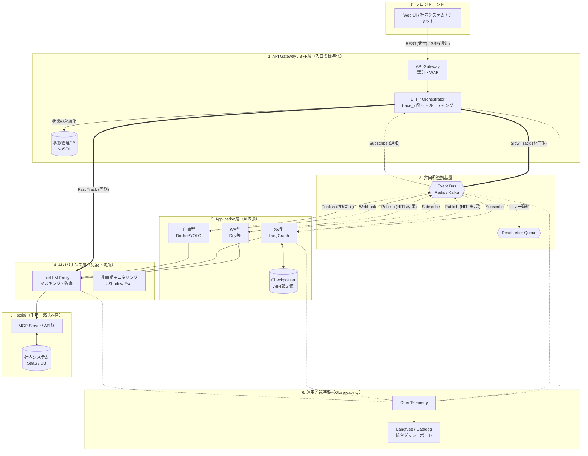

# AIエージェントの業務適用を見据えた生成AIアーキテクチャ検討

---

## 0. 前提

本書では、生成AIをエンタープライズの業務に安全かつ効果的に組み込むため、システム全体を以下の「3つの層」に分割して設計するアーキテクチャを採用しています。
ここで登場する各層の具体像は以下の前提資料で定義されていますが、本書を読み進める上での基本的な役割は以下の通りです。

### コア層
* **Application（アプリケーション）層：AIの「脳」**
* プロンプトやエージェント（WF型/自律型/SV型）を用いて、実際の業務ロジック、推論、タスクの進行管理（オーケストレーション）を担う層です。
* 詳細：[修正版_AIエージェントの業務適用を見据えた生成AIアプリケーション層の検討.md](./修正版_AIエージェントの業務適用を見据えた生成AIアプリケーション層の検討.md)

* **生成AI信頼性保証層：AIの「免疫・安全網」**
* LLMの通信やツール実行の間に介在し、個人情報（PII）のマスキング、ハルシネーション（虚偽出力）の検知、監査ログの記録など、全社的なガバナンスと統制を強制する層です。
* 詳細：[AIエージェントの業務適用を見据えた生成AI信頼性保障層の検討.md](./AIエージェントの業務適用を見据えた生成AI信頼性保障層の検討.md)
* ※本書では、表記の簡略化と、ITガバナンスにおける一般的な概念（Quality ガバナンス等）との親和性を考慮し、以降この層を「**AIガバナンス層**」と呼称します。

* **Tool（ツール）層：AIの「手足・感覚器官」**
* 社内DBやSaaS等とやり取りするためのステートレスなインターフェース（MCP等）を提供する層です。統合認証基盤（IdP）や各種ゲートウェイ（データ仮想化、ゼロトラストプロキシ等）と連携し、実行ユーザーの権限を引き継ぐとともに、AIに「データの意味（セマンティック）」を正しく提供する役割を持ちます。
* 詳細：[AIエージェントの業務適用を見据えた生成AIツール層の検討.md](./AIエージェントの業務適用を見据えた生成AIツール層の検討.md)

---

### 周辺層（実運用で必須の基盤）

上記の「3層（Application / AIガバナンス / Tool）」は生成AI機能の中核ですが、
実際に業務適用するには、さらに以下の周辺基盤が不可欠です。

* **APIゲートウェイ/BFF層（入口の標準化）**：認証・`trace_id` 発行・IDマッピング・非同期通知（SSE/WebSocket）
  * 詳細：[AIエージェントの業務適用を見据えたAPIゲートウェイBFF層の検討.md](./AIエージェントの業務適用を見据えたAPIゲートウェイBFF層の検討.md)

* **非同期連携基盤（Event Bus）**：長時間処理・非同期HITL・外部Webhook駆動を疎結合で実現（DLQ/リトライ含む）
  * 詳細：[AIエージェントの業務適用を見据えた非同期連携基盤（Event Bus）の検討.md](./AIエージェントの業務適用を見据えた非同期連携基盤（Event Bus）の検討.md)

* **運用/監視基盤（Observability）**：`trace_id` をキーに、止められる・追える・説明できる運用（評価/Eval含む）
  * 詳細：[AIエージェントの業務適用を見据えた運用監視基盤（Observability）の検討.md](./AIエージェントの業務適用を見据えた運用監視基盤（Observability）の検討.md)

---

## 1. 目的（本書が解く問題）

企業の多くの業務はシステム化・自動化されている一方、依然として以下が残っています。

* 人手による判断（例外判定、調整、合意形成）
* 人手による探索（調査、根拠収集、情報統合）
* 人手による整形・登録（文書整形、チケット起票、各システム登録）

本書の目的は、「なぜ、企業の多くの業務はシステム化されずに残っているのか？」と「それらの業務に生成AI技術を適用してシステム化することは可能か？」についての検討をまとめています。

---

## 2. なぜ、企業の多くの業務はシステム化されずに残っているのか？

従来のITシステム（RPAやSaaSなど）では対応できず、人手に頼らざるを得なかった背景には、大きく分けて**「4つの壁」**が存在します。

### ① 技術の壁（非定型データと曖昧性の限界）

従来のシステムは列や行が決まった「構造化データ」しか処理できず、フォーマットがバラバラな情報をシステムに登録するには、人間が「翻訳機」になる必要がありました。

* **【業務例】** 取引先ごとにフォーマットが違うPDF請求書や注文書のシステム手入力、顧客からの長文の問い合わせメールの読み解きと分類

### ② 投資の壁（ROIの限界）

複雑な条件分岐や例外処理が多い業務を、従来型のプログラミング（If-Thenルール）でシステム化しようとすると開発・保守コストが膨大になり、投資対効果が合いませんでした。

* **【業務例】** 毎週フォーマットが微修正される特定顧客向けの個別レポート作成、「数千万かけてシステム化するほどではない」と放置されている無数のロングテール業務

### ③ 統制の壁（ガバナンスと責任の限界）

最終的な「Go/No-Go」の判断や、間違えた際のリスクが極めて大きく、ルールベースの機械に全権を委譲（自動化）することが許されない領域です。

* **【業務例】** クレームに対する謝罪文のトーン＆マナーを含めた対応方針の決定、数億円規模の契約書のリーガルチェック

### ④ 暗黙知の壁（経験と文脈への依存）

マニュアル化できる「手順」よりも、ベテラン社員の頭の中にある「勘」「経験」「背景の理解」に強く依存しており、要件定義そのものが不可能な領域です。

* **【業務例】** 「このエラーログなら、あの顧客の特殊環境が原因だろう」という文脈を補った障害対応、数字には出ない市場の動きのアタリをつける調査

---

## 3. 生成AIアーキテクチャは、この4つの壁をどう突破するのか？

これらの課題に対し、生成AIの特性と**「Application層（WF型 / SV型 / 自律型）」「AIガバナンス層」「Tool層」**からなる新しい3層アーキテクチャを導入することで、これまで手付かずだった業務のシステム化を実現します。

**【大前提：3層アーキテクチャの常時連携】**
いかなる業務プロセスにおいても、特定の層だけが単独で動くことはありません。常に以下の3層が協調して稼働します。

* **Application層（脳）**：プロンプトやエージェント（WF/自律/SV）により、業務ロジックや推論を実行する。
* **Tool層（手足/感覚器官）**：システムとの入出力（MCP等）を担う。**自身は状態を持たず（ステートレス）、統合認証基盤やゲートウェイ製品（Denodo, Zscaler等）に権限判定や通信制御を委譲することで**、実行ユーザーの権限コンテキストを引き継いだ安全な認可コントロールと、ハルシネーションを防ぐための「データの意味（セマンティックレイヤー/カスタムインストラクション）」の提供を行います。
* **AIガバナンス層（免疫/安全網）**：すべてのLLM通信とツール実行の間に介在し、PIIの検知、監査ログの記録、システム権限の統制を常時行う。

### 対 ①技術の壁：非定型データの構造化

* **解決アプローチ:** 人間が行っていた「翻訳・転記作業」を生成AIの言語理解能力で代替します。
* **主役となる機能:** **Application層（WF型）の言語処理能力**
* **3層の連携:**
  * **Application層（WF型）**がクレンジングされたテキストを読み解き、後続のシステムが受け取れる構造化データ（JSON等）に変換します。
  * **Tool層**が、実行ユーザーのアクセス権限に基づき、利用可能なメールやPDF、チケット等の非定型データのみをシステムから安全に読み取ります。
  * **AIガバナンス層**がそのデータに含まれる個人情報（PII）や機微情報をLLMに渡る前に検知・マスキングします。
  

### 対 ②投資の壁：超低コストな開発と探索的業務の自律化

* **解決アプローチ:** 複雑な条件分岐は自然言語（プロンプト）で定義し、手順が予測不可能な調査・分析業務はAI自身に試行錯誤（探索）させることで、要件定義や実装のコストを極小化します。
* **主役となる機能:** **Application層（SV+自律型ワーカー）の探索能力 ＋ Tool層の汎用化**
* **3層の連携:**
  * **Application層**は、単純な処理はWF型で部品化して量産します。一方、手順化が不可能な領域については、「SV型の管理下で自律型ワーカー」に権限を絞ったツール（Read-Only等）を与え、自発的に試行錯誤を繰り返させます。
  * **Tool層**を標準化（MCP等）しておくことで、個別のAPI連携開発を不要にします。
  * **AIガバナンス層**は、自律型ワーカーが探索中に予期せぬ破壊的動作を行わないよう、実行権限を厳格に統制します。

### 対 ③統制の壁：HITL(Human In The Loop)による安全網と責任の明確化

* **解決アプローチ:** AIを「決定者」ではなく「起案者」とし、最終的な責任は人間が負うプロセスを標準化します。
* **主役となる機能:** **AIガバナンス層のガードレール ＋ Application層（SV型）のHITL**
* **3層の連携:**
  * **Application層（SV型）**が業務品質を評価し、最終承認のために処理を一時停止（永続化）して人間の判断を待ちます（非同期HITL）。
  * **Tool層**（更新・送信系ツール）は、これら「人間の承認」と「AIガバナンスのゲート」を両方パスした場合にのみ、外界への実行を許可されます。
  * **AIガバナンス層**は、人間が承認したとしても、送信前に「断言禁止ワード」や「ハルシネーション」がないかを機械的・最終的にブロックするSynchronous Gate（同期ゲート）として機能します。

### 対 ④暗黙知の壁：Copilot（副操縦士）による高度な分業

* **解決アプローチ:** 人間が暗黙知を発揮するための「手前の情報収集と整理」をAIに任せます。
* **主役となる機能:** **Application層（SV+専門ワーカー/自律型ワーカー）によるチームプレイ**
* **3層の連携:**
  * **Application層（SV型）**により、SVが専門ワーカーや自律型ワーカーを指揮して情報を高速収集し、矛盾点などを整理したレポート（引用付き）を作成します。
  * **Tool層**が、社内のナレッジベースに対してユーザーの権限範囲内でアクセスし、メタデータやカスタムインストラクションを通じてAIにデータの意味（コンテキスト）を提供します。
  * **AIガバナンス層**が、提示されたレポートの引用元（URLやバージョン）が正確に存在するかを検証し、虚偽の根拠（ハルシネーション）に基づく判断を人間が下してしまうのを防ぎます。人間は安全が担保されたレポートに自身の「暗黙知」を掛け合わせて意思決定します。

## 4. 生成AI基盤（AIレディ基盤）の全体アーキテクチャ像と設計原則

第3章で述べた「4つの壁」を突破し、エンタープライズの厳しい要件を満たしながら業務適用を進めるためには、コアとなる3層単体では不十分です。  
周辺基盤と結合した**「6層構造のAIレディ基盤」**として構成し、以下の設計・運用原則に従って稼働させます。

図解の前に、本アーキテクチャを構成する6つの層の役割を定義します。

* **1. API Gateway / BFF層（入口の標準化・交通整理）**
すべてのリクエストを受け付け、認証やルーティング（同期/非同期の振り分け）を行います。「状態管理DB」を独占してジョブの進捗を管理し、フロントエンドにリアルタイム通知（SSE）を届ける司令塔です。
* **2. 非同期連携基盤（Event Bus / 土管と待合室）**
Redis StreamsやKafkaを用い、処理時間が読めないAIジョブや人間の承認待ち（HITL）のメッセージを確実かつ疎結合にリレーする、システム全体の巨大な非同期ネットワークです。
* **3. Application層（AIの脳・指揮官）**
プロンプトやエージェント（WF型/SV型/自律型ワーカー）が稼働する中核です。業務ロジックの推論や、タスクの分解、ツールへの実行指示など、自律的な思考と進行管理（オーケストレーション）を担います。
* **4. AIガバナンス層（免疫・関所）**
Application層（脳）から外界へのすべての通信（LLM推論やツール実行）に強制的に介在し、個人情報のマスキング、監査ログの取得、ポリシー違反の遮断を行うセキュリティの要です。
* **5. Tool層（手足・感覚器官）**
社内システムや外部SaaSへのAPIアクセス（MCP等）を抽象化して提供します。自身は状態を持たず、アクセスしてきたユーザーの権限（コンテキスト）に従って安全にデータの読み書きを行います。
* **6. 運用監視基盤（Observability / 串刺しの眼）**
W3C準拠の `trace_id` をキーにして、上記1〜5のすべての層を横断的に監視します。「誰のジョブがどこで止まっているか」の追跡や、AIの回答精度の評価（Eval）、コスト管理を一元的に行います。

### 4.1 全体アーキテクチャ図（コンポーネント連携）

### 4.2 基盤を貫くアーキテクチャ設計原則

#### ① トラフィックの動的ルーティングと状態管理の分離（CQRS）

BFF層でリクエストを「Fast Track（同期）」と「Slow Track（非同期/Event Bus）」に振り分けます。また、UI表示用の「状態管理DB」とAI思考用の「Checkpointer」を完全に分離し、エージェントからの直接的なDB更新を禁じます。

#### ② 非同期連携とHITL（状態の永続化と介入）の標準化

エージェント処理をシステムに組み込む際の「処理時間の不確実性」と「人間の反応遅延」を回避するため、以下の非同期設計を徹底します。

* **長時間のジョブ化**：同期通信でLLMを待たず、即座にJob ID（受付票）を返してバックグラウンドで処理し、Event Bus経由で通知します。
* **Checkpointerによる一時停止**：人間の承認（HITL）が必要な操作の直前で処理をフリーズ（StateをDBへ保存）させ、システムリソースを解放して安全に待機します。
* **Tool層のステートレス化**：Tool層（MCP等）内部では絶対に人間を待つ処理を行わず、待ちの制御はすべてApplication層に集約します。

#### ③ `trace_id` による一気通貫のオブザーバビリティ

フロントエンドから非同期の待機、数日後のHITL再開に至るまで、すべての通信とペイロードに W3C準拠の `trace_id` を伝播させ、LangfuseやDatadog等で串刺し検索を可能にします。

### 4.3 業務適用のための運用・ガバナンス原則

アーキテクチャの安全性を実際の業務運用で担保するため、以下の原則を全ユースケースに強制適用します。

#### ① SV型とAIガバナンス層の不可分性（The Inseparability Principle）

SV型（推論・判断を伴うAIエージェント）を採用するすべてのプロセスにおいて、AIガバナンス層の適用は必須です。AIの非決定的な出力に対し、「監査ログ（追える）」「ガードレール（止める）」「非同期評価（採点する）」といった安全網を敷かずに本番稼働させてはなりません。

#### ② 段階的自律化（Progressive Autonomy）のロードマップ適用

どのような業務であっても、最初からAIに全権を委譲することはありません。すべてのプロセスは以下のロードマップに沿って運用し、AIガバナンス層での評価スコア（信頼性）をエビデンスとしてフェーズを移行させます。

* **導入期（検証〜安定稼働）**：すべてのプロセス間に人間による確認（Human-in-the-loop）を必須とします。自律型ワーカーの探索も、必ずSVの監視下・隔離環境でのみ許可します。
* **成熟期（自律化への移行）**：運用実績が積まれ、評価スコアが安定したプロセス（例：内部向けのサマリ作成等）から順次、人間の介入を事後確認（Human-on-the-loop）や自動化へと移行させます。※対外送信や本番DB更新系は、最も遅い段階までHITLを維持します。

#### ② 段階的自律化（Progressive Autonomy）のロードマップ適用

どのような業務であっても、最初からAIに全権を委譲することはありません。すべてのプロセスは以下のロードマップに沿って運用し、AIガバナンス層での評価スコア（信頼性）をエビデンスとしてフェーズを移行させます。

* **導入期（検証〜安定稼働）**：すべてのプロセス間に人間による確認（Human-in-the-loop）を必須とします。自律型ワーカーの探索も、必ずSVの監視下・隔離環境でのみ許可します。
* **成熟期（自律化への移行）**：運用実績が積まれ、評価スコアが安定したプロセス（例：内部向けのサマリ作成等）から順次、人間の介入を事後確認（Human-on-the-loop）や自動化へと移行させます。※対外送信や本番DB更新系は、最も遅い段階までHITLを維持します。

---

### 4.4 アーキテクチャを支える5つの実装方針

詳細なイベント設計（trace_id伝播、冪等性、リトライ/DLQ、イベント種別の標準化など）は、別紙：[AIエージェントの業務適用を見据えた非同期連携基盤（Event Bus）の検討.md](./AIエージェントの業務適用を見据えた非同期連携基盤（Event Bus）の検討.md)を参照してください。

エージェント処理をシステムに組み込む際の「処理時間の不確実性（タイムアウト）」と「人間の反応遅延」を回避し、全体を統制するために以下の設計を徹底します。

**対策1：長時間の処理（探索・合議）に対するジョブ化（受付票＋イベント通知）**
* Dify等の上位システムからLangGraph（SV層）を呼び出す際、同期通信（応答待ち）は行いません。LangGraphは即座にJob ID（受付票）を返し、処理をバックグラウンドで実行します。処理が完了次第、WebhookやEvent Bus経由のイベント通知によって上位のワークフローを再開させます。

**対策2：人間の承認（HITL）に対するCheckpointerの活用**
* 人間の承認は即時に行うことが可能な場合もあれば、熟慮や協議が必要な場合もあります。人間の判断に時間を要することも考慮し、承認が必要な操作（対外送信やシステム更新）の直前で、LangGraphの `interrupt` 機能を発火させます。
* これにより、Checkpointer（DB）に現在のメモリ・文脈（State）が丸ごと保存（フリーズ）され、システムリソースを占有することなく安全に待機します。
* 人間が承認UIでアクションを起こすと、保持していた `thread_id` をキーにStateが復元され、安全に後続の更新処理（TicketUpdateWF）が実行されます。

> **※アーキテクチャ上の重要注意点（状態管理の責務分離）**
> LangGraphのCheckpointer（AIの内部記憶）と、ユーザーUIに「進行中」「承認待ち」を表示するための「状態管理DB（NoSQL等）」は完全に分離します。状態管理DBへの書き込み権限はBFFが独占し、エージェント（Application層）はEvent Busへステータス変更の通知を投げるのみに留めます（密結合の排除）。

> **補足：高度自律型ワーカー（コーディングエージェント等）における非同期HITLの例外**
> システム開発やデータパイプライン構築などを担う高度な自律型ワーカーをDockerコンテナ等で稼働させる場合、細かなステップごとのHITL（Checkpointerによる一時停止）は開発者体験を著しく損ないます。
> この場合、隔離された安全なサンドボックス環境で確認をスキップする**YOLOモード（完全自律実行）**をデフォルトとし、HITLのタイミングを「プロセス途中」から**「最終成果物のレビュー（Pull Request / Merge Requestの承認）」**へと後方シフトさせるアーキテクチャを推奨します。

**対策3：Tool層（MCP）の完全ステートレス化**
* **Tool層内部では絶対に人間を待つ処理（HITL）や状態の永続化を行いません。** 人間を待つ役割はすべてApplication層（LangGraph）に集約し、Tool層はAIからの指示を受け取ったら、権限チェックののち即座に実行（または非同期ジョブの発行）のみを行います。

**対策4：APIゲートウェイ/BFF層によるトラフィックの動的ルーティング**
BFF層は単なる中継器ではなく、リクエストの性質に応じて経路を振り分けます（Fast Track / Slow Track）。
* **Fast Track（同期・Event Busバイパス）**：単純な一問一答や要約など、即時応答が可能で状態を持たない処理は、BFFから直接APIを叩き、SSEでフロントエンドへストリーミング応答します。
* **Slow Track（非同期・Event Bus経由）**：SV型の合議や自律型ワーカーの探索、HITLを伴う長時間の業務は、BFFが即座に「受付票（HTTP 202）」を返し、Event Busへ処理を委譲します。
 
**対策5：`trace_id` を主軸とした分散トレーシングと運用監視（Observability）**
非同期連携やHITLによって「時間」と「コンポーネント」が分断される本アーキテクチャにおいて、BFFの入口からApplication層、AIガバナンス層のガードレール判定、Event BusのDLQ（退避キュー）に至るまで、W3C準拠の `trace_id` をすべてのヘッダとペイロードに伝播させます。これにより、LangfuseやDatadog等の監視基盤上で、1つの業務トランザクションを串刺しで追跡・評価可能にします。

---

## 5. 業務への適用例（カスタマーサポート）

本章では **カスタマーサポート（CS）** を取り上げ、「どのプロセスを、どのレイヤー／型（WF/自律/SV）で支えるか」を具体化します。

### 5.1 適用シナリオとユーザーストーリー

複雑なログ調査や過去事例の紐解きを伴うテクニカルサポート業務を想定し、生成AI基盤がどのように業務をオーケストレーションするかを定義します。

**【連携する周辺システム（Tool層）の例】**

* Zendesk（顧客対応チケット管理）
* Redmine（開発・内部調査チケット管理）
* Growi / Confluence（社内ナレッジベース・過去事例）

#### ユーザーストーリー：データ仮想化サーバーの突然停止とログ調査

**【トリガー（事象）】**
顧客から、「データ仮想化サーバーのプロセスが突然停止した。再起動で現在は復旧しているが、再発防止のために原因を調査してほしい。事象発生時のサーバーログ（大容量）を添付する」という問い合わせとログファイルがZendeskに起票された。

**【As-Is（従来の課題：ベテランの勘と膨大な時間への依存）】**

1. CS管理者がZendeskから問い合わせ通知を受領。Zendeskチケットを確認後、緊急度や担当者の負荷状況を判断して、CS担当者を割り当てる（アサイン待ちのタイムロス発生）。
2. アサインされたCS担当者はZendeskチケットを確認し、Redmineに内部管理用の調査チケットを手動で起票する。
3. 大容量のログファイルをダウンロードし、テキストエディタでエラー箇所（ExceptionやFatalレベルのログ）を目視で検索する。
4. ログの中から「Out of Memory (OOM)」や「特定の重い結合クエリによるスレッド枯渇」らしき痕跡を見つけるが、確証が得られない。
5. 過去の類似チケットや社内Wiki（Growi）を複数のキーワードで検索し、似たような突然停止の事例と、その時の回避策（メモリチューニング設定やパッチ適用）を探し回る。
6. ログの該当箇所を抜粋し、過去事例を引用しながら、原因の仮説と推奨する設定変更の手順をまとめ、顧客への回答文を1〜2時間かけて作成する（ベテランでないと対応が難しい）。

**【To-Be（AIエージェント導入後：初動0分で解析とドラフト完了、人間は最終確認のみ）】**

1. **管理者を介さない瞬時のトリアージ**: 問い合わせが入ると即座にAI（WF型）が起動。Zendeskの内容から「緊急度：高」「カテゴリ：サーバー停止・ログ調査」と判定し、CS管理者のアサイン判断を待たずに、AI自身が調査担当として初動を開始する。
2. **無菌化と自動起票**: 添付されたログファイルからIPアドレス等のPIIをマスク（無菌化）した上で、Redmineに内部管理用の調査チケットを自動起票し、配下の調査用エージェント（SV型）を起動する。
3. **並列調査（ログ解析とナレッジ探索）**:
* **ログ解析ワーカー（自律型）**が、サンドボックス環境でPythonスクリプト等を駆使して大容量ログをパースし、停止時刻直前のスパイクや異常なスタックトレースを抽出。「特定の巨大クエリによるメモリ枯渇が原因の可能性が高い」という仮説を立てる。
* **ナレッジ探索ワーカー（自律型）**が、抽出されたエラーメッセージを元に社内ナレッジと過去チケットを自律的に検索し、推奨されるメモリ設定値（JVM引数等）のチューニング手順を特定する。

4. **総合SVによるドラフト作成**: 親玉であるSV（オーケストレーター）が、ログ解析結果（根拠となるログの抜粋）と、ナレッジ探索結果（チューニング手順）を統合し、技術的に正確かつ顧客に分かりやすい回答ドラフトを作成する。
5. **人間の承認（非同期HITL）**: CS担当者がアサインされて画面を開いた時点では、すでに「ログの異常箇所のハイライト」「原因の仮説」「回答文ドラフト」が完了し承認待ちになっている。担当者は自身の暗黙知と照らし合わせて内容の妥当性を確認し、「承認（Approve）」ボタンを押すだけで、顧客への送信とZendesk/Redmine双方のチケットクローズが完了する。

---

### 5.2 「未システム化だった理由」×「生成AIでの型」整理（サマリ）

前項の「To-Be」で描いた5つのプロセスが、なぜ従来のITシステム（RPAやIf-Thenのプログラム）では自動化できず、生成AIアーキテクチャによってどう突破されるのかを整理します。

| To-Beの業務プロセス | 従来システム化が難しかった主因（4つの壁） | 生成AIでの推奨型 | 主担当層と役割（補足） |
| --- | --- | --- | --- |
| **1〜2. 瞬時のトリアージ・無菌化・自動起票** | **暗黙知の壁**（管理者のアサイン勘）  **技術の壁**（非定型な文章の解釈） | **WF ＋ SV**  （定型処理＋判断） | **Application (WF/SV)** ＋  **AIガバナンス**（PIIマスキング） |
| **3. 並列調査**  （ログ解析とナレッジ探索） | **暗黙知の壁**（ベテランの検索スキルや勘）  **投資の壁**（多様なログ解析の試行錯誤） | **SV**  （配下に自律型ワーカー） | **Application (SV/自律型)** ＋  **Tool**（Read-Only検索） ＋  **AIガバナンス**（サンドボックス統制） |
| **4. 総合SVによるドラフト作成** | **技術の壁**（複雑な事象の自然言語化と要約） | **SV**  （情報の統合と起案） | **Application (SV)** ＋  **AIガバナンス**（ハルシネーションチェック） |
| **5. 人間の承認（HITL）とチケットクローズ** | **統制の壁**（対外送信の責任判断、誤更新のリスク） | **WF ＋ 非同期HITL**  （待機と確定的実行） | **Application (WF)** ＋  **Tool**（Write権限での更新） ＋  **AIガバナンス**（最終ゲート/監査ログ） |

---

### 5.3 アプリケーション構成とフローの詳細化（CS：Case Workflow中心）

前項のストーリーを実現するため、システム内部では「チケットの状態遷移（Case Workflow）」を主軸とし、定型的な処理は**WF（ワークフロー型）**、非定型な調査・起案は**SV（スーパーバイザー型）**に委譲する構成をとります。

#### 5.3.1 全体のワークフロー（Case Workflowの状態遷移）

ZendeskのチケットID（`case_id`）と、発行した `trace_id` を紐付けて、以下の状態遷移（State）を管理します。

* `RECEIVED`（Zendesk起票）
* `TRIAGED`（AIによるトリアージ完了、Redmine自動起票完了）
* `INVESTIGATING`（ログ解析＋ナレッジ探索の並列実行中）
* `DRAFT_READY`（回答ドラフト生成完了、コンプライアンスチェック済）
* **`WAITING_APPROVAL`（非同期HITL待ち：StateをDBに永続化し、人間のアサインと承認を待機）**
* `CLOSED`（人間が承認。顧客へ回答送信、Zendesk/Redmine双方をクローズ）

#### 5.3.2 定型業務を担うWF（機能要素とツール）

AIの自律的な探索が不要な「一本道の定型処理」をWF型として切り出し、処理の高速化・確実性の向上・LLMコストの削減を図ります。

* **(A) `IntakeWF`（受付・トリアージ・起票）**:
* **役割**: 顧客からの問い合わせ内容とログを無菌化し、緊急度を判定。管理者を待たずに調査用のRedmineチケットを起票します。
* **利用ツール**: `zendesk.read_ticket`, `pii.detect_and_mask` (Read-Only), `redmine.create_ticket` (Write)

* **(B) `TicketUpdateWF`（登録/更新）**:
* **役割**: **人間の承認（HITL）直後にのみ実行される外界への操作です。** 顧客へ回答を送信し、関連するすべてのチケットをクローズします。
* **利用ツール**: `zendesk.reply_and_close`, `redmine.update_status` (Write / Send)

#### 5.3.3 非定型業務を構成するSV（参加AIエージェント／ツール）

ログの解析や過去事例の探索など、手順が予測不可能なタスクはSV型（LangGraph等）に委譲し、自律型ワーカーに試行錯誤（探索）させます。

**【実装例1】 `InvestigationSV`（オーケストレーション型：並列調査）**

* **`TechPlanner`（SV役）**: トリアージ結果を受け取り、調査方針を立案して以下のワーカーへ並列指示を出します。
* **`LogAnalyzer`（自律型ワーカー）**: 添付された大容量ログを対象に、隔離されたサンドボックス環境でPythonコードを動的に生成・実行し、Out of Memoryなどのエラースパイクを特定します。
* **`KnowledgeRetriever`（自律型ワーカー）**: `LogAnalyzer` が見つけたエラー文言をクエリに変換し、解決策（チューニング手順など）が見つかるまで社内Wikiや過去のRedmineチケットを探索します（ReActパターン）。**ツール権限：Read-Only**

**【実装例2】 `ResolutionManagerSV`（階層型：回答ドラフト作成と自己レビュー）**

* **親SV（MainResolutionSV）**: 上記の並列調査結果（ログの根拠＋Wikiの解決手順）を統合し、ドラフト作成プロセスへ回します。
* **起案ワーカー（子SV）**: 顧客向けの分かりやすい言葉で、原因の仮説と回避策（引用URL付き）のドラフトを作成します。
* **コンプライアンスチーム（子SV）**: AIガバナンス層のポリシー検証ツールを用いて「推測を断言していないか」「SLA違反を勝手に認めていないか」をレビューし、問題があれば起案ワーカーへ差し戻し（自己修正）要求を行います。

---

