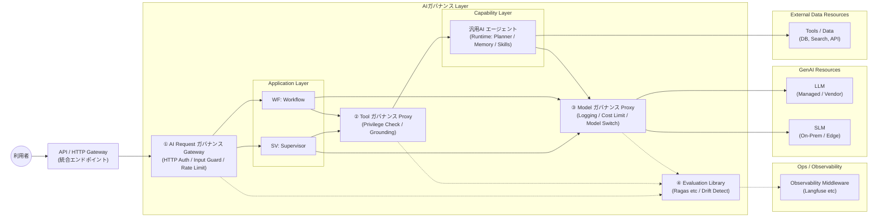

# AIエージェントの業務適用を見据えた生成AI信頼性保証層アーキテクチャ(AIガバナンス Architecture)の提言

## 【Part 1: Why & What】 背景と解決策の定義

### Slide 1. 背景：セキュリティ・パラダイムの変化

従来のシステムセキュリティは「通信経路」や「ID」を制御するものでしたが、生成AIの登場により、
**「意味論（セマンティクス）の制御」**という新たな防御領域が出現しました。

* **従来のセキュリティ（NW・ID・暗号化）**
* **NWアクセス制御 (FW/SG):** 正しいIP/ポートからの通信か？
* **認証・認可 (IAM):** 正しい権限を持つユーザーか？
* **限界:** 通信経路が正規であれば、その中身が「業務命令」であろうと「機密情報の持ち出し命令（プロンプトインジェクション）」であろうと、**ネットワーク層はすべて「正常な通信」として通してしまう。**


* **生成AI時代のセキュリティ（意味論・確率論）**
* **入力の意味理解:** 正規ユーザーからの通信だが、**AIへの攻撃（脱獄）**を含んでいないか？
* **出力の事実確認:** 回答データの中に、**嘘（ハルシネーション）やバイアス**が含まれていないか？
* **振る舞いの統制:** エージェントが自律的に**不適切なツール操作**を行っていないか？

---

### Slide 2. 生成AI活用における「新たな脅威」

生成AIを業務システム（特にエージェント型）に適用する際、以下の脅威が顕在化します。
これらは確率的に発生するため、従来の決定論的なプログラム制御では対処できません。

| 領域 | 具体的な脅威 | リスクの内容 |
| --- | --- | --- |
| **入力** | **プロンプトインジェクション / 脱獄** | ガードレールを迂回し、AIに不適切な挙動をさせる攻撃。 |
| **出力** | **ハルシネーション（幻覚）** | もっともらしい嘘をつき、誤った意思決定を誘発する。 |
| **出力** | **PII（個人情報）漏洩** | 学習データやコンテキストに含まれる機微情報を吐き出す。 |
| **実行** | **エージェントの暴走 / 権限昇格** | 自律エージェントがループに陥ったり、許可外のDB更新を行う。 |
| **品質** | **サイレントな性能劣化 (Drift)** | モデル更新やデータ追加により、回答精度が徐々に低下する。 |

---

### Slide 3. 脅威に対抗するための「4つの必須機能」

上記の脅威を防ぎ、企業が説明責任（Accountability）を果たすためには、以下の4機能を持つ防御機構が必要です。

1. **Guardrails（防御・統制・即時判定）**
* **役割:** 入出力およびツール実行をリアルタイムで監視し、悪意あるリクエストや危険な挙動を**即時に遮断・無害化**する。

2. **Citation & Grounding（根拠性・証明）**
* **役割:** 回答が事実に基づいていることを、**「出典メタデータ」と「検証スコア」で証明**する。

3. **Audit & Trace（監査・追跡）**
* **役割:** 事故発生時に、「指示ミス」「データ不備」「AIの暴走」のいずれが原因かを**完全追跡（Traceability）**可能にする。

4. **Evaluation（評価・測定）**
* **役割:** 運用中の全ログを継続的にモニタリングし、**品質劣化（Drift）を検知**してモデル改善に繋げる。

---

### Slide 4. 既存ソリューションの現状と課題（The Gap）

世の中には、これら個別の機能を提供する優れたソフトウェア（OSS/SaaS）は既に存在します。

* **防御:** AWS Bedrock Guardrails, NVIDIA NeMo Guardrails
* **評価:** Ragas, DeepEval, Langfuse
* **根拠:** LangChain, LlamaIndex, Google Vertex AI Grounding, **Semantic Layer（出典メタデータを返すデータアクセス層）**

※補足：**GroundingにSemantic Layerは使える**（むしろエンタープライズでは重要）

Semantic Layer（例：GraphQL/データプロダクト/セマンティックAPI）を挟むことで、
「回答に必要なデータ」だけでなく、**出典ID・版・アクセス区分・責任者**などのメタデータを標準形式で返せるため、Citation/Groundingの品質を上げやすい。
一方で、Groundingは単なる“検索”ではなく、
**(1) 出典メタデータの付与 → (2) 出典と主張の整合性検証 → (3) ログと証跡の欠損検知**まで含むため、Semantic Layer“だけ”では完結しない（統制点が必要）。

**本アーキテクチャの必要性（解決すべき課題）**
しかし、これらは「点」のソリューションです。これらをバラバラに導入すると、以下の問題が発生します。

1. **サイロ化:** 業務アプリごとに安全基準がバラつき、全社ガバナンスが効かない。
2. **実装負荷:** アプリケーション開発者が個別にガードレールを実装するため、生産性が低下する。
3. **統合不全:** 「評価スコアが悪ければ止める（Eval → Guard）」といった連携が取れない。

**結論:**
「ツールはあるが、それらを統合的にまとめ、**生成AI特有の脅威からシステム全体を守るアーキテクチャ（AIガバナンスレイヤー）**」が未確立である。

**補足（提言としてのポイント）**
個別ツールの機能差以上に、エンタープライズで問題になりやすいのは、
**(a) ポリシー変更の承認・回帰・ロールバック**、
**(b) 監査ログの必須項目・欠損検知**、
**(c) 事故時の封じ込め手順（Kill Switch）**
に加えて、GroundingにSemantic Layerを含める場合は、
**(d) 出典メタデータ整備の運用（オーナー/版管理/棚卸し/変更統制）**
といった **運用モデル（Operating Model）が標準化されていない**点である。

---

### Slide 4（補足）. API保護（Azure Application Gateway + API Management）との対比

本アーキテクチャは、API向けに一般的な **「L7 Gateway（入口統合）＋API Management（ポリシー強制）」** の考え方を踏襲しつつ、
生成AI特有の脅威に対応する **「意味論（セマンティクス）と確率論」** の統制を +α として追加したものです。

従来APIの世界では、Azure Application Gateway / APIM といった製品の組み合わせにより、
「経路・ID・ルール」を中心とした統合的な保護を比較的“既製品”として実現できます。
一方、生成AIでは「入力の意図」「出力の妥当性」「ツール実行の正当性」など意味論的な統制が中核となり、
現時点では **単一製品（あるいは標準的な組み合わせ）でE2Eに統合的保護を完結できる有力解が見つけづらい**のが実態です。

そのため、下表のように **“未対応（従来API製品だけではカバーできない）”の行を、点ソリューション（Guardrails/Eval/Tracing等）で埋める**必要があり、
この統合を成立させるための統制点（Control Point）が求められます。

| 観点 | 種別 | 生成AI（ガバナンスレイヤーでの +α） | 生成AIの候補（点ソリューション例） | 従来API（Azure Application Gateway / APIM） | 対応製品（従来API） |
| --- | --- | --- | --- | --- | --- |
| 入口統合点 | 決定論（L7） | API/HTTP Gatewayは維持しつつ、直下でHTTP内容（自然言語）を検査 | （入口は従来製品で代替しやすい） | Application GatewayでTLS終端・WAF・L7ルーティング | Application Gateway / APIM |
| 認証・認可 | 決定論（ID/Policy） | 同等の認証/認可に加えて、プロンプトの意図/逸脱を検出し、リスクに応じて拒否/HITL | AWS Bedrock Guardrails / NeMo Guardrails（補助） | APIMでJWT検証、サブスクリプションキー、IP制限 | APIM |
| 入力バリデーション（形式/制約） | 決定論（Schema/Size） | スキーマ/サイズ/レート制限に加えて、攻撃パターン兆候を検知 | AWS Bedrock Guardrails / ルールベース検知 | スキーマ/サイズ/レート制限、WAFルール | Application Gateway / APIM |
| 入力バリデーション（意図/意味） | 意味論（自然言語） | プロンプトインジェクション/脱獄、機微情報要求を文脈込みで判定（確率的） | AWS Bedrock Guardrails / NeMo Guardrails / LLM判定 | 形式検査では検出困難（語彙・文脈依存） | 未対応 |
| 出力制御（PII/禁則） | 決定論（Rule/Regex） | 不適切出力（PII/暴言等）のマスキング、必要に応じて拒否 | AWS Bedrock Guardrails（マスク/拒否） 等 | 従来APIでは想定外（出力はアプリが生成） | 未対応 |
| 出力制御（妥当性/事実性） | 意味論（検証/評価） | 根拠付き（Citation）、矛盾検知、Faithfulness評価（必要なら再試行/HITL） | Ragas / DeepEval（評価）、**Semantic Layer（出典メタデータ/アクセス区分）**、RAG基盤（引用） | 従来APIでは不要/対象外（決定論的レスポンス） | 未対応 |
| バックエンド保護（接続先/経路） | 決定論（Routing） | 生成AIでも同様に、呼び出し先制御・タイムアウト・リトライ等を適用 | （従来製品で代替しやすい） | APIMのポリシーで呼び出し先制御、リトライ等 | APIM |
| バックエンド保護（ツール実行の権限/根拠） | 意味論（実行統制） | ツール実行（DB/API）をインターセプトし、権限・ReadOnly・出典付与を強制 | Tool Proxy（自前/共通化）、OPA等のポリシー、**Semantic Layer（データ分類/権限のメタデータ供給）** | 従来APIでは「エージェントが勝手にツールを選ぶ」前提がない | 未対応 |
| 上流依存/コスト | 決定論（Quota） | トークン/予算、モデル切替、キャッシュ、完全トレーシングを一元化 | LiteLLM（モデルプロキシ）等 | スロットリング、キャッシュでAPIコスト抑制 | APIM |
| 監査・運用 | 横断（Observability） | 入口/ツール/モデルの全ログを相関IDで束ね、評価で劣化（Drift）を継続監視 | Langfuse（Tracing/Eval）/ OpenTelemetry | AppInsights等でログ/メトリクス | Application Gateway / APIM |

**まとめ:** 従来APIは「経路・ID・ルール」を中心に統合製品（群）で守れていたのに対し、生成AIでは「意味論＋ツール実行」の統制が中核となる。
その結果、点ソリューションの組み合わせが必要になり、**統合・強制・監査を成立させるための統制点（ガバナンスレイヤー）が必須**になる。

---

### Slide 4（対応案）. 課題に対する打ち手（選択肢とロードマップ）

本スライドでは、Slide 4で述べた「生成AI保護の統合不全」という課題に対し、現実的な打ち手を3つの選択肢として提示する。
（※選択肢は排他的ではなく、段階的に併用・移行する。）

1. **統合製品/ソリューションの探索（Buy/Partner）**
* 生成AI向けの統合的保護（Guardrail + Tool control + Audit + Eval）を提供する製品/ソリューションを継続探索。
* 有力候補が見つかった場合、**代理店契約/マネージド提供**を含め、短期導入の選択肢を確保する。

2-1. **既存製品の組み合わせの検討（Best-of-breed Integration）**
* Guardrails / Tracing / Eval / Model proxy など既存の点ソリューションを組み合わせ、リファレンス構成を確立。
* この組み合わせと運用（ポリシー変更、回帰、監査ログ設計）を、**自社ノウハウとしてサービス化**する。

2-2. **組み合わせ＋統一アーキの実現（Build Platform → Productize）**
* 既存製品を組み合わせつつ、統制点（Control Point）を中核とする**統一的なアーキテクチャ**を設計・実装し、横展開可能な基盤へ昇華する。
* 中長期的には、運用モデル（Operating Model）も含めて**製品/ソリューション化**を図る。

**各案の収益モデル（例）**

| 案 | 提供形態 | 主な収益源（初期） | 主な収益源（継続） | 価格指標（例） |
| --- | --- | --- | --- | --- |
| 1. 統合製品/ソリューションの探索（Buy/Partner） | リセール / 代理店 / マネージド提供 | 導入支援（要件定義・設計・接続） / PoC / 移行 | サブスク再販マージン / 運用代行（監査・評価・ポリシー運用） | 利用量（トークン/リクエスト） + 対象業務数 + 運用SLA |
| 2-1. 既存製品の組み合わせの検討（Best-of-breed Integration） | SI（リファレンス構築）+ テンプレート化 | アーキ設計・実装（統合） / 標準テンプレ（Helm/ポリシー）導入 | 運用保守（ポリシー更新・回帰・監査） / 継続改善（評価指標拡張） | 対象アプリ数 + 連携先（LLM/Tool）数 + 監査要件レベル |
| 2-2. 組み合わせ＋統一アーキの実現（Build Platform → Productize） | 自社基盤（プラットフォーム）提供（SaaS / 専用テナント / BYOC（顧客環境デプロイ）） | 基盤初期構築（導入プロジェクト） / 顧客環境導入（BYOC）/ テナント立上げ | 基盤利用料（Platform Fee）/ Managed SaaS / モジュール課金（Guard/Eval/Tracing等） | テナント/環境数 + 利用量 + 有効化モジュール数 |

---

### （Section Title）AIガバナンスレイヤー：統一アーキテクチャの提案

ここから先は、対応案のうち **2-2「組み合わせ＋統一アーキの実現」**を具体化する。
すなわち、生成AIアプリケーションを横断で守るための「統制点（Control Point）」を **AIガバナンスレイヤー**として定義し、
参照アーキテクチャ（プロキシ分割）と、実装・運用のロードマップへ落とし込む。

---

### Slide 5. 解決策：AIガバナンスレイヤーの定義

我々が提案するのは、個別の防御ツールを統合し、生成AIアプリケーションを「包み込む（Wrap）」ことで信頼性を担保する、新たな中間層アーキテクチャです。

**定義 (Definition)**
**AIガバナンス Layer（AI信頼性保証層）**とは、
生成AIアプリケーション（WF/SV）の**すべての入出力・外部実行・思考プロセスに介入（Intercept）**し、
企業のセキュリティポリシーと品質基準を**強制的に適用（Enforce）**するミドルウェア基盤である。

**設計思想：3方向防御（3-way Protection）**
アプリケーションを「信頼できない領域（Untrusted Zone）」と定義し、その周囲を3つのプロキシで囲い込む。

1. **対ユーザー (North):** 入力攻撃と情報漏洩を防ぐ。
2. **対データ (South):** 権限逸脱とデータの破壊を防ぐ。
3. **対モデル (East):** 無限ループ（コスト）とブラックボックス化を防ぐ。

---

### Slide 6. システム構成図（リファレンス・アーキテクチャ）

アプリケーション層（SV/WF）は、ガバナンスレイヤーによって**「完全包囲」**され、外部との直接通信経路を持たない。



※注：Application Layer 側に **AIエージェント（業務固有）** を配置する構成も可。
ただしその場合も、外部データ／ツール（External Data Resources）へのアクセスは **② Tool ガバナンス Proxy** を必ず経由する（直結しない）。

---

### Slide 7. 各プロキシの役割分担（機能マトリクス）

3つのゲートウェイ/プロキシは、それぞれ異なる種類の脅威に対処する。

| コンポーネント | 配置 | 主な防御対象 (Threats) | 実装機能 (Functions) |
| --- | --- | --- | --- |
| **① AI Request ガバナンス Gateway** | **入口**<br />(対User) | **悪意ある入力**<br />プロンプトインジェクション、DoS<br />**不適切な出力**<br />PII漏洩、暴言 | ・HTTP認証/認可（既存API/HTTP GWと連携）<br />・Input Guardrail（HTTP内容検査）<br />・Output Masking<br />・Risk-Adaptive HITL |
| **② Tool ガバナンス Proxy** | **出口**<br />(対Data) | **権限逸脱・破壊**<br />許可外データの参照、誤った更新<br />**ハルシネーション**<br />根拠のないデータの捏造 | ・SQL/API インターセプト<br />・Read-Only強制<br />・Citation（出典）付与<br />・Grounding検証 |
| **③ Model ガバナンス Proxy** | **核心**<br />(対LLM) | **コスト爆発・依存**<br />無限ループ、ベンダーロックイン<br />**ブラックボックス化**<br />思考プロセスの記録漏れ | ・モデル集約/ルーティング（LiteLLM Proxy）<br />・トークン制限 / 予算管理（業務/テナント単位）<br />・監査ログ必須項目の強制（Tracing）<br />・キャッシュ |

---

## 【Part 2: Why Proxy?】 アーキテクチャの必然性

### Slide 8. なぜ「プロキシ」が必要なのか？（構造的課題）

「アプリで個別に実装すれば良いのでは？」という問いに対し、エンタープライズシステムにおける構造的な必然性を提示する。

**結論（いまプロキシが必要な理由）**

従来APIの世界では、Azure Application Gateway / APIM のような製品が **「経路・ID・ルール」** を決定論的に強制できるため、入口の標準ガードとして機能してきた。
一方、生成AIで問題になるのは **「入力の意図」「出力の妥当性」「ツール実行の正当性」** といった意味論（セマンティクス）の領域である。
この領域に対するクラウド/OSS/商用のガードレール製品は既に存在するものの、現時点では次の理由により、
**“製品単体で、組織横断の説明責任まで含めて強制できる標準形” は確立していない**。

* **検知が確率的（FP/FN）**で、業務要件に対し「なぜ止めた/通したか」を一貫して説明しづらい
* **入力→参照（RAG）→ツール実行→出力**までのE2E統制（相関ログ・権限・根拠・評価）が、単一製品で完結しにくい
* 攻撃がコンテキスト依存（prompt/indirect injection等）で、**静的ルールだけでは陳腐化が早い**

したがって「今すぐ業務適用したい」現場に対しては、製品選定以前に、まず **統制点（Control Point）をアーキテクチャとして確保**し、
そこにポリシー適用・ログ取得・評価を一元化して載せていく必要がある。

将来的にAPIM等が進化し、意味論ガードが標準機能としてオフロード可能になる可能性はある。
しかし「今すぐ業務適用したい」現場に対しては、統制点（Control Point）としてのプロキシを実装し、ポリシー適用・ログ取得・評価を一元化する以外に現実的な選択肢がない。

**プロキシ不在時の「スパゲッティ化」問題 (O(n×m) Problem)**

* **ガバナンスの分散:** 人事アプリはAzure、CSアプリはAWS…とセキュリティ基準がバラバラになり、全社統制が効かない。
* **ベンダーロックイン:** アプリ内に特定のモデル（OpenAI等）のコードが埋め込まれ、より高性能・安価なモデルへの切り替え時に改修コストが発生する。
* **ログの散逸:** 誰がどのAIをどう使っているか、統合的に監視できない。

### Slide 9. プロキシ導入による解決 (O(n+m) Solution)

ガバナンス Proxyを「ハブ」として配置することで、複雑性を解消し、持続可能な基盤とする。

1. **抽象化 (Abstraction):**
* アプリはプロキシと話すだけ。裏側のモデルがGPT-4からClaude 3.5に変わっても、アプリ改修は不要。


2. **一元強制 (Centralized Enforcement):**
* 「全社共通の禁止用語」や「PIIマスキング」をプロキシで一括適用。開発者のスキルに依存しない安全性を担保。


3. **完全な可観測性 (Unified Observability):**
* すべての入出力・思考ログを一箇所（Langfuse等）に集約し、監査可能にする。

---

## 【Part 3: Implementation】 実装方式とロードマップ

### Slide 10. 実装アーキテクチャ：Kubernetesサイドカー構成

アプリケーション（WF/SV）とガバナンス Proxyを**同一Pod内のサイドカー**として配置し、ネットワークポリシーで「脱出不能なサンドボックス」を形成する。

* **物理的な強制力 (Physical Enforcement):**
* **Network Policy:** アプリコンテナから外部への直接通信を遮断（Deny All）。
* **Localhost Binding:** アプリは必ず隣のProxy (`localhost`) を経由しないと外部（LLM/DB）と通信できない。


* **OSS選定 (Best of Breed):**
* **Control:** LiteLLM (Multi-Model Proxy)
* **Guard:** NVIDIA NeMo Guardrails (Dialog Control)
* **Eval/Log:** Ragas + Langfuse (Audit & Evaluation)


### Slide 11. 構築ロードマップ (3 Phase Approach)

セキュリティと機能を段階的に拡張する。

1. **Phase 1: Foundation (基盤構築)**
* **目標:** 「見えない・止められない」恐怖の排除。
* **実装:** k8sサイドカー構成、LiteLLMによるモデル集約、Langfuseによるログ完全取得。


2. **Phase 2: Logic & Grounding (業務適用)**
* **目標:** 業務データの安全な連携。
* **実装:** Ragasによるハルシネーション検知、Semantic Layerによるデータ出典付与。


3. **Phase 3: Operations (運用・継続改善)**
* **目標:** 人間とAIの協働。
* **実装:** スコア低下時のHITL（人間介入）フロー、品質劣化（Drift）の自動検知アラート。


### Slide 12. 結論：SIerとしての提供価値

本提案は、単なるツールの導入ではなく、**「AIガバナンスをコード化（Policy as Code）し、インフラレベルで強制するアーキテクチャ」**の提供である。

* **安全性:** 3方向プロキシによる完全包囲。
* **拡張性:** OSS採用によるベンダーロックイン回避。
* **信頼性:** 出典提示（Citation）＋自動評価（Faithfulness等）により、検証可能性（Verifiability）を担保。

これにより、貴社のAI活用を「実験」から「実業務」へと昇華させる。


ご提示いただいた懸念点（「将来の製品で代替可能では？」「ボトルネックになるのでは？」）は、システムアーキテクチャ提案において非常に鋭く、かつ必ず聞かれるポイントです。

これらに対し、**「プロキシを置くこと自体が『将来の製品への移行』をスムーズにするための投資である」** という逆転のロジックで回答するスライド構成案を作成しました。

Slide 8, 9 に続く形で、**Slide 10, 11** として追加・統合してください。

---

## Slide 10. 将来の変化に備える「資産としてのインターフェース」

「優れた製品が出てきたら、このプロキシは無駄になるのではないか？」という懸念に対する回答。
プロキシは「実装」ではなく**「制御点（Control Point）」**として維持することで、将来の製品導入をむしろ加速させる。

### 1. インターフェースと実装の分離 (Separation of Concerns)

* **現状 (Day 1):** プロキシ内部で「OSSの自前ロジック（Python）」を動かし、セキュリティを担保する。
* **将来 (Day 2):** 優れたSaaS（例: AWSの新型ガードレール）が登場した場合、プロキシは**「自前ロジックを捨て、そのSaaSへリクエストを転送するだけ」**の役割に切り替える。

### 2. ストラングラー・パターンによる漸進的移行

* アプリケーション側は「プロキシ」とだけ通信していれば良いため、裏側でガードレール製品を入れ替えても、**アプリ側のコード修正は一切発生しない**。
* これにより、ベンダーロックインを回避しつつ、常に最新・最高の技術コンポーネントを即座に取り込める体制を維持できる。

**Speaker notes**

* 「作る」と言っても、巨大なモノリスを作るわけではありません。**「将来、より良い製品が出てきたときに、アプリを改修せずにその製品へ乗り換えるための『アダプター』」**を今のうちに挟んでおく、という戦略です。

---

## Slide 11. 「邪魔にならない」パススルー・アーキテクチャ

「プロキシがボトルネックや障害点になるのではないか？」という懸念に対する回答。
プロキシは機能単位でON/OFFが可能であり、不要な場合は**土管（Pass-through）**として振る舞う設計とする。

### 1. 機能のモジュール化とバイパス (Feature Toggling)

* プロキシ内の各機能（PII検知、ハルシネーションチェック等）は独立したモジュールとして実装される。
* 業務要件やパフォーマンス要件に応じて、**「特定の機能だけをOFF（パススルー）」**にする設定が可能。
* *例: 「社内Q&AなのでPIIチェックはスキップし、ログだけ取る」*


### 2. 最小限のオーバーヘッド (Low Latency Design)

* 全機能をOFFにした場合、プロキシは単なる「リクエストの中継とログ記録」のみを行うため、オーバーヘッドはミリ秒単位に収まる。
* したがって、将来的にOSレベルでセキュリティが担保される時代が来ても、**「監査ログ収集ポイント」**としての価値は残り続け、システムの邪魔にはならない。

**Speaker notes**

* 「要らなくなったら捨てられる」ように作ります。しかし、実際には「誰がいつ使ったか（監査ログ）」のニーズはなくならないため、**「透明な土管」**として残り続け、ガバナンスの最後の砦として機能します。


---

## Slide 11A. 評価と停止のモード設計（Risk-based ガバナンス）

生成AIの品質評価は「測る」だけでなく「いつ止めるか（止められるか）」が本質である。

1. **Synchronous Gate（応答前に停止）**
* 対外回答、法務表現、個人情報を扱う業務など。
* 応答を返す前に、PII/禁則/根拠整合性などの判定で **拒否・マスク・HITL** に分岐する。

2. **Async Monitor（応答後に監視）**
* 社内検索、草案生成など（誤りが修正可能）向け。
* 返答後にRagas等で採点し、低スコア時はアラート、改善学習、次回のポリシー更新に繋げる。

3. **Shadow Eval（影評価）**
* 本番影響なしで、モデル/プロンプト/ナレッジ更新の回帰評価に使う。
* 「変更が常態化する」生成AIの運用において、意思決定の証跡（Evidence）になる。

---

## Slide 11B. 事故を前提にした“封じ込め可能性”の設計

生成AIは誤りをゼロにできないため、事故時に **止められる／追える／戻せる** ことが重要となる。
ガバナンスレイヤーにより以下を標準化する。

* **Kill Switch（封じ込め）**：特定モデル／特定ツール／特定業務の一括停止（即時の被害拡大防止）
* **相関IDでの追跡（フォレンジック）**：入力→参照→ツール→出力→ポリシー判定→評価結果を一気通貫で追跡
* **ポリシー変更の統制（再発防止）**：承認・回帰テスト・ロールバックを **Policy as Code + CI** として運用可能にする

---

### 全体ストーリーの補強（Slide 8, 9との接続）

このロジックを入れることで、以下のようなストーリー展開になります。

1. **Slide 8 (課題):** 直結するとスパゲッティ化して管理不能になる。
2. **Slide 9 (解決):** プロキシを置いて整理（O(n+m)化）しよう。
3. **Slide 10 (未来):** 「将来もっといい製品が出る」からこそ、今プロキシが必要だ。（乗り換え用のアダプタとして）
4. **Slide 11 (性能):** 「重くなる」心配はない。要らない機能はOFFにして素通りさせればいい。

### 補足
ガバナンスレイヤーの「具体的な実装」にフォーカスし、コードレベルや設定ファイルレベルに近い解像度で解説します。

全体像としては、**「既存のOSS部品（LiteLLM, NeMo, Langfuse）をPython製の軽量プロキシ（FastAPI等）で接着剤のように繋ぎ合わせる」**のが、最も現実的で拡張性の高い実装です。

以下に、3つの主要コンポーネントの実装イメージを提示します。

---

### 1. AI Request ガバナンス Gateway（入口：既存API/HTTP Gateway直下のAI検査点）

既存のAPI/HTTP Gateway（Kong, Nginx, AWS APIGW など）は**「統合エンドポイント（入口）」**としてそのまま維持します。
その直下に、生成AI向けの **「HTTP内容検査・統制（Input/Output Guard）」** を担うコンポーネント（AI Request ガバナンス Gateway）を置き、Webアプリ（MCP含む）へ渡す前にリクエスト/レスポンスをチェックします。

* **役割:** 既存のAPI/HTTP Gatewayと連携して認証（OIDC）・レート制限を適用しつつ、**HTTP内容レベルのAI特有フィルタ（PII/禁則/インジェクション兆候）**を実施。
* **実装パターン:**
* **Kongの場合:** `AI Proxy` プラグインを使用し、Azure OpenAI等へのルーティング設定を行う。
* **Nginxの場合:** `ngx_http_lua_module` または Pythonサイドカーを使い、リクエストボディ内のPII（クレジットカード番号、電話番号）を正規表現で検知・置換する。


**実装イメージ (Kong Configuration Example):**

```yaml
plugins:
  - name: ai-proxy
    config:
      route_type: "llm/v1/chat"
      auth:
        header_name: "Authorization"
        header_value: "Bearer <OPENAI_API_KEY>"
      # ここで簡易的なログ出力やヘッダー制御を行う
  - name: rate-limiting
    config:
      minute: 100 # AI専用のレート制限

```
---

### 2. ガバナンス Proxy（中核：サイドカー実装）

ここが最も重要です。**「Python製の軽量Webサーバー（FastAPI）」**として実装し、Kubernetesのサイドカーとしてデプロイします。
内部では、**LiteLLM（モデル通信）**と**NVIDIA NeMo Guardrails（対話制御）**をライブラリとして呼び出します。

* **役割:** 3方向（User/Data/Model）のインターセプトとロジック実行。
* **技術スタック:**
* **Language:** Python 3.11+
* **Framework:** FastAPI (非同期処理に強いため)
* **Core Libs:** `litellm` (モデル抽象化), `nemoguardrails` (制御), `langfuse` (ログ)


**実装コードイメージ (main.py):**

```python
from fastapi import FastAPI, Request, HTTPException
from litellm import completion
from nemoguardrails import LLMRails, RailsConfig
import langfuse

app = FastAPI()

# 1. NeMo Guardrailsの初期化（対話ルールの読み込み）
config = RailsConfig.from_path("./config")
rails = LLMRails(config)

@app.post("/v1/chat/completions")
async def proxy_chat(request: Request):
    body = await request.json()
    messages = body.get("messages", [])

    # --- Phase 1: Input Guard (NeMo) ---
    # プロンプトインジェクションやトピック逸脱をチェック
    # NeMoが「暴力的な表現」などを検知すると、ここで拒否レスポンスを返す
    guard_res = await rails.generate(messages=messages)
    if guard_res.blocked:
        return {"error": "Policy Violation", "detail": guard_res.reason}

    # --- Phase 2: Model Routing & Logging (LiteLLM + Langfuse) ---
    # 予算管理やモデルの切り替え（例: GPT-4 -> Claude 3.5）を透過的に行う
    response = completion(
        model="azure/development",  # アプリ側はモデルを知らなくて良い
        messages=messages,
        callbacks=[langfuse.LiteLLMCallback()] # 全ログをLangfuseへ送信
    )
    
    # --- Phase 3: Output Verification (Async) ---
    # レスポンスを返しつつ、裏でRagas評価ジョブをキューに投げる（後述）
    background_tasks.add_task(evaluate_response, response)

    return response

```

**NeMoの設定イメージ (config/rails.co):**

```colang
define user ask about competitors
  "御社の競合他社について教えて"
  "A社の製品と比べてどう？"

define bot refuse competitors
  "申し訳ありませんが、他社製品との比較については回答できません。"

define flow
  user ask about competitors
  bot refuse competitors
  stop

```

---

### 3. Backend Infrastructure（評価・基盤）

Proxyが「止める」処理を行うのに対し、バックエンドは「測る」「裏付ける」処理を非同期で行います。

#### A. Ragas / LLM-as-a-Judge 基盤 (Async Worker)

ユーザーを待たせないため、評価プロセスは**非同期ワーカー（Celery + Redis）**で実装します。

* **構成:**
* **Queue:** Redis (Proxyが「回答ログID」と「内容」をPUSH)
* **Worker:** Python Worker (Ragasを実行)


* **動作:**
1. Proxyがレスポンスを返した後、評価リクエストをQueueに入れる。
2. Workerが取り出し、`ragas.evaluate()` を実行。
* Faithfulness（忠実性）: 回答とCitation（根拠）の整合性をチェック。
* Answer Relevance（関連性）: 質問に対する回答になっているかチェック。


3. スコアを**Langfuse**に書き戻す。スコアが低い場合、Slack等にアラートを飛ばす。


#### B. Semantic Layer (Data Access API)

アプリがDBを直接SQLで叩くのを防ぐための、**「意味論（セマンティック）データアクセス層」**です。

* **実装:** GraphQLサーバー (Hasura等) または FastAPIで作ったラッパーAPI。
* **役割:** 生データではなく、**「コンテキスト（意味）」と「出典メタデータ」**をセットで返す。
* **レスポンス例:**

```json
{
  "data": "A社の2025年度売上は100億円です。",
  "metadata": {
    "source_id": "doc_12345",
    "source_name": "2025年度決算報告書.pdf",
    "page": 12,
    "access_level": "confidential" // Proxyがこれを見てアクセス権チェックを行う
  }
}

```

---

### まとめ：SIerとして提案すべき「構成品目」

この実装イメージに基づき、顧客に提示するシステム構成品目は以下のようになります。

1. **API/HTTP Gateway Container:** Kong + Custom Plugin (またはNginx)
2. **ガバナンス Proxy Container:** Python (FastAPI + LiteLLM + NeMo Guardrails)
3. **Evaluation Worker Container:** Python (Celery + Ragas)
4. **Message Queue:** Redis
5. **Observability DB:** Langfuse (PostgreSQL)

これらを**Kubernetes Manifest (Helm Chart)** としてパッケージ化し、「御社専用のAIガバナンス基盤」として納品するイメージです。


ご提示いただいた論旨は、技術的な洞察として非常に深く、経営層にとっても「投資の妥当性」と「出口戦略」の両方を納得させる強力なストーリーです。

これをPPTの**「将来展望（Future Roadmap）」**または**「クロージング（Conclusion）」**のパートとして配置する構成案を作成しました。

---

## Slide 13. 将来展望：ガバナンスレイヤーの進化と「今」取り組む意義

本アーキテクチャ（プロキシ構成）は、AIモデルの未熟さとエコシステムの不足を補うための**「過渡期の技術（Bridge Technology）」**である。
しかし、その**「責務」**は恒久的であり、今構築することが将来の競争優位に直結する。

### 1. 将来、「ガバナンスレイヤー」はどう進化するか？

技術の成熟に伴い、「外付けのプロキシ」という形態は姿を消し、インフラやモデルそのものに溶け込んでいく（Invisible ガバナンス）。

| フェーズ | 形態 | ガバナンスの所在 | 我々のアクション（出口戦略） |
| --- | --- | --- | --- |
| **Phase 1: Proxy**<br />(現在〜2026) | **物理的な中間層**<br />(Sidecar Proxy) | **外付けアプリ**<br />(NeMo / LiteLLM) | **自前構築:**<br />未成熟なモデルを外部から補完し、ログ資産を蓄積する。<br />*(本提案の範囲)* |
| **Phase 2: Mesh**<br />(2027〜2028) | **通信基盤への統合**<br />(Service Mesh) | **インフラ機能**<br />(Istio for AI / AWS Native) | **オフロード:**<br />PII検知や暴言フィルター等の「汎用的な防御」はクラウド標準機能へ移譲し、プロキシを軽量化する。 |
| **Phase 3: Native**<br />(2029〜) | **モデル/OSへの内包**<br />(Built-in) | **モデル内部 & プロトコル** | **特化:**<br />ガバナンスレイヤーは純粋な**「業務ロジック（社内規定・顧客対応ルール）」**の管理に特化する。 |

### 2. それでも「今」このレイヤーを作るべき理由

たとえ実装形態が変わろうとも、以下の2点は企業固有の資産として残り続けるため、今すぐ着手する必要がある。

1. **文脈（Context）の注入場所として不可欠:**
* 将来のAIがどれほど賢くなっても、「一般常識」は知っていても**「当社の最新の社内規定」や「今日の在庫状況」**は知り得ない。
* ビジネス要件をAIに注入する「ゲートウェイ」の役割は永遠に残る。


2. **ログデータ＝将来の教師データ:**
* 今、プロキシ経由で蓄積される「人間が修正したログ（HITL）」や「ハルシネーションの検知パターン」は、
将来**自社専用モデル（SLM）を作るための最も貴重な教師データ**となる。

### 結論 (Conclusion)

> 「プロキシ」という実装形態は**暫定的**かもしれないが、
> **『AIの出力を監視し、ビジネス要件と照合する』という責務（ガバナンス）**は恒久的に不可欠である。
> したがって、今このレイヤーを定義し、データを蓄積し始めることが、
> 将来の技術革新に追随するための**最短ルート**となる。

---

## Speaker Notes (話し方のヒント)

* **SSLアクセラレータの例え話:**
* 「かつてインターネット黎明期には、『SSLアクセラレータ』という専用の高価なハードウェアがありました。
今はWebサーバーの標準機能になり、専用機は消えましたが、『暗号化する』という責務はより重要になっています。今回のプロキシもそれと同じです。」

* **「捨てる」前提の設計:**
* 「我々が作るのは巨大なモノリスではありません。将来、AWSやAzureが同等の機能を標準提供し始めたら、即座にそちらへ乗り換えられるよう、疎結合なアーキテクチャ（Sidecar）を採用しています。」

* **データの価値:**
* 「ツールは陳腐化しますが、データ（ログ）は陳腐化しません。今プロキシを通さずにAIを使っている企業は、将来の競争力の源泉（ログ）をドブに捨てているのと同じです。」