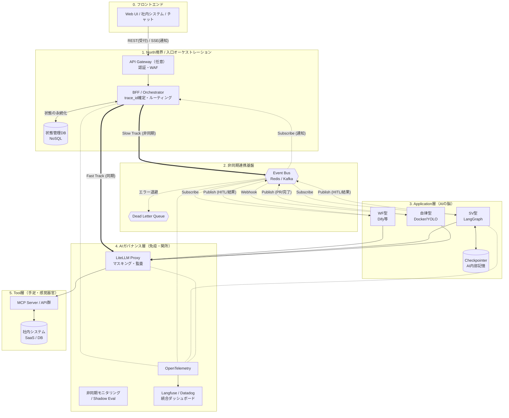

# 生成AI基盤のコンポーネント配置と実装・運用原則

---

## 0. 位置づけ

本書は、[01_AIエージェントの業務適用を見据えた生成AIアーキテクチャ検討.md](../01_アーキテクチャ検討/01_AIエージェントの業務適用を見据えた生成AIアーキテクチャ検討.md) の第4章で定義した責務を、どのコンポーネントに配置し、どのような設計・運用原則で実現するかを整理するための実現方式文書です。

[01_アーキテクチャ検討](../01_アーキテクチャ検討) 配下の文書が Why / What / 責務原則を扱うのに対し、本書は How に相当するコンポーネント配置と実装・運用原則を扱います。

---

## 1. 全体アーキテクチャ図（コンポーネント配置）

ここでは、責務をどのコンポーネントに配置するかを示します。BFF は Application層の非同期要件を north 境界で受ける配置先であり、Observability は AIガバナンス層の横断能力を支える実装要素として配置します。

---

## 2. 基盤を貫くアーキテクチャ設計原則

### 2.1 トラフィックの動的ルーティングと状態管理の分離（CQRS）

Application層が要求する同期/非同期の経路分岐は north 境界の BFF で受け持ち、リクエストを「Fast Track（同期）」と「Slow Track（非同期 / Event Bus）」に振り分けます。また、UI表示用の「状態管理DB」とAI思考用の「Checkpointer」を完全に分離し、エージェントからの直接的なDB更新を禁じます。

### 2.2 非同期連携とHITL（状態の永続化と介入）の標準化

エージェント処理をシステムに組み込む際の「処理時間の不確実性」と「人間の反応遅延」を回避するため、以下の非同期設計を徹底します。
非同期HITL、長時間実行、Pause / Resume、UI復元、イベント設計の正本は、[04_アプリケーション層の実現方式.md](./04_アプリケーション層の実現方式.md) です。

* **長時間のジョブ化**：同期通信でLLMを待たず、即座に Job ID（受付票）を返してバックグラウンドで処理し、Event Bus 経由で通知します。
* **Checkpointerによる一時停止**：人間の承認（HITL）が必要な操作の直前で処理をフリーズ（StateをDBへ保存）させ、システムリソースを解放して安全に待機します。
* **Tool層のステートレス化**：Tool層（MCP等）内部では絶対に人間を待つ処理を行わず、待ちの制御はすべてApplication層に集約します。

### 2.3 trace_id による一気通貫のオブザーバビリティ

フロントエンドから非同期の待機、数日後のHITL再開に至るまで、すべての通信とペイロードに W3C準拠の `trace_id` を伝播させ、AIガバナンス層の観測・評価機能から Langfuse や Datadog 等で串刺し検索を可能にします。

---

## 3. 業務適用のための運用・ガバナンス原則

### 3.1 SV型とAIガバナンス層の不可分性

SV型（推論・判断を伴うAIエージェント）を採用するすべてのプロセスにおいて、AIガバナンス層の適用は必須です。AIの非決定的な出力に対し、「監査ログ（追える）」「ガードレール（止める）」「非同期評価（採点する）」といった安全網を敷かずに本番稼働させてはなりません。

### 3.2 段階的自律化（Progressive Autonomy）のロードマップ適用

どのような業務であっても、最初からAIに全権を委譲することはありません。すべてのプロセスは以下のロードマップに沿って運用し、AIガバナンス層での評価スコア（信頼性）をエビデンスとしてフェーズを移行させます。

* **導入期（検証〜安定稼働）**：すべてのプロセス間に人間による確認（Human-in-the-loop）を必須とします。自律型ワーカーの探索も、必ずSVの監視下・隔離環境でのみ許可します。
* **成熟期（自律化への移行）**：運用実績が積まれ、評価スコアが安定したプロセスから順次、人間の介入を事後確認（Human-on-the-loop）や自動化へと移行させます。対外送信や本番DB更新系は、最も遅い段階までHITLを維持します。

---

## 4. アーキテクチャを支える5つの実装方針

詳細なイベント設計（trace_id伝播、冪等性、リトライ/DLQ、イベント種別の標準化など）は、主に [04_アプリケーション層の実現方式.md](./04_アプリケーション層の実現方式.md) を参照してください。
旧文書の参照入口としては [AIエージェントの業務適用を見据えた非同期連携基盤（Event Bus）の検討.md](../01_アーキテクチャ検討/AIエージェントの業務適用を見据えた非同期連携基盤（Event Bus）の検討.md) も残しています。

### 4.1 長時間の処理（探索・合議）に対するジョブ化（受付票＋イベント通知）

* Dify等の上位システムからLangGraph（SV層）を呼び出す際、同期通信（応答待ち）は行いません。LangGraphは即座に Job ID（受付票）を返し、処理をバックグラウンドで実行します。処理が完了次第、Webhookや Event Bus 経由のイベント通知によって上位のワークフローを再開させます。

### 4.2 人間の承認（HITL）に対するCheckpointerの活用

* 人間の承認は即時に行うことが可能な場合もあれば、熟慮や協議が必要な場合もあります。人間の判断に時間を要することも考慮し、承認が必要な操作（対外送信やシステム更新）の直前で、LangGraphの `interrupt` 機能を発火させます。
* これにより、Checkpointer（DB）に現在のメモリ・文脈（State）が丸ごと保存（フリーズ）され、システムリソースを占有することなく安全に待機します。
* 人間が承認UIでアクションを起こすと、保持していた `thread_id` をキーにStateが復元され、安全に後続の更新処理（TicketUpdateWF）が実行されます。

> **重要注意点（状態管理の責務分離）**
> LangGraphのCheckpointer（AIの内部記憶）と、ユーザーUIに「進行中」「承認待ち」を表示するための「状態管理DB（NoSQL等）」は完全に分離します。状態管理DBへの書き込み権限はBFFが独占し、エージェント（Application層）はEvent Busへステータス変更の通知を投げるのみに留めます。

> **補足：高度自律型ワーカーにおける非同期HITLの例外**
> システム開発やデータパイプライン構築などを担う高度な自律型ワーカーをDockerコンテナ等で稼働させる場合、細かなステップごとのHITLは開発者体験を著しく損ないます。
> この場合、隔離された安全なサンドボックス環境で確認をスキップする YOLOモード（完全自律実行）をデフォルトとし、HITLのタイミングを「プロセス途中」から「最終成果物のレビュー（Pull Request / Merge Requestの承認）」へ後方シフトさせるアーキテクチャを推奨します。

### 4.3 Tool層（MCP）の完全ステートレス化

* **Tool層内部では絶対に人間を待つ処理（HITL）や状態の永続化を行いません。** 人間を待つ役割はすべてApplication層（LangGraph）に集約し、Tool層はAIからの指示を受け取ったら、権限チェックののち即座に実行（または非同期ジョブの発行）のみを行います。

### 4.4 north境界によるトラフィックの動的ルーティング

必要に応じて API Gateway が入口防御を担い、BFF は単なる中継器ではなく、Application層の要求に応じてリクエスト経路を振り分けます（Fast Track / Slow Track）。

* **Fast Track（同期・Event Busバイパス）**：単純な一問一答や要約など、即時応答が可能で状態を持たない処理は、BFFから直接APIを叩き、SSEでフロントエンドへストリーミング応答します。
* **Slow Track（非同期・Event Bus経由）**：SV型の合議や自律型ワーカーの探索、HITLを伴う長時間の業務は、BFFが即座に「受付票（HTTP 202）」を返し、Event Busへ処理を委譲します。

### 4.5 trace_id を主軸とした分散トレーシングと運用監視

非同期連携やHITLによって「時間」と「コンポーネント」が分断される本アーキテクチャにおいて、BFFの入口からApplication層、AIガバナンス層のガードレール判定、Event BusのDLQ（退避キュー）に至るまで、W3C準拠の `trace_id` をすべてのヘッダとペイロードに伝播させます。これにより、AIガバナンス層に統合された観測・評価機能を通じて、1つの業務トランザクションを串刺しで追跡・評価可能にします。
