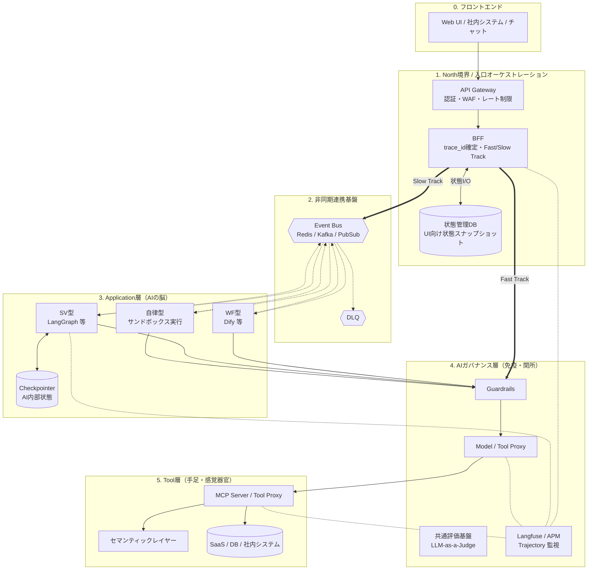

# 生成AI基盤のコンポーネント配置と実装・運用原則

---

## 0. 位置づけ

本書は、[01_AIエージェントの業務適用を見据えた生成AIアーキテクチャ検討.md](../01_アーキテクチャ検討/01_AIエージェントの業務適用を見据えた生成AIアーキテクチャ検討.md) と [00_はじめに.md](../01_アーキテクチャ検討/00_はじめに.md) で定義した 3 層アーキテクチャと横断原則を、どのコンポーネントに配置して実現するかを整理する文書です。

`docs/01_アーキテクチャ検討` 配下が Why / What を扱うのに対し、本書は How に相当する配置方針と責務分界を扱います。

本書で重要なのは、**Application層 / Tool層 / AIガバナンス層の 3 層は責務による分類であり、API Gateway、BFF、Event Bus、状態管理DB、Checkpointer、Observability 基盤はその責務を成立させる補助コンポーネントである**と明示することです。

---

## 1. 全体アーキテクチャ図

### 図の読み方

* **3 層の主役は責務**です。業務ロジックと状態制御は Application層、外界接続は Tool層、企業共通の意味論的統制は AIガバナンス層が担います。
* **North境界は層ではなく補助コンポーネント**です。API Gateway は決定論的防御、BFF は `trace_id` の確定、Fast / Slow Track の分岐、状態管理 DB の正本管理を担います。
* **非同期連携基盤と Checkpointer は別物**です。Event Bus は疎結合な連携、Checkpointer は Application 層内部の再開用状態保持、状態管理DB は UI 向けの現在状態保持です。
* **Observability はログ集約ではなく Trajectory 再構成の基盤**です。`trace_id` を軸に各層の判断、ツール実行、承認待ち、評価結果を串刺しで追跡できることを狙います。

---

## 2. 基盤を貫く設計原則

### 2.1 3 層と補助コンポーネントを混同しない

* **Application層** は、WF型 / SV型 / 自律型の使い分け、状態遷移、非同期HITL、段階的自律化を担います。
* **Tool層** は、MCP 等を通じた標準化、権限コンテキスト継承、セマンティックレイヤーの利用、Read / Write 分離を担います。
* **AIガバナンス層** は、Guardrails、グラウンディング、サイテーション、共通評価、停止判断を担います。
* **North境界 / Event Bus / 状態管理DB / Checkpointer / Observability** は、上記 3 層の責務を実システムとして成立させる補助コンポーネントです。

### 2.2 状態と実行を分離する

* 人間承認待ちや長時間処理の状態は Application層で扱います。
* Tool層は状態を持たず、即時結果または Job ID を返します。
* UI 向け状態は状態管理DB、AI 内部の再開用状態は Checkpointer、疎結合な事実通知は Event Bus に分離します。

### 2.3 `trace_id` を横断キーにする

* `trace_id` は BFF で最終確定します。
* `trace_id` は Event Bus、Application層、AIガバナンス層、Tool層、評価基盤、通知系に伝播します。
* 追跡対象は個別ログではなく、判断と実行の軌跡である Trajectory です。

### 2.4 権限コンテキストを end-to-end で継承する

* API Gateway / BFF で受けたユーザーの認証コンテキストを、Application層と Tool層へ透過的に引き継ぎます。
* Tool層はユーザー本人の権限に基づいて最終認可を受け、AIガバナンス層はその経路全体を上位ポリシーで統制します。

---

## 3. コンポーネント別の配置方針

### 3.1 North境界

| コンポーネント | 主な責務 |
| --- | --- |
| API Gateway | JWT 検証、WAF、レート制限、TLS 終端、経路制御、`traceparent` 補完 |
| BFF | `trace_id` 確定、Fast / Slow Track 分岐、状態管理DB 書き込み主権、SSE / 通知、Cancel / Resume 受付 |

**配置原則**

* API Gateway は決定論的防御を担い、AIガバナンス層の代替にしません。
* BFF は単なる中継器ではなく、アプリ全体の入口オーケストレーションを担います。

### 3.2 Application層

| 型 | 主な役割 | 代表的な基盤 |
| --- | --- | --- |
| WF型 | 予見可能な固定フローの実行 | Dify、固定構成の LangGraph |
| SV型 | 合議、評価、非同期HITL を含む統制 | LangGraph |
| 自律型 | 探索的タスクの段階的自律化 | サンドボックス実行基盤 |

**配置原則**

* 型の選択は予見性で決めます。
* Coordinator または入口ユニットを置き、どこまでを固定フローで扱い、どこから動的制御へ委譲するかを切り分けます。
* 自律型は単独で野放しにせず、SV型の監督下またはサンドボックス内から始めます。

### 3.3 AIガバナンス層

**主な責務**

* 入出力 Guardrails
* モデル利用経路と予算の統制
* Tool 利用の上限制御
* グラウンディング、サイテーション、同期検証、事後評価
* Risk-Adaptive な HITL / Kill Switch
* マルチエージェント時の East-West 統制

**配置原則**

* AIガバナンス層は Application層の代わりに推論せず、Tool層の代わりに外界接続もしません。
* 企業共通の安全性、根拠性、追跡可能性、停止判断を横断的に担います。

### 3.4 Tool層

**主な責務**

* MCP 等による標準化された実行インターフェース
* ユーザー権限コンテキストの継承
* セマンティックレイヤー経由の意味付け
* 非同期ジョブ、Read / Write 分離、Dry Run

**配置原則**

* Tool層内部では人間を待たせず、状態を保持しません。
* 生データや生 API を直接 AI に見せず、意味付けされたインターフェースを返します。

---

## 4. 実装・運用上の原則

### 4.1 Fast Track / Slow Track を明確に分ける

* **Fast Track** は短時間・同期応答・状態レスの処理です。
* **Slow Track** は非同期HITL、長時間推論、自律型ワーカー、外部イベント駆動の処理です。
* 経路分岐は BFF が担い、統制強度の切り替えは AIガバナンス層が担います。

### 4.2 段階的自律化を前提にする

* 導入初期は WF型や SV型を中心に構成します。
* 自律型は Read-Only、限定権限、サンドボックス、停止条件付きで段階的に拡張します。
* 高リスクな更新系処理は最後まで HITL を維持します。

### 4.3 マルチエージェントを前提に East-West 統制を設ける

* agent-to-agent handoff は内部通信であってもゼロトラストで扱います。
* 共有 State には State Scrubbing、委譲時には権限コンテキスト検証、予算監視、軽量 Guardrails を適用します。

---

## 5. 関連文書

* 全体アーキテクチャの Why / What: [../01_アーキテクチャ検討/01_AIエージェントの業務適用を見据えた生成AIアーキテクチャ検討.md](../01_アーキテクチャ検討/01_AIエージェントの業務適用を見据えた生成AIアーキテクチャ検討.md)
* Application層の実現方式: [./02_生成AIアプリケーション層の実現方式.md](./02_生成AIアプリケーション層の実現方式.md)
* Tool層の実現方式: [./03_生成AIツール層の実現方式.md](./03_生成AIツール層の実現方式.md)
* AIガバナンス層の実現方式: [./04_生成AIガバナンス層の実現方式.md](./04_生成AIガバナンス層の実現方式.md)
* 技術課題一覧: [./技術課題と対応方針.md](./技術課題と対応方針.md)
