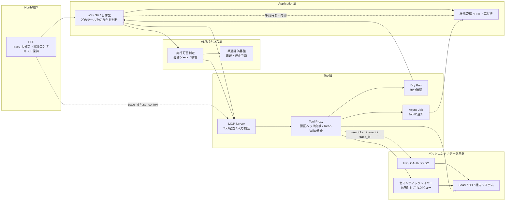

# ツール層の実現方式

---

## 0. 位置づけ

本書は、[03_AIエージェントの業務適用を見据えた生成AIツール層の検討.md](../01_アーキテクチャ検討/03_AIエージェントの業務適用を見据えた生成AIツール層の検討.md) で定義した Tool層の Why / What を、どのような実装方式で成立させるかを整理する文書です。

[01_アーキテクチャ検討](../01_アーキテクチャ検討) 配下の文書が背景、要求、責務分界を扱うのに対し、本書は MCP サーバー、Tool Proxy、権限コンテキスト継承、セマンティックレイヤー連携、非同期ジョブ、Dry Run、監査といった How を扱います。

Tool層は単なる API ラッパーではなく、Application層の不確実な推論と外界に対する確実な実行を分離し、再利用可能な業務実行インターフェースとして資産化する実行基盤です。本書では、そのために必要なステートレス性、権限分離、意味付け、可逆性、追跡可能性を具体化します。

---

## 0.1 Tool層専用アーキテクチャ図

Tool層は、Application層の判断結果を安全な実行へ変換し、AIガバナンス層およびバックエンドの認可機構と連携することで成立します。以下の図は、権限コンテキスト継承、Read / Write 分離、Dry Run、非同期ジョブ化の関係を示したものです。

図の読み方は次の通りです。

* **BFF** は `trace_id` と実行ユーザーの認証コンテキストを保持し、Application層と Tool層へ渡します。
* **Application層** はツールの呼び出し判断、承認待ち、再試行、Job ID の監督を担い、Tool層内部に状態を持ち込みません。
* **AIガバナンス層** は、更新系ツールや高リスク実行に対する最終ゲートと共通監査を担います。
* **Tool層** は、MCP Server と Tool Proxy を中心に、入力検証、認証ヘッダ変換、Read / Write 分離、Dry Run、非同期ジョブ化を実装します。
* **バックエンド / データ基盤** は、IdP による認可とセマンティックレイヤーによる意味付けを通じて、Tool層へ安全な実行対象を提供します。

---

## 1. ステートレスな業務実行インターフェースとしての実装原則

### 1.1 MCP を基本形とする理由

Tool層は、個別アプリケーションごとに API 呼び出し仕様を埋め込むのではなく、MCP 等の標準プロトコルを基本形とします。これにより、AI モデルの変更や Application 層の差し替えがあっても、外界接続の仕様と実装を再利用できます。

* **Tool サーバーの責務**: ツール一覧の公開、入力検証、バックエンド呼び出し、結果整形
* **Application層の責務**: どのツールをいつ呼ぶかの判断、再試行、承認待ち、状態遷移
* **AIガバナンス層の責務**: 実行可否、入力 / 出力統制、共通監査、停止判断

### 1.2 Tool層をステートレスに保つ理由

Tool層内部で人間承認待ちや長時間の文脈保持を行うと、Application層との責務分界が崩れ、タイムアウトや復旧不能な中間状態を招きます。そのため Tool層は状態を保持せず、即時結果または Job ID を返すことを原則とします。

* **同期実行**: 数秒以内に返せる参照系ツールは、その場で結果を返す
* **非同期実行**: 時間のかかる処理は即座に Job ID を返し、裏側で処理を継続する
* **禁止事項**: Tool 層内での HITL、対話的待機、業務状態の永続化

### 1.3 Tool Proxy の配置

実装上は、バックエンド API の前段に Tool Proxy を置き、MCP サーバーからの呼び出しを集約する構成が有効です。Tool Proxy は入力検証、認証ヘッダ変換、Read / Write 制御、監査ログ付与を担い、バックエンド固有の差分を Tool サーバーから隠蔽します。

---

## 2. 権限コンテキスト継承と Identity-aware Access

### 2.1 実行ユーザーの権限を透過的に継承する

Tool層では、固定 API キーを共有して AI に広い権限を与えるのではなく、実行ユーザーの認証コンテキストをバックエンドまで透過的に継承することを原則とします。これにより、AI はユーザーの代理として動作し、権限の出所が明確になります。

* **推奨方式**: OIDC / OAuth2 トークンのフォワーディング
* **補助方式**: Tool Proxy によるヘッダ正規化、トークン交換、バックエンド向け属性変換
* **監査要件**: user_id、tenant_id、trace_id、tool_name、target_resource を必ず記録する

### 2.2 権限判定を Tool 層で抱え込みすぎない

Tool層は認可の起点にはなっても、権限モデルそのものを独自実装しすぎるべきではありません。最終的なアクセス可否は、IdP、データ基盤、SaaS 側の認可機構へ委譲し、Tool 層は必要なコンテキストを正しく伝播させることに集中します。

### 2.3 Read-Only 制御と権限プロファイル

自律型や探索系のワーカーに対しては、初期段階では Read-Only の権限プロファイルをデフォルトとします。Write 操作は SV 型や人間承認を伴う経路に限定し、ツール公開時点で参照系と更新系を明確に分離します。

---

## 3. セマンティックレイヤーと文脈付与の実装

### 3.1 生データを直接渡さない

LLM に物理テーブルや複雑な API 仕様を直接見せると、SQL や引数のハルシネーションが起こりやすくなります。そのため Tool層は、生データや生 API を露出するのではなく、セマンティックレイヤーやメタデータを通じて意味付けされたインターフェースを提供します。

### 3.2 セマンティックレイヤーの実装パターン

* **データ基盤側での抽象化**: DWH、データ仮想化、GraphQL、業務 API 等でビジネス用語へ翻訳する
* **Tool 定義での文脈補強**: description、input schema、resource metadata に業務用語と制約を書く
* **出典付与**: レコード ID、URL、バージョン、access_level などの根拠メタデータを返す

### 3.3 Tool層が返すべき最小情報

Tool層は結果本文だけでなく、少なくとも以下を返せるようにします。

* **意味のある主データ**: AI が処理対象として使う本文や構造化データ
* **出典メタデータ**: 参照元 URL、ID、バージョン、取得日時
* **権限属性**: access_level、tenant、owner などの制御情報
* **操作種別**: Read か Write か、Dry Run か本実行か

---

## 4. 非同期ジョブと Read / Write 分離の実装

### 4.1 長時間処理は Job ID で返す

重い検索、ETL、ファイル変換、外部システム連携のような処理は同期完了を目指さず、Tool層は即座に Job ID を返します。進行監督、再試行、人間待ち、UI 表示は Application層が担当します。

### 4.2 Read / Write の分離

同じバックエンドに対するツールでも、参照系と更新系は別ツールとして公開します。これにより、AIガバナンス層や Application層がツールの危険度を明示的に扱えるようになります。

* **Read ツール**: 参照、検索、取得、要約の入力データ収集
* **Write ツール**: 登録、更新、送信、削除、起票

### 4.3 Dry Run を標準機能とする

更新系ツールでは、本実行の前に Dry Run を実行できるようにします。Dry Run では、何が変更されるか、対象件数はいくつか、差分は何かを返し、人間承認や AI ガバナンス層の最終ゲートに渡せる形式にします。

### 4.4 承認前提の実行トークン

本実行は、Application層の承認状態と AIガバナンス層の最終判定を通過したことを示す承認トークン、または等価の実行コンテキストを要求します。これにより、更新系ツール単体の誤呼び出しを防ぎます。

---

## 5. 監査、追跡可能性、補助コンポーネントとの接続

### 5.1 `trace_id` を必ず通す

Tool層は横断設計原則の一部として、BFF で確定した `trace_id` を必ず受け取り、バックエンド呼び出しと監査ログに引き継ぎます。これにより、どのユーザー要求からどの Tool 実行が発生したかを追跡できます。

### 5.2 Tool 実行ログの最小要件

* `trace_id`
* `tool_name`
* `user_id` または代理元識別子
* `target_resource`
* `operation_type`（Read / Write / Dry Run）
* `decision`（許可 / 拒否 / 要承認）
* `latency_ms`

### 5.3 00 文書との接続

Tool層は、[00_生成AI基盤のコンポーネント配置と実装・運用原則.md](./00_生成AI基盤のコンポーネント配置と実装・運用原則.md) で示した Tool Proxy / MCP Server に相当します。North境界、AIガバナンス層、Application層と以下のように接続されます。

* **North境界 / BFF**: `trace_id`、認証コンテキスト、Fast / Slow Track の文脈を受け取る
* **Application層**: ツール呼び出しの判断主体。状態管理と承認待ちは持つが、実行は Tool層へ委譲する
* **AIガバナンス層**: 実行可否、最終ゲート、共通監査、停止判断を担う

---

## 6. 関連文書と責務分界

### 6.1 概念整理の正本

Tool層の Why / What、設計原則、責務分界の正本は [../01_アーキテクチャ検討/03_AIエージェントの業務適用を見据えた生成AIツール層の検討.md](../01_アーキテクチャ検討/03_AIエージェントの業務適用を見据えた生成AIツール層の検討.md) を参照します。

### 6.2 PoC 実装方針との関係

Zitadel、Identity-aware MCP、LiteLLM 経由のヘッダ伝播などの PoC 実装上の詳細は [../03_PoC手順/05_Tool層実装方針.md](../03_PoC手順/05_Tool層実装方針.md) を参照します。本書はその上位にある実現方式の整理であり、特定製品に依存しない原則を扱います。

### 6.3 他層との責任分界

* **Application層**: どのツールを使うか、いつ再試行するか、どこで承認待ちに入るかを決める
* **Tool層**: 権限コンテキストを引き継いで、外界への実行をステートレスに行う
* **AIガバナンス層**: 入出力統制、実行可否判定、共通評価基盤、停止判断を担う

---

## 7. 関連文書

* Why / What / 設計背景: [../01_アーキテクチャ検討/03_AIエージェントの業務適用を見据えた生成AIツール層の検討.md](../01_アーキテクチャ検討/03_AIエージェントの業務適用を見据えた生成AIツール層の検討.md)
* 全体実現方式: [00_生成AI基盤のコンポーネント配置と実装・運用原則.md](./00_生成AI基盤のコンポーネント配置と実装・運用原則.md)
* PoC 実装方針: [../03_PoC手順/05_Tool層実装方針.md](../03_PoC手順/05_Tool層実装方針.md)