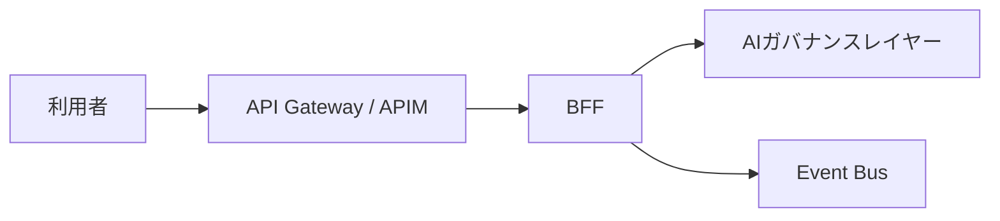

# アプリケーション層の実現方式

---

## 0. 位置づけ

本書は、[04_AIエージェントの業務適用を見据えた生成AIアプリケーション層の検討.md](../01_アーキテクチャ検討/04_AIエージェントの業務適用を見据えた生成AIアプリケーション層の検討.md) のうち、非同期HITL、長時間実行、Pause / Resume、UI復元、イベント設計、運用注意点といった How を整理する文書です。

[01_アーキテクチャ検討](../01_アーキテクチャ検討) 配下のアプリケーション文書は、WF型 / SV型 / 自律型の基本パターンや責任分界を扱い、本書はそれを成立させる実装方式を扱います。

---

## 1. 非同期処理を前提にした実装設計

AI エージェントは処理時間が読みにくく、人間承認も数時間から数日単位で遅延し得るため、同期 API 応答待ちではなく非同期ジョブ前提で設計します。

### 1.1 長時間実行のジョブ化

* 上位システムからの依頼に対し、即座に Thread ID や Job ID を返す
* 実処理はバックグラウンドで行う
* 完了時は Webhook や Event Bus を通じて上位フローを再開する

### 1.2 非同期HITLによる状態永続化

* 承認直前で LangGraph の interrupt を発火する
* Checkpointer に文脈全体をフリーズする
* 人間承認後、thread_id をキーに状態を復元して処理再開する

---

## 2. Event Bus / 状態管理DB / Checkpointer の分離

### 2.1 三者分離の原則

* **Event Bus**: 状態変化イベントを疎結合に伝える
* **状態管理DB**: UI が参照する現在状態のスナップショットを保持する
* **Checkpointer**: Application 層内部の文脈をフリーズ / 復元する

この 3 者を分けることで、推論の状態とユーザーに見せる状態を混同せずに済みます。

### 2.2 CQRSパターン

* Event Bus は「状態が変わった」という事実を伝える
* 状態管理DB は `RUNNING` や `PAUSED_FOR_HITL` などの現在状態を返す
* Checkpointer は interrupt 後の再開を可能にする内部状態ストアとして使う

### 2.3 Event Bus を挟む理由

* DB ポーリング地獄の回避
* ワーカー起動の疎結合化
* 思考ログやツール実行イベントの緩衝

---

## 3. 代表ユースケース

### 3.1 長時間実行のジョブ化

BFF が `JOB_REQUESTED` を publish し、Application のワーカーが subscribe して処理し、完了時に `JOB_COMPLETED` や `JOB_FAILED` を publish します。

### 3.2 思考プロセスのリアルタイム可視化と UI 復元

ワーカーが `AGENT_THOUGHT` を publish し、BFF が SSE でフロントへ流しつつ、状態管理DBへスナップショットを保持します。再接続時は状態管理DBから UI を復元します。

### 3.3 非同期HITL（Pause / Resume）

Application 側で `HITL_REQUIRED` を publish し、BFF が状態管理DB更新と通知を行います。人間入力を受けた BFF は `HITL_RESUMED` を publish して Application を再開します。

### 3.4 外部イベント駆動

GitHub / GitLab などの Webhook を BFF が受け、`PR_CREATED` や `PR_COMMENTED` のイベントとして publish し、Application のエージェントジョブを起動します。

---

## 4. north境界との責務分界

生成AIシステムでは、意味論的な統制を AI ガバナンス層で担うとしても、north 境界での決定論的な入口防御は依然として必要です。API Gateway を置かずに各アプリや BFF へ入口防御を分散させると、認証・認可、WAF、レート制限、経路制御、証明書運用がアプリごとにばらつきます。

### 4.1 役割分担

| コンポーネント | 主な責務 |
| --- | --- |
| **API Gateway** | JWT 検証、WAF、レート制限、TLS 終端、経路制御、`traceparent` 補完 |
| **BFF** | `trace_id` の確定、Fast / Slow Track、状態管理DB との I/O、SSE 通知、Cancel / Resume |
| **Application** | interrupt、Checkpointer、内部状態制御、状態変化の通知 |
| **AIガバナンスレイヤー** | Input Guardrail、Output Masking、Tool/Model Proxy、Tracing、Evaluation |

重要なのは、API Gateway を AI ガバナンスの代替と見なさないことです。API Gateway は外縁の決定論的防御、BFF は入口オーケストレーション、AI ガバナンスレイヤーは意味論的統制を担います。

### 4.2 API Gatewayが担うことと担わないこと

**API Gateway が担うこと**

* JWT 検証、WAF、レート制限、入力サイズ制限、CORS、TLS 終端
* north 境界の共通経路としてのルーティングとバックエンド隠蔽
* v1/v2、blue/green などの段階的移行制御
* `traceparent` が欠落している場合の補完、および後段へ渡す共通ヘッダの付与

**API Gateway が担わないこと**

* プロンプト検査、出力マスキング、Risk-Adaptive HITL などの意味論的統制
* 状態管理 DB への I/O、ID マッピング、SSE / WebSocket による通知
* Fast Track / Slow Track の業務判断、Cancel / Resume の制御
* ベンダー固有の AI 推論 API 仕様をそのままフロントエンドへ露出すること

### 4.3 推奨アーキテクチャ

PoC から初期本番にかけては、次の接続順を基本形とします。

* API Gateway は north 境界の共通入口として配置する
* BFF は `trace_id` の確定と状態管理 DB の正本管理を担う
* Event Bus や状態管理 DB をフロントエンドへ直接露出しない

### 4.4 意思決定ポイント

* **製品選定**: Azure APIM を第一候補としつつ、PoC では Nginx / Kong でも代替可能
* **共通ポリシーの粒度**: JWT 検証、WAF、レート制限までは API Gateway で共通化し、意味論的制御は後段へ送る
* **トレース戦略**: API Gateway は `traceparent` を補完できるが、業務上の主キーとしての `trace_id` は BFF で最終確定する

### 4.5 書き込み主権

状態管理DBへの書き込み主権は BFF が持ち、Application やワーカーは Event Bus 経由で状態変化を通知します。これにより密結合を防ぎます。

---

## 5. イベント設計の最低限の標準

### 5.1 共通属性

* `trace_id`
* `event_type`
* `occurred_at`
* `producer`
* `idempotency_key`

### 5.2 ペイロード設計

HITL_REQUIRED などのイベントでは、状態、thread_id、人間が判断するタスク概要などを data に含めます。

### 5.3 運用上の注意点

* 冪等性を前提に Subscriber を実装する
* リトライと DLQ を実装する
* イベントには署名や mTLS を用い、PII は参照キー化する
* Redis Streams 等の PoC 構成でも trace_id と idempotency_key は最初から入れる

---

## 6. アンチパターン

* Event Bus を検索用途に使い、状態復元をイベントソーシングに頼る
* エージェントから状態管理DBを直接更新する
* BFF プロセス内に状態を保持する
* trace_id が north 境界、Event Bus、ワーカー間で分断される
* DLQ を実装せず、失敗イベントを消失させる

---

## 7. 関連文書と責任分界

### 7.1 Tool層との関係

DB、API、ファイル等の外界アクセスは Tool 層の責務です。Application はそれらをツールとして扱い、権限の大きい操作には HITL や AI ガバナンス層のゲートを挟みます。

### 7.2 評価の二段構え

* **Application 層内の評価ユニット**: 業務固有の品質保証
* **AI ガバナンス層の共通評価基盤**: 企業共通の守りと評価

### 7.3 責任分界

* **開発部門**: 業務ユニット・評価ユニットの精度
* **IT / ガバナンス部門**: 共通基盤としての堅牢性
* **ユーザー**: 最終出力と業務上の最終判断

---

## 8. 関連文書

* Why / What / 基本パターン: [04_AIエージェントの業務適用を見据えた生成AIアプリケーション層の検討.md](../01_アーキテクチャ検討/04_AIエージェントの業務適用を見据えた生成AIアプリケーション層の検討.md)
* 全体実現方式: [00_生成AI基盤のコンポーネント配置と実装・運用原則.md](./00_生成AI基盤のコンポーネント配置と実装・運用原則.md)
* 検証シナリオ: [../03_PoC検討/検証シナリオ.md](../03_PoC検討/検証シナリオ.md)
