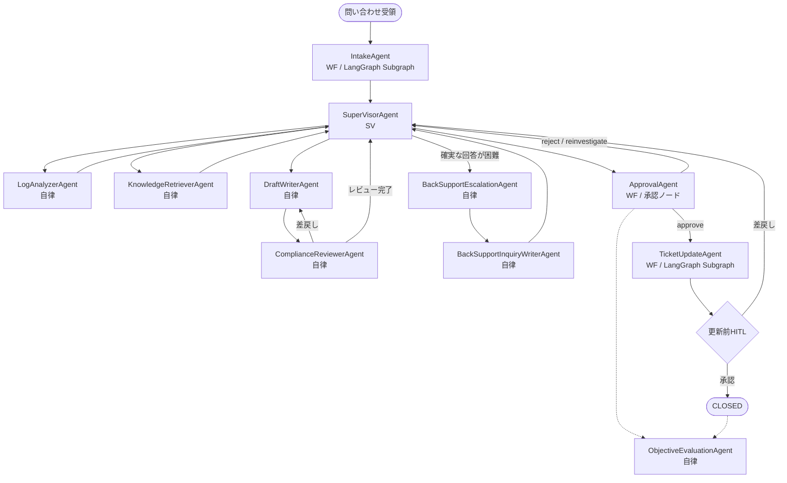
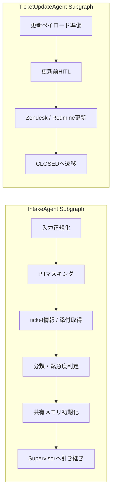

## 6. 業務への適用例（カスタマーサポート）

本章では **カスタマーサポート（CS）** を取り上げ、「どのプロセスを、どのレイヤー／型（WF/自律/SV）で支えるか」を具体化します。

### 6.1 適用シナリオとユーザーストーリー

複雑なログ調査や過去事例の紐解きを伴うテクニカルサポート業務を想定し、生成AI基盤がどのように業務をオーケストレーションするかを定義します。

**【連携する周辺システム（Tool層）の例】**

* Zendesk（顧客対応チケット管理）
* Redmine（開発・内部調査チケット管理）
* Growi / Confluence（社内ナレッジベース・過去事例）

#### ユーザーストーリー：データ仮想化サーバーの突然停止とログ調査

**【トリガー（事象）】**
顧客から、「データ仮想化サーバーのプロセスが突然停止した。再起動で現在は復旧しているが、再発防止のために原因を調査してほしい。事象発生時のサーバーログ（大容量）を添付する」という問い合わせとログファイルがZendeskに起票された。

**【As-Is（従来の課題：ベテランの勘と膨大な時間への依存）】**

1. CS管理者がZendeskから問い合わせ通知を受領。Zendeskチケットを確認後、緊急度や担当者の負荷状況を判断して、CS担当者を割り当てる（アサイン待ちのタイムロス発生）。
2. アサインされたCS担当者はZendeskチケットを確認し、Redmineに内部管理用の調査チケットを手動で起票する。
3. 大容量のログファイルをダウンロードし、テキストエディタでエラー箇所（ExceptionやFatalレベルのログ）を目視で検索する。
4. ログの中から「Out of Memory (OOM)」や「特定の重い結合クエリによるスレッド枯渇」らしき痕跡を見つけるが、確証が得られない。
5. 過去の類似チケットや社内Wiki（Growi）を複数のキーワードで検索し、似たような突然停止の事例と、その時の回避策（メモリチューニング設定やパッチ適用）を探し回る。
6. ログの該当箇所を抜粋し、過去事例を引用しながら、原因の仮説と推奨する設定変更の手順をまとめ、顧客への回答文を1〜2時間かけて作成する（ベテランでないと対応が難しい）。

**【To-Be（AIエージェント導入後：初動整理から回答案作成、評価までを一貫支援）】**

1. **受付と初期整理**: 問い合わせを受けると、受付担当が内容、緊急度、追加確認要否を整理し、後続エージェントが参照できる共通メモを作成する。
2. **調査方針の決定**: 監督役エージェントが、問い合わせが仕様確認か障害調査かを見極め、必要な調査担当を選択する。
3. **専門エージェントによる調査**:
* ログ解析担当が、添付ログや証跡から異常兆候や再現条件を洗い出す。
* ナレッジ探索担当が、社内文書や過去事例から類似ケースや推奨対応を探す。
4. **回答案またはエスカレーション案の作成**: 調査結果を受けて、回答起案担当が顧客向け文面を作成する。十分な根拠がない場合は、エスカレーション担当と問い合わせ文案担当が追加確認やバックサポート連携の案を用意する。
5. **レビューと承認**: レビュー担当が表現やポリシー観点を確認し、人間は最終承認に集中する。
6. **事後評価**: 最後に評価担当が、各エージェント間で情報欠落がなかったか、対応が適切だったかを客観的に振り返る。

---
### 6.3 想定フローと参加エージェント

本シナリオでは、問い合わせ対応を次の流れで進める想定とする。

1. IntakeAgent が問い合わせを受け取り、分類、緊急度判定、初期メモ整理を行う。
2. SuperVisorAgent がケース全体を見て、どの調査担当を使うかを決める。
3. LogAnalyzerAgent と KnowledgeRetrieverAgent が必要に応じて調査を行う。
4. DraftWriterAgent が顧客向けの回答案を作成する。
5. ComplianceReviewerAgent が、表現リスクやポリシー観点を確認する。
6. 十分な回答が難しい場合は、BackSupportEscalationAgent と BackSupportInquiryWriterAgent がエスカレーション案を整える。
7. ApprovalAgent が、人間の承認、差戻し、再調査要求を受け付ける。
8. 承認後、TicketUpdateAgent が外部チケット更新を行う。
9. 最後に ObjectiveEvaluationAgent が全体対応を振り返り、改善点を整理する。

全体の実行イメージは次のとおりである。

WF 型エージェントのうち、Subgraph として段階的に実装するものは次のイメージである。ApprovalAgent は subgraph ではなく、HITL を受け付ける workflow 上の停止ノードとして扱う。

#### 6.3.1 各エージェントの役割と特徴

| エージェント | 主な処理 | 4つの壁の克服ポイント |
| --- | --- | --- |
| **IntakeAgent（WF）** | 問い合わせ文の正規化、必要に応じた PII マスキング、チケット情報と添付ファイルの取り込み、分類、緊急度判定、初期メモ作成を定型処理として実行する。 | **技術の壁**: 非定型な問い合わせ文や添付情報を、後続が扱える構造化情報へ変換する。  **統制の壁**: PII マスキングと共有メモ初期化を先に通すことで、安全な後続処理の土台を作る。 |
| **SuperVisorAgent（SV）** | Intake 結果を受けて調査方針を決め、必要な専門エージェントを起動し、結果を統合し、通常回答かエスカレーションかを判断する。 | **暗黙知の壁**: ベテランが頭の中で行っていた論点整理と担当振り分けを可視化して代替する。  **投資の壁**: 個別ロジックを作り込まず、SV が状況に応じて専門 agent を組み合わせることで探索系業務を低コストに実装できる。 |
| **LogAnalyzerAgent（自律）** | ログ、ZIP、PDF、Office、画像などの証跡を前処理し、ログ形式推定、異常兆候抽出、例外や再現条件の探索を行う。 | **技術の壁**: 大容量ログや非テキスト証跡を横断的に読み解き、人手での目視確認を置き換える。  **投資の壁**: 毎回専用解析ロジックを個別実装せず、探索的にパターン生成と検索を回せる。 |
| **KnowledgeRetrieverAgent（自律）** | 社内文書、過去チケット、取得済みチケット情報を検索し、類似事例、根拠リンク、raw snippet を集める。 | **暗黙知の壁**: ベテランの検索語選定や過去事例探索を肩代わりし、根拠付き候補として可視化する。  **投資の壁**: 例外の多い検索業務を自然言語ベースで回せるため、固定ロジックを大量開発しなくてよい。 |
| **DraftWriterAgent（自律）** | 調査結果から、顧客に伝える事実、未確定事項、次アクションを仕分けし、顧客向け回答ドラフトを作成する。 | **技術の壁**: 複雑な技術調査結果を、対外説明可能な自然言語へ変換する。  **暗黙知の壁**: ベテランしか難しかった「何をどこまで説明するか」の下書きを先に作り、人間は妥当性確認に集中できる。 |
| **ComplianceReviewerAgent（自律）** | ドラフトと確定事実、ポリシー文書を照合し、過剰な断定、禁則表現、注意文不足、修正観点を検出する。 | **統制の壁**: 対外送信前にポリシー・表現チェックを差し込み、AI を決定者ではなく起案補助に留める。  **技術の壁**: 事実整合と規定照合を同時に行い、人手レビューの抜け漏れを減らす。 |
| **BackSupportEscalationAgent（自律）** | 通常回答で確証が持てない場合に、未解決事項、不足ログ、追加確認事項、バックサポート向け論点を整理する。 | **暗黙知の壁**: どの情報が足りず、何を確認すべきかを整理して、熟練者依存の切り分けを平準化する。  **統制の壁**: 無理な断定回答を避け、確証不足時は正式なエスカレーションへ切り替える。 |
| **BackSupportInquiryWriterAgent（自律）** | バックサポート宛て問い合わせ文案や、顧客への追加ログ依頼文案を生成する。 | **技術の壁**: 調査状況と不足情報を、相手に伝わる依頼文へ変換する。  **暗黙知の壁**: 依頼文に含めるべき論点や不足項目を定型化し、属人化を減らす。 |
| **ApprovalAgent（WF）** | WAITING_APPROVAL で停止し、人間の承認、差戻し、再調査要求を受けて後続フェーズへ接続する。 | **統制の壁**: 最終判断を人間に残し、AI は承認待ちの状態まで準備する役割に限定する。 |
| **TicketUpdateAgent（WF）** | 承認済みの回答内容を更新ペイロードへ変換し、更新前 HITL 後に Zendesk / Redmine へ反映する。 | **統制の壁**: 外部更新の直前に確認ポイントを設け、誤送信や誤更新のリスクを抑える。  **技術の壁**: 人手で転記していた更新処理を、確定的なワークフローへ落とし込む。 |
| **ObjectiveEvaluationAgent（自律）** | workflow state、shared memory、各エージェントの working memory、成果物を照合し、対応品質と情報伝達を客観評価する。 | **投資の壁**: 対応後レビューを半自動化し、改善サイクルを低コストで回せる。  **暗黙知の壁**: ベテランの振り返り観点をレポート化し、品質改善の知見を形式知へ寄せる。 |

### 6.2 業務へのAIエージェント適用整理

前項の「To-Be」で描いた5つのプロセスが、なぜ従来のITシステム（RPAやIf-Thenのプログラム）では自動化できず、生成AIアーキテクチャによってどう突破されるのかを整理します。

| To-Beの業務プロセス | 従来システム化が難しかった主因（4つの壁） | 対応エージェント | 各エージェントの処理と壁の克服 |
| --- | --- | --- | --- |
| **1〜2. 瞬時のトリアージ・無菌化・自動起票** | **暗黙知の壁**（管理者のアサイン勘）  **技術の壁**（非定型な文章の解釈） | **IntakeAgent（WF）**  **SuperVisorAgent（SV）** | **IntakeAgent** が問い合わせ文の正規化、分類、緊急度判定、PII マスキング、初期メモ作成を行い、非定型入力を後続へ渡せる形に変えることで **技術の壁** を越える。  **SuperVisorAgent** が Intake 結果をもとに調査方針と起動担当を決め、人手のアサイン勘に頼っていた初動判断を可視化することで **暗黙知の壁** を下げる。 |
| **3. 並列調査**  （ログ解析とナレッジ探索） | **暗黙知の壁**（ベテランの検索スキルや勘）  **投資の壁**（多様なログ解析の試行錯誤） | **SuperVisorAgent（SV）**  **LogAnalyzerAgent（自律）**  **KnowledgeRetrieverAgent（自律）** | **SuperVisorAgent** が調査観点を整理し、ログ解析とナレッジ探索を必要に応じて組み合わせる。  **LogAnalyzerAgent** が多様な証跡を前処理して異常兆候を抽出し、手作業の目視解析を置き換えることで **投資の壁** を下げる。  **KnowledgeRetrieverAgent** が過去事例や社内文書を根拠付きで探索し、ベテラン依存だった検索スキルを補うことで **暗黙知の壁** を下げる。 |
| **4. 総合SVによるドラフト作成** | **技術の壁**（複雑な事象の自然言語化と要約） | **SuperVisorAgent（SV）**  **DraftWriterAgent（自律）**  **ComplianceReviewerAgent（自律）**  **BackSupportEscalationAgent（自律）**  **BackSupportInquiryWriterAgent（自律）** | **SuperVisorAgent** が採用する根拠と次アクションを統合し、通常回答かエスカレーションかを判断する。  **DraftWriterAgent** が技術調査結果を顧客向け文へ変換して **技術の壁** を越える。  **ComplianceReviewerAgent** が事実整合とポリシー違反を確認し、対外表現を安全側へ寄せる。  確証不足なら **BackSupportEscalationAgent** と **BackSupportInquiryWriterAgent** が不足情報整理と問い合わせ文案作成を担い、無理な断定を避けながら次の調査へつなぐ。 |
| **5. 人間の承認（HITL）とチケットクローズ** | **統制の壁**（対外送信の責任判断、誤更新のリスク） | **ApprovalAgent（WF）**  **TicketUpdateAgent（WF）** | **ApprovalAgent** が承認、差戻し、再調査要求の受付点となり、最終判断を必ず人間に残すことで **統制の壁** を越える。  **TicketUpdateAgent** が承認済み内容だけを更新ペイロード化し、更新前 HITL 後に外部チケットへ反映することで、誤送信・誤更新を防ぎつつ処理を自動化する。 |

---

#### 6.3.2 このシナリオで見たいポイント

* 受付から調査、回答、承認までの流れが途中で詰まらないか。
* 調査担当間で必要な情報が引き継がれているか。
* 回答案が、調査根拠と顧客向け表現の両方を満たしているか。
* 回答が難しい場合に、無理に断定せずエスカレーションへ切り替えられるか。
* 最後の評価で、各担当の強みや改善余地が見えるか。

---
#### 将来的なプラン
* 自己改善エージェントの導入
  回答内容評価レポート作成エージェントが存在するものの、
  その評価内容を見て、改修する作業に人手が介在する。
  評価レポート生成後に、その内容を確認して、コーディングエージェントに開発環境のソースコード改修を支持する処理を自律的に行うエージェントを導入する。

* 自動検証エージェントの導入
  現在は、サポートのコアとなる業務としてドキュメント検索・ログ調査のみに対応、
  再現テスト等の検証の自動化までは行えていない。自動検証エージェントの導入を検討する。

