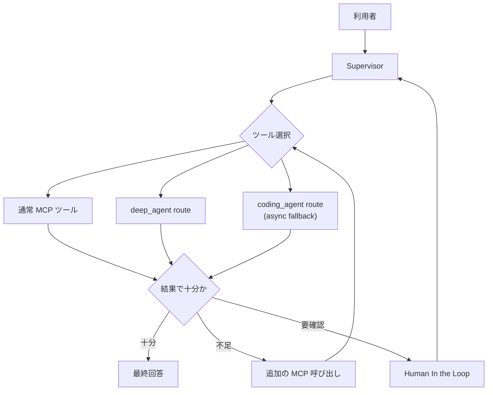

# スーパーバイザーのツール選択とMCP結果判断の検証

## 検証目的

本検証の主目的は、スーパーバイザーが利用可能なツール一覧から適切なツールを選択し、その実行結果がユーザー要求を満たすかどうかを判断しながら、必要に応じて追加の MCP 呼び出しまたは Human In the Loop を行えることを確認することである。

最終的に目指す姿は、スーパーバイザーが全体の実行計画を担い、単純な処理や定型的な処理は通常の MCP ツールへ委譲し、推論、分析、調査のように複数ステップを要する処理は DeepAgent を優先経路として委譲する構成である。DeepAgent で扱いにくい非同期ジョブ系要求は fallback として coding-agent 経路へ残す。この検証では、そのために必要となる以下の 2 つの中核機能を確認対象とする。

1. スーパーバイザーがツールの名称、説明、引数情報から適切なツールを選択できること
2. スーパーバイザーが MCP ツールの返却結果を評価し、追加照会、回答生成、HITL のいずれに進むべきか判断できること

## 関連するアーキテクチャ検討文書

本ドキュメントは、主に Application 層におけるスーパーバイザーの判断ロジックと、Tool 層における MCP ツール活用の PoC 検証資料として位置付ける。あわせて、全体アーキテクチャ上の配置、周辺レイヤとの関係、技術課題への対応状況を補助的に確認するため、以下の文書と対応している。

- [02_AIエージェントの業務適用を見据えた生成AIアプリケーション層の検討.md](../01_アーキテクチャ検討/02_AIエージェントの業務適用を見据えた生成AIアプリケーション層の検討.md)
  - スーパーバイザーによるツール選択、結果評価、追加照会、HITL への分岐は、SV 型の統合ユニットと評価ユニットの責務に直接対応する。
- [03_AIエージェントの業務適用を見据えた生成AIツール層の検討.md](../01_アーキテクチャ検討/03_AIエージェントの業務適用を見据えた生成AIツール層の検討.md)
  - 通常 MCP ツール、DeepAgent route、coding-agent fallback を分離し、それぞれの結果をスーパーバイザーが使い分ける構成は、Tool 層の標準化、意味付け、責務分界の具体例である。
- [AIエージェントの業務適用を見据えた運用監視基盤（Observability）の検討](../01_アーキテクチャ検討/AIエージェントの業務適用を見据えた運用監視基盤（Observability）の検討.md)
  - 「なぜそのツールを選んだか」「なぜ再照会または HITL に進んだか」を追跡できる証跡性は、trace_id を軸にした運用監視の設計と対応する。
- [01_AIエージェントの業務適用を見据えた生成AIアーキテクチャ検討.md](../01_アーキテクチャ検討/01_AIエージェントの業務適用を見据えた生成AIアーキテクチャ検討.md)
  - スーパーバイザー、MCP、DeepAgent、coding-agent fallback、HITL を含む今回の判断フローが、Application 層、Tool 層、周辺基盤をまたぐ全体像のどこに位置付くかを確認するための上位文書である。
- [技術課題と対応方針](../03_検証準備/技術課題と対応方針.md)
  - ツール選択の再現率、HITL 判定、証跡性、状態管理といった論点を、どの技術課題として整理するかを確認する際の参照先である。

## 対応する課題とサブ課題

| 親課題 | サブ課題 | この文書で主に確認すること |
| --- | --- | --- |
| A-01 | A-01-02 | Supervisor が利用可能な経路やツール群から、要求に合う委譲先を選べるかを確認する。 |
| T-01 | T-01-02 | ツール名、説明、引数情報といったメタデータ整備が、選択精度に与える影響を確認する。 |
| O-02 | O-02-03 | なぜそのツールを選び、なぜ追加照会や HITL に進んだかを後から再構成できるかを確認する。 |

本検証は Supervisor の判断品質を中心に扱うため、A-01-02 を主対象としつつ、Tool 定義品質と証跡性を横断的に確認する。

## 検証対象

今回の検証対象は、主に ai-chat-util 側のスーパーバイザー実装であり、特に以下の責務を対象とする。

| 観点 | 確認したい内容 | 主な実装候補 |
| --- | --- | --- |
| ツール選択 | 利用可能ツール一覧から適切な委譲先を選べるか | LangChain の既存 tool calling / 独自プロンプト |
| 結果評価 | ツール結果だけで回答可能か、追加照会が必要かを判断できるか | Supervisor の state / prompt / post-processing |
| 再質問制御 | 同一 MCP への再照会や別ツールへの切り替えを適切に行えるか | LangGraph の分岐制御 |
| HITL 判定 | ツール結果だけでは不足する場合に、ユーザー確認へ遷移できるか | interrupt / resume または明示的な確認応答 |
| 証跡性 | どの判断でどのツールを選び、なぜ再質問したか追えるか | 実行ログ / 中間 state |

## 前提

- スーパーバイザーは LangChain / LangGraph ベースで実装する
- 通常の情報取得系ツールと、複数ステップ調査を担う DeepAgent / coding-agent 系経路は分離する
- ツール情報として最低限、名称、説明、引数スキーマを取得できることを前提とする
- HITL は「ユーザーへ追加質問する」「承認待ちにする」の両方を含む広義の意味で扱う
- `agent_chat` を正規の supervisor 実行経路とし、`features.enable_deep_agent: true` および `features.preferred_coding_route: deep_agent` を有効化する
- DeepAgent route は非同期ジョブ系の `execute` / `status` / `get_result` を使わず、利用可能なファイル系 / MCP ツールだけで完結する前提とする
- 非同期ジョブ系が必要な場合は fallback として coding-agent 経路を許容する

## DeepAgent 適用時の前提

- DeepAgent route は `deepagents` 追加依存が導入済みであることを前提とする
- structured routing 検証では `routing_mode: structured`、`sufficiency_check_enabled: true`、`audit_log_enabled: true` に加え、`enable_deep_agent: true` と `preferred_coding_route: deep_agent` を有効化する
- `coding_agent_endpoint.mcp_server_name` は async task 型の fallback 経路を識別する設定として残す。DeepAgent route 自体は `deep_agent` route として監査ログに記録される
- DeepAgent route で使えるツールは ai-chat-util 側の allowlist に従うため、PoC では主に `get_loaded_config_info` と `analyze_files` 系を観測対象とする

## 検証で整理したい論点

### 1. ツール選択処理

確認したいこと:

- LangChain の既存 tool calling だけで、利用可能ツール一覧から適切なツール選択が安定して行えるか
- 既存機能だけで不足する場合、ツール情報とユーザー指示を入力として、選択結果を構造化して返す追加プロンプトが必要か
- ツール選択の誤りを減らすために、説明文や引数情報の整備だけで足りるか、それとも専用の選択ステップが必要か

判断基準:

- 代表的な問い合わせに対して、期待するツールが高い再現率で選ばれる
- 不適切なツールが選ばれた場合、原因がプロンプト不足なのか、ツール定義不足なのか、既存機能の限界なのか切り分けできる
- 追加実装を行う場合は、選択結果を XML や JSON などの構造化形式で受け取れる

### 2. MCP ツール結果の判断

確認したいこと:

- 単一のツール結果だけでユーザー要求に十分回答できるかを判断できるか
- 不十分な場合に、同じ MCP への追加質問、別ツールへの委譲、ユーザーへの確認依頼を切り分けられるか
- 結果の欠落、不確実性、矛盾を検知して、そのまま不完全な回答を返さないか

判断基準:

- ユーザーの要求項目とツール結果の対応関係を説明できる
- 情報不足時に「不足している情報は何か」を明示できる
- ツール再実行のループが暴走せず、一定回数や条件で HITL へ切り替えられる

### 3. Human In the Loop の導入条件

確認したいこと:

- 追加の MCP 呼び出しで解決できるケースと、ユーザー確認が必要なケースを区別できるか
- 副作用のある操作や、要求自体が曖昧なケースで適切に確認を求められるか
- 非同期 HITL まで視野に入れる場合、どの state を保持すべきかが整理できるか

HITL が必要になる代表例:

- ユーザー要求が曖昧で対象や条件が確定できない
- ツール結果に複数の候補があり、どれを採用すべきか業務判断が必要
- 追加実行に副作用やコスト増が伴う
- ツール側エラーではないが、回答品質を担保するために確認が必要

## 想定アーキテクチャ



図の意図:

- ツール選択と結果評価は別の責務として扱う
- 「選んで実行する」だけではなく、「結果が足りるかを判断する」段階を明示する
- 追加質問は MCP 再照会へ戻し、業務判断が必要な場合のみ HITL へ遷移する
- DeepAgent route を優先しつつ、非同期ジョブ系要求だけを coding-agent fallback に残す

上記の責務分解は、設計文書上では複数の層にまたがる。ツール選択、結果評価、追加照会、HITL への分岐は [02_AIエージェントの業務適用を見据えた生成AIアプリケーション層の検討.md](../01_アーキテクチャ検討/02_AIエージェントの業務適用を見据えた生成AIアプリケーション層の検討.md) における SV 型の統合・評価・監督の役割に対応し、通常ツール、DeepAgent route、coding-agent fallback の使い分けは [03_AIエージェントの業務適用を見据えた生成AIツール層の検討.md](../01_アーキテクチャ検討/03_AIエージェントの業務適用を見据えた生成AIツール層の検討.md) における Tool 層の標準化と責務分界の具体化として読むことができる。

## 実装観点ごとの確認ポイント

### ツール選択

| 確認項目 | 期待結果 |
| --- | --- |
| ツール一覧の取得 | 名称、説明、引数情報をスーパーバイザーが参照できる |
| 単純問い合わせの選択 | 通常 MCP ツールが選択される |
| 複数ステップ問い合わせの選択 | `deep_agent` route が優先選択される |
| 非同期ジョブ要求の扱い | `deep_agent` では完結しない場合のみ `coding_agent` fallback に進む |
| 曖昧問い合わせの扱い | 不適切な即時実行ではなく、確認か追加質問に進める |

### 結果判断

| 確認項目 | 期待結果 |
| --- | --- |
| 情報充足性の判断 | 要求項目を満たす場合のみ最終回答へ進む |
| 情報不足時の挙動 | 追加のツール実行かユーザー確認へ分岐する |
| 矛盾検知 | ツール結果と最終回答の矛盾を抑止できる |
| ループ制御 | 再照会が無制限に続かない |

### HITL

| 確認項目 | 期待結果 |
| --- | --- |
| 確認要求の生成 | ユーザーへ不足情報や判断ポイントを明示できる |
| 中断条件 | どの条件で中断するか説明可能である |
| 再開条件 | 追加入力後にどこから再開するか整理されている |

## 検証シナリオ

### シナリオ 1: 通常ツールを選択すべき問い合わせ

入力例:

- 現在読み込まれている設定ファイルの場所を教えてください
- 利用可能な解析系ツールを簡潔に教えてください

期待結果:

- 通常 MCP ツールが選択される
- `deep_agent` や `coding_agent` への不要な委譲をしない
- 結果だけで足りる場合はそのまま最終回答へ進む

### シナリオ 2: DeepAgent へ委譲すべき問い合わせ

入力例:

- docs 配下を調査して、共通している見出しを 3 点に整理してください
- 対象ワークスペースを調べて、関連する設定ファイルと実装箇所を洗い出してください

期待結果:

- `deep_agent` route が優先選択される
- ワークスペース参照を伴う複数ステップ調査が、`analyze_files` 系などのファイル系 / MCP ツールで完結する
- 実行結果が十分なら最終回答へ進む

### シナリオ 2-b: 非同期ジョブ系が必要で coding-agent fallback へ委譲すべき問い合わせ

入力例:

- 長時間の非同期タスクとして実行し、進捗確認付きで結果を取得してください
- `execute` / `status` / `get_result` を使う必要がある前提で調査してください

期待結果:

- `deep_agent` route ではなく `coding_agent` route が選択される
- async task 型の tool contract が必要な場合だけ fallback する
- fallback 条件がログまたは最終回答から追跡できる

### シナリオ 3: ツール結果だけでは不足し、追加照会が必要な問い合わせ

入力例:

- この設定で本番投入してよいですか
- 関連ドキュメントを見て不足点を教えてください

期待結果:

- 1 回目のツール結果だけで断定しない
- 追加の調査や別ツール利用が必要であれば再照会する
- 再照会しても判断不能なら、その理由を示して HITL 候補に進む

### シナリオ 4: ユーザー確認が必要な問い合わせ

入力例:

- 複数の候補があるが、どれを正式値として採用するか決めてください
- このまま更新処理を実行してよいですか

期待結果:

- スーパーバイザーが不足情報や判断ポイントを整理して確認を返す
- 副作用のある次アクションを勝手に進めない
- 非同期 HITL を採る場合は中断と再開の論点が整理される

## ai-chat-util チームへ依頼が必要になる境界

以下のいずれかに該当する場合は、ai-chat-util チームへの依頼対象とする。

1. LangChain 既存機能だけではツール選択の再現率が不足し、スーパーバイザー側の明示的な選択ステップ追加が必要
2. ツール結果の情報充足性判断を、現行の state / prompt / post-processing だけでは安定して実現できない
3. 追加質問と HITL の切り分けに必要な state 管理や interrupt/resume 制御が ai-chat-util 側実装に依存する
4. ログや証跡が不足しており、なぜそのツール選択や結果判断になったか追跡できない

依頼時に整理して渡すべき情報:

- 入力プロンプト
- 利用可能ツール一覧
- 実際に選ばれたツールと期待したツール
- ツール返却結果
- スーパーバイザー最終回答
- どの時点で追加照会または HITL が必要だと判断したか

## 検証手順

1. 利用可能ツール一覧を取得し、名称、説明、引数情報が確認できる状態にする
2. シナリオ 1、2、必要に応じて 2-b を実行し、ツール選択の妥当性を確認する
3. シナリオ 3 を実行し、結果評価と追加照会の分岐を確認する
4. シナリオ 4 を実行し、HITL が必要なケースの応答内容を確認する
5. 各シナリオについて、期待したツール選択、結果評価、最終応答、ログ証跡を比較する

現行の supervisor 実行 CLI は `chat --use_mcp` ではなく `agent_chat` である。また、この検証ではツール選択・結果十分性・監査イベントを観測しやすくするため、`routing_mode: structured`、`sufficiency_check_enabled: true`、`audit_log_enabled: true` に加えて `enable_deep_agent: true`、`preferred_coding_route: deep_agent` を有効化した専用設定を使う。

DeepAgent route は `execute` / `status` / `get_result` を使わないため、複数ステップ調査シナリオでは file 系 / MCP ツールで完結する問い合わせを基本形とする。非同期ジョブ系を要求する場合だけ、fallback として `coding_agent` route の観測を追加する。

## 実行コマンド例

以下は ai-platform-poc 側の検証環境を前提にした実行例である。既存の wrapper を使い、親 CLI 側へ必要な秘匿情報を安全に注入する。

### 共通変数

```bash
export AI_CHAT_UTIL_RUNNER="/home/user/source/repos/ai-platform-poc/infra/31-ai-chat-util-mcp/run-ai-chat-util.sh"
export AI_CHAT_UTIL_CONFIG="/home/user/source/repos/ai-platform-poc/infra/31-ai-chat-util-mcp/ai-chat-util-config.structured-routing.poc.yml"
export AUDIT_LOG_PATH="/home/user/source/repos/ai-platform-poc/infra/31-ai-chat-util-mcp/work/structured-routing-audit.jsonl"
export TARGET_WORKSPACE="/home/user/source/repos/ai-platform-poc"

rm -f "$AUDIT_LOG_PATH"
```

### 1. 利用可能ツール一覧の確認

```bash
"$AI_CHAT_UTIL_RUNNER" \
  --config "$AI_CHAT_UTIL_CONFIG" \
  agent_chat \
  -p "supervisor が参照した利用可能ツール一覧を、agent 名ごとに教えてください。"
```

確認ポイント:

- スーパーバイザーが参照した最終的な tool catalog を回答またはログで確認できる
- 通常ツール、`deep_agent` route、必要に応じて `coding_agent` fallback の役割差が読み取れる

### 2. 通常ツール選択の確認

```bash
"$AI_CHAT_UTIL_RUNNER" \
  --config "$AI_CHAT_UTIL_CONFIG" \
  agent_chat \
  -p "必ず MCP ツールで設定情報を確認してから、現在読み込まれている設定ファイルの場所と利用可能な解析系ツールを簡潔に説明してください。"
```

確認ポイント:

- `get_loaded_config_info` など通常ツールだけで完結する
- `deep_agent` や `coding_agent` への不要な委譲が起きない

### 3. DeepAgent 選択の確認

```bash
"$AI_CHAT_UTIL_RUNNER" \
  --config "$AI_CHAT_UTIL_CONFIG" \
  agent_chat \
  -p "作業対象は $TARGET_WORKSPACE です。DeepAgent を優先して docs/11_検証 配下の Markdown を調査し、共通している見出しを 3 点に整理してください。非同期ジョブ系の execute/status/get_result は使わずに完結してください。"
```

確認ポイント:

- スーパーバイザーが `deep_agent` route を優先選択する
- `analyze_files` 系などのファイル系 / MCP ツールを使った複数ステップ調査が実行される

### 3-b. coding-agent fallback の確認

```bash
"$AI_CHAT_UTIL_RUNNER" \
  --config "$AI_CHAT_UTIL_CONFIG" \
  agent_chat \
  -p "作業対象は $TARGET_WORKSPACE です。非同期ジョブとして実行し、進捗確認を伴って結果を取得してください。execute/status/get_result が必要な前提で docs/11_検証 配下を調査してください。"
```

確認ポイント:

- `deep_agent` ではなく `coding_agent` route が選択される
- fallback 条件がログまたは最終回答から読み取れる

### 4. 結果評価と追加照会の確認

```bash
"$AI_CHAT_UTIL_RUNNER" \
  --config "$AI_CHAT_UTIL_CONFIG" \
  agent_chat \
  -p "作業対象は $TARGET_WORKSPACE です。まず MCP ツールで現在の設定情報を確認し、その後 DeepAgent を優先して docs/11_検証 配下を調査してください。この設定と文書だけで本番投入判断に足りるかを答え、足りない場合は不足情報を挙げて必要な追加確認を示してください。"
```

確認ポイント:

- 1 回のツール結果だけで断定しない
- 追加調査で埋められる不足と、ユーザー判断が必要な不足を分けて説明できる

### 5. HITL 判定の確認

```bash
"$AI_CHAT_UTIL_RUNNER" \
  --config "$AI_CHAT_UTIL_CONFIG" \
  agent_chat \
  -p "作業対象は $TARGET_WORKSPACE です。MCP ツールで関連設定を確認したうえで、本番投入してよいか判断してください。判断に必要な前提が不足している場合は、追加で確認すべき点を 3 つまで挙げ、どれがユーザー判断事項かを明示してください。"
```

確認ポイント:

- 副作用のある判断を勝手に確定しない
- ツール再照会で解決できることと、ユーザー確認が必要なことを切り分ける

## プロンプト例と観察観点

| シナリオ | プロンプト例 | 主な観察観点 |
| --- | --- | --- |
| 通常ツール選択 | `現在読み込まれている設定ファイルの場所と利用可能な解析系ツールを教えてください` | 通常ツールのみで完結するか |
| DeepAgent 選択 | `DeepAgent を優先して docs/11_検証 配下を調査し、共通見出しを 3 点に整理してください` | `deep_agent` route へ委譲されるか |
| coding-agent fallback | `execute/status/get_result が必要な前提で docs/11_検証 配下を調査してください` | `coding_agent` fallback に進むか |
| 結果評価 | `この設定と文書だけで本番投入判断に足りるか` | 情報不足を検知して追加確認に進めるか |
| HITL 判定 | `本番投入してよいか判断してください。不足していればユーザー判断事項を明示してください` | HITL が必要な条件を説明できるか |

観察時に残すとよいメモ:

- 実際に選ばれたツール名
- 選択理由として読み取れる説明
- 追加照会に進んだ回数
- ユーザー確認が必要と判断した理由
- 最終回答が断定過剰になっていないか

## 判定基準

| 観点 | 合格条件 |
| --- | --- |
| ツール選択 | 期待した種類のツールが選ばれ、明らかな誤選択がない |
| 結果評価 | 情報不足時に不完全な断定回答を返さない |
| 追加照会 | 不足情報に応じた追加 MCP 実行へ進める |
| HITL | ユーザー判断が必要な場面で適切に確認へ遷移できる |
| 証跡性 | 選択理由と結果判断の流れをログまたは state から追える |

## 取得しておくべき証跡

- 利用可能ツール一覧の取得結果
- structured routing の監査 JSONL（`$AUDIT_LOG_PATH`）
- 各シナリオの入力プロンプト
- `route_decided` の route 名（`general_tool_agent` / `deep_agent` / `coding_agent`）
- 選択されたツール名と呼び出し引数
- MCP ツールの返却結果
- スーパーバイザーの最終回答
- 追加照会または HITL 判定に至ったログ

これらの証跡は、単に検証結果を保存するためだけでなく、設計へ戻すための入力でもある。特に、ツール選択理由、結果評価の分岐、HITL 判定の理由は [AIエージェントの業務適用を見据えた運用監視基盤（Observability）の検討](../01_アーキテクチャ検討/AIエージェントの業務適用を見据えた運用監視基盤（Observability）の検討.md) における trace_id 中心の証跡設計と接続し、状態管理や interrupt/resume の扱いは [技術課題と対応方針](../03_検証準備/技術課題と対応方針.md) における非同期 HITL、E2E トレース、状態管理の論点へ返して整理する。


## DeepAgent 版の実施状況

DeepAgent 優先設定への文書・設定反映は完了したが、本ドキュメント執筆時点では DeepAgent 前提の再テスト結果はまだ採取していない。以下の実測結果は、比較用に残している coding-agent 前提の参考値である。

DeepAgent 版で新たに確認すべき観点:

- `features.enable_deep_agent: true` と `features.preferred_coding_route: deep_agent` が読み込まれていること
- 複数ステップ調査シナリオで `route=deep_agent` が選択されること
- `tool_catalog_resolved` に `deep_agent` の tool catalog が記録されること
- 非同期ジョブ要求時のみ `coding_agent` fallback に切り替わること

## 参考: coding-agent 版の再テスト結果（2026-04-02, structured routing 反映後）

ai-chat-util README の現行仕様に合わせて、supervisor 実行経路を `agent_chat` に更新し、`routing_mode: structured` と監査 JSONL を有効化した専用設定で再テストした。

### 実施日時

- 2026-04-02 01:02 - 01:10

### 実施者

- GitHub Copilot

### 実施条件

- 利用モデル: `gpt-4o` を LiteLLM Proxy 経由で利用
- 実行ランナー:
  - `/home/user/source/repos/ai-platform-poc/infra/31-ai-chat-util-mcp/run-ai-chat-util.sh`
- 使用設定ファイル:
  - `/home/user/source/repos/ai-platform-poc/infra/31-ai-chat-util-mcp/ai-chat-util-config.structured-routing.poc.yml`
- MCP 設定:
  - `/home/user/source/repos/ai-platform-poc/infra/31-ai-chat-util-mcp/mcp_servers.local.json`
- 監査ログ:
  - `/home/user/source/repos/ai-platform-poc/infra/31-ai-chat-util-mcp/work/structured-routing-audit.jsonl`
- 主な有効化設定:
  - `routing_mode: structured`
  - `sufficiency_check_enabled: true`
  - `audit_log_enabled: true`
  - `audit_log_path: /home/user/source/repos/ai-platform-poc/infra/31-ai-chat-util-mcp/work/structured-routing-audit.jsonl`
- 対象ワークスペース:
  - `/home/user/source/repos/ai-platform-poc`

### シナリオ別確認結果

| シナリオ | 結果 | 補足 |
| --- | --- | --- |
| 利用可能ツール一覧の取得 | OK | 出力本文には `tool_agent_coding` と `tool_agent_general` の一覧が返った。structured routing の `route_decided` 自体は `reject` だったが、`tool_catalog_resolved` を使って最終回答が構成された |
| 通常ツール選択 | OK | 通常ログに `Resolved tool catalog: route=general_tool_agent` が出力され、`get_loaded_config_info` により設定ファイル path と解析系ツール一覧を返した |
| coding-agent 選択 | OK | 通常ログに `Resolved tool catalog: route=coding_agent` が出力され、見出し 3 点を返した |
| 結果評価と追加照会 | OK | 本番投入判断は「一部不足あり」と評価し、追加で必要な確認事項を列挙した。見出し抽出ではなく判断結果に収束した |
| HITL 判定 | OK | `Resolved tool catalog: route=general_tool_agent` を維持しつつ、ユーザー判断事項を含む追加確認点を返した。今回の run では `paused` 応答までは発生していない |
| 証跡性 | OK | `route_decided`、`tool_catalog_resolved`、`sufficiency_judged`、`final_answer_validated` が監査 JSONL に記録され、通常ログの `Resolved tool catalog` と整合した |

### ログ抜粋

- 利用可能ツール一覧の出力:

  ```text
  supervisor が参照した利用可能ツール一覧:
  - tool_agent_coding: healthz, execute, status, cancel, workspace_path, get_result
  - tool_agent_general: get_loaded_config_info, analyze_files, analyze_pdf_files, analyze_image_files
  ```

- 通常ツール選択の通常ログ:

  ```text
  Resolved tool catalog: route=general_tool_agent catalog={"tool_agent_names": ["tool_agent_general"], "tool_catalog": [{"agent_name": "tool_agent_general", "tool_names": ["get_loaded_config_info", "analyze_files", "analyze_pdf_files", "analyze_image_files"]}]}
  ```

- coding-agent 選択の通常ログ:

  ```text
  Resolved tool catalog: route=coding_agent catalog={"tool_agent_names": ["tool_agent_coding", "tool_agent_general"], "tool_catalog": [{"agent_name": "tool_agent_coding", "tool_names": ["healthz", "execute", "status", "cancel", "workspace_path", "get_result"]}, {"agent_name": "tool_agent_general", "tool_names": ["get_loaded_config_info"]}]}
  ```

- 結果評価シナリオの最終出力抜粋:

  ```text
  ### 本番投入判断できるか → 一部不足あり

  技術的なPoC検証は完了しているが、本番投入判断には以下の情報が不足している:
  - ペネトレーションテスト結果
  - 脆弱性スキャン結果
  - 本番監視項目とアラート定義
  - バックアップ・リカバリー手順
  - ロールバック計画
  ```

- HITL 判定シナリオの最終出力抜粋:

  ```text
  本番投入前に確認すべき事項
  1. APIキーの確認（ユーザー判断事項）
  2. ネットワーク設定の確認
  3. ログの設定確認（ユーザー判断事項）
  ```

### 確認できたこと

- README の現行仕様どおり、supervisor 実行 CLI は `chat --use_mcp` ではなく `agent_chat` である
- `routing_mode: structured` と `audit_log_enabled: true` を有効化すると、通常ログと JSONL の両方で route と tool catalog を追跡できる
- 通常問い合わせでは `tool_agent_general` のみに catalog が絞られ、coding-agent 系ツールは露出しなかった
- explicit coding-agent 問い合わせでは `tool_agent_coding` と `tool_agent_general` が同時に catalog へ入り、見出し抽出結果まで収束できた
- 利用可能ツール一覧の問い合わせだけは `route_decided=reject` になったが、`tool_catalog_resolved` を使った最終回答は成功した

### 所見

- 03 の検証は ai-chat-util の変更影響を受けており、実行手順は `agent_chat` と structured routing 前提へ更新する必要があった
- 現行実装では、ツール選択・結果十分性・最終回答妥当性を audit JSONL で追えるため、検証の証跡性は以前より高い
- 一方で、利用可能ツール一覧の問い合わせは route 判定上は `reject` になるため、tool catalog intent の扱いは今後の安定化対象として残る

### ai-chat-util へ返却したい事項

1. `supervisor が参照した利用可能ツール一覧を、agent 名ごとに教えてください。` のような tool catalog intent では、回答本文は正しく返る一方で `route_decided=reject` になる
2. 実害は小さいが、監査ログ上では unsupported request に見えるため、`tool_catalog_resolved` を返せる問い合わせは `reject` ではなく専用 intent または `general_tool_agent` へ収束した方が観測しやすい
3. 今回の structured routing 再テストでは、`route_decided=reject` と `final_answer_validated=completed` が同居することを確認したため、回帰候補として切り出してよい

## 参考: coding-agent 版の HITL pause/resume 再テスト結果（2026-04-02, API 経由）

`agent_chat` の CLI だけではプロセスを跨ぐ resume を扱いにくいため、API の `POST /api/ai_chat_util/agent_chat` を用いて `paused` → 承認 → `completed` の往復を確認した。

### 実施日時

- 2026-04-02 08:09 - 08:12

### 実施条件

- API サーバー:
  - `uv run -m ai_chat_util.api.api_server --config /home/user/source/repos/ai-platform-poc/infra/31-ai-chat-util-mcp/ai-chat-util-config.structured-routing.hitl.poc.yml`
- 使用設定ファイル:
  - `/home/user/source/repos/ai-platform-poc/infra/31-ai-chat-util-mcp/ai-chat-util-config.structured-routing.hitl.poc.yml`
- 追加設定:
  - `routing_mode: structured`
  - `sufficiency_check_enabled: true`
  - `audit_log_enabled: true`
  - `hitl_approval_tools: ["analyze_files"]`
- 監査ログ:
  - `/home/user/source/repos/ai-platform-poc/infra/31-ai-chat-util-mcp/work/structured-routing-hitl-audit.jsonl`
- 対象 trace_id:
  - `4bf92f3577b34da6a3ce929d0e0e4736`

### 実施内容

1. 初回リクエストで `analyze_files` を明示し、対象 Markdown の要約を要求した
2. API から `status="paused"` と `hitl.kind="approval"` を受け取った
3. 同じ `trace_id` に、承認メッセージ `はい、analyze_files の実行を承認します。` を追加して再送した
4. API から `status="completed"` を受け取り、要約結果が返ることを確認した

### 確認結果

| 項目 | 結果 | 補足 |
| --- | --- | --- |
| 初回 pause | OK | `status="paused"`、`hitl.kind="approval"`、`source="supervisor:analyze_files"` を確認 |
| 承認後 resume | OK | 同一 `trace_id` で再送すると `status="completed"` となり、要約結果が返った |
| 監査ログ | OK | 初回 run では `sufficiency.approval_required` と `hitl_requested`、resume 後は `tool_selected(analyze_files)`、`tool_result_received`、`final_answer_validated=completed` を確認 |

### API 応答抜粋

- 初回 pause 応答:

  ```json
  {
    "status": "paused",
    "trace_id": "4bf92f3577b34da6a3ce929d0e0e4736",
    "hitl": {
      "kind": "approval",
      "prompt": "analyze_files ツールを使用して、指定された Markdown ファイルを確認し、検証目的を要約しますか？",
      "source": "supervisor:analyze_files"
    }
  }
  ```

- resume 後の完了応答:

  ```json
  {
    "status": "completed",
    "trace_id": "4bf92f3577b34da6a3ce929d0e0e4736",
    "hitl": null
  }
  ```

### 監査ログ抜粋

```text
event_type=hitl_requested
reason_code=hitl.tool_approval_requested
payload={"kind":"approval","source":"supervisor:analyze_files"}

event_type=tool_selected
tool_name=analyze_files
approval_status=required

event_type=tool_result_received
tool_name=analyze_files
payload={"success":true,"cached":false}

event_type=final_answer_validated
final_status=completed
```

### 所見

- `hitl_approval_tools` に `analyze_files` を入れると、structured routing + API 経由で approval pause/resume を安定して再現できた
- resume は「同じ `trace_id` に承認メッセージを追加して再送する」実装で動作する
- これにより、03 の検証文書で扱っていた HITL は「質問文を返すだけ」ではなく、実際に `paused` / `completed` の外部契約まで確認済みになった


## 参考: coding-agent 版の検証結果

### 実施日時

- 2026-03-30 13:52 - 14:01
- 補足照合: 2026-03-30 14:xx

### 実施者

- GitHub Copilot

### 実施条件

- 利用モデル: `gpt-4o` を LiteLLM Proxy 経由で利用
- Supervisor 実装: `ai-chat-util` の LangChain / LangGraph ベース実装
- 利用可能ツール一覧の取得方法: supervisor 経由で `--use_mcp` を有効化し、まず独立再確認用の一覧プロンプトを実行した。その後、ai-chat-util チーム提示の正確なプロンプト `supervisor が参照した利用可能ツール一覧を、agent 名ごとに教えてください。` で補足照合した
- MCP 設定: `/home/user/source/repos/ai-platform-poc/infra/31-ai-chat-util-mcp/mcp_servers.local.json`
- 設定ファイル: `/home/user/source/repos/ai-platform-poc/infra/31-ai-chat-util-mcp/ai-chat-util-config.poc.yml`
- 対象ワークスペース: `/home/user/source/repos/ai-platform-poc`
- 実行ランナー: `/home/user/source/repos/ai-platform-poc/infra/31-ai-chat-util-mcp/run-ai-chat-util.sh`

### シナリオ別確認結果

| シナリオ | 結果 | 補足 |
| --- | --- | --- |
| 通常ツール選択 | OK | 設定ファイル path と解析系ツールを返し、通常ログにも `Resolved tool catalog: route=general_tool_agent ... analyze_files, analyze_pdf_files, analyze_image_files` が出力された |
| coding-agent 選択 | OK | docs 配下の Markdown を調査し、共通見出し 3 点を返した |
| 結果評価と追加照会 | OK | 本番投入判断に必要な追加確認事項を列挙し、情報不足として返せた |
| HITL 判定 | OK | 本番投入前にユーザー判断事項を明示し、追加確認点を返せた |
| 証跡性 | OK | 独立再確認では広めの一覧化依頼で `analyze_files` 系の欠落が再現したが、ai-chat-util チーム提示の正確なプロンプトで再照合した結果、回答本文とログの両方で tool catalog の整合を確認できた |

### ログ抜粋

- ツール一覧取得ログ:

  ```text
  supervisor が参照した利用可能ツール一覧:
  - tool_agent_coding: healthz, execute, status, cancel, workspace_path, get_result
  - tool_agent_general: get_loaded_config_info, analyze_files, analyze_pdf_files, analyze_image_files
  ```

- ツール選択ログ:

  ```text
  Resolved tool catalog: route=general_tool_agent catalog={"tool_agent_names": ["tool_agent_general"], "tool_catalog": [{"agent_name": "tool_agent_general", "tool_names": ["get_loaded_config_info", "analyze_files", "analyze_pdf_files", "analyze_image_files"]}]}
  ```

- MCP 実行結果:

  ```text
  Markdown ファイルを調査し、共通している見出しを以下の3点に整理しました:
  1. `## 実行手順`
  2. `## 検証結果`
  3. `## 今後の課題`
  ```

- 追加照会または HITL 判定ログ:

  ```text
  これらの情報をもとに本番投入判断を行うためには、以下の追加の確認が必要です。
  - MCP設定ファイルの具体的な内容が本番要件を満たしているか
  - 検証文書における実験内容や結果の詳細分析
  - 本番環境でのパフォーマンスやセキュリティの追加検討

  ### 追加確認すべき点
  1. APIキーの管理
  2. ネットワーク設定の確認
  3. 使用許可の確認
  ```

### 所見

- 通常ツール選択、coding-agent 選択、結果評価、HITL 判定という主要動作は、最新修正版で成立している
- 主要論点だったツール一覧証跡の一貫性は、確認プロンプトを `supervisor が参照した利用可能ツール一覧を、agent 名ごとに教えてください。` に固定した条件では解消を確認した
- 一方で、より自由度の高い一覧化依頼では応答整形が変わる可能性が残るため、必要であれば「汎化した一覧要求でも同等の完全性を保つか」は別観点として追加検証対象に切り分ける
- 現時点では、当初の確認観点に対する主要な blocker は解消済みとみなしてよい
