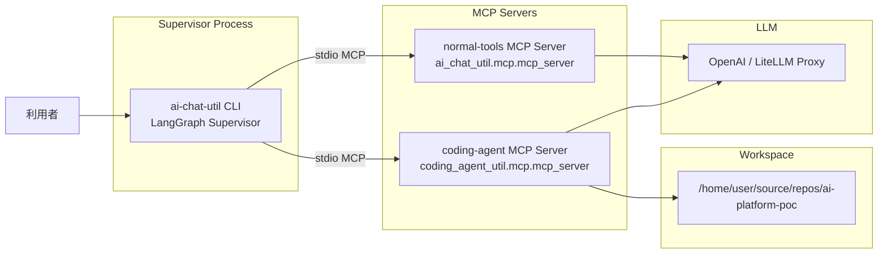

# コーディングエージェントのMCPサーバー化検証

## 検証目的

本検証の主目的は、LangChain/LangGraph で実装したスーパーバイザーから、MCP サーバー化したコーディングエージェントを実用的なツールとして呼び出せることを確認することである。単に MCP サーバーが起動することではなく、スーパーバイザーが問い合わせ内容に応じて適切な委譲先を選び、その実行結果を回収して最終判断に利用できることを確かめる。

最終的に目指す姿は、スーパーバイザーが全体の実行計画を担い、単純な処理や定型的な処理は通常の MCP ツールへ委譲し、推論、分析、調査のように複数ステップを要する処理はコーディングエージェントへ委譲する構成である。本検証は、その全体像を一度に評価するのではなく、まず正常系の基本動作が成立するかを段階的に確認する位置づけとする。

今回の検証範囲は、以下の 3 点に限定する。

1. コーディングエージェントを MCP サーバーとして起動し、スーパーバイザーから利用可能な形で公開できること
2. スーパーバイザーが MCP 設定を通じてコーディングエージェント用サーバーと通常ツール用サーバーを識別し、適切に接続できること
3. 通常ツールによる処理、コーディングエージェントへの委譲処理、その結果の統合処理までを正常系シナリオとして確認できること

なお、Docker Proxy による外部通信制御、ファイルアクセス制御、秘匿情報送信遮断といったガードレールは既存の検証結果を前提条件として扱う。そのため本ドキュメントでは、これらの安全対策そのものの有効性ではなく、それらを前提にした上でスーパーバイザーと MCP サーバー群の連携が成立するかに焦点を当てる。

## 検証で確認したいこと

正常系の検証では、MCP サーバー単体の成立性、スーパーバイザーからの接続成立性、委譲結果の統合成立性の 3 つに分けて確認する。

### 1. MCP サーバーとしての正常起動

- coding-agent 側の MCP サーバーを起動して、設定ファイルの読み込みに失敗しない
- 通常ツール側の MCP サーバーを起動して、指定したツール群を公開できる
- 少なくともスーパーバイザーから利用する前提で stdio transport が成立する

### 2. スーパーバイザーからの接続成立

- スーパーバイザー実装が参照する MCP 設定 JSON に、コーディングエージェント用サーバーと通常ツール用サーバーを定義できる
- `mcp.coding_agent_endpoint.mcp_server_name` と JSON 側の server key を一致させることで、コーディングエージェント用サーバーを正しく切り分けられる
- `--use_mcp` でスーパーバイザー実行時に、定義した MCP サーバーへ到達できる

### 3. 委譲と統合の正常系

- 単純な設定確認のような処理は通常ツール側で完結できる
- 調査や複数ステップの処理はコーディングエージェント側へ委譲できる
- 通常ツールの結果とコーディングエージェントの結果をスーパーバイザーが統合して最終回答を返せる

## 対象構成

今回の検証では、スーパーバイザー、通常ツール用 MCP サーバー、コーディングエージェント用 MCP サーバーを分離して扱う。スーパーバイザーは問い合わせ内容に応じて委譲先を選択し、それぞれの実行結果を最終回答へ統合する。



図の見方:

- スーパーバイザーは ai-chat-util 側の LangGraph Supervisor 実装を利用する
- 通常ツール用 MCP サーバーとコーディングエージェント用 MCP サーバーは、別 server key として定義する
- コーディングエージェントは作業対象ワークスペースを参照して調査や複数ステップ処理を実行する

| コンポーネント | 役割 | 実装/設定箇所 |
| --- | --- | --- |
| Supervisor | LLM による計画立案、委譲、結果統合 | `ai_chat_util/base/llm/llm_mcp_client_util.py` |
| サブエージェント分離 | `coding-agent` 用サーバーとそれ以外を分離 | `ai_chat_util/base/llm/agent.py` |
| 通常ツール MCP サーバー | 設定確認、ファイル解析系ツール公開 | `ai_chat_util/mcp/mcp_server.py` |
| coding-agent MCP サーバー | `healthz` / `execute` / `status` など公開 | `coding_agent_util/mcp/mcp_server.py` |
| 非秘匿設定 | LLM、MCP、workspace などの設定 | `ai-chat-util-config.yml` |
| MCP 設定 JSON | スーパーバイザーから接続するサーバー定義 | 任意の JSON ファイル |

## 役割分担の考え方

本検証では、どの処理をどのサーバーに委譲するかを明確に分ける。これにより、スーパーバイザーの接続確認と委譲判断を観察しやすくする。

### 通常ツール側

通常ツール側 MCP サーバーは、設定確認やファイル解析などの定型処理を公開する。今回の正常系検証では、`get_loaded_config_info` や `analyze_files` などを例として利用する。

### コーディングエージェント側

コーディングエージェント側 MCP サーバーは、`execute` を通じて別プロセスのコーディングエージェントを起動し、ワークスペース調査や複数ステップの作業を実行する。workspace path は絶対パスで渡す前提とする。

### スーパーバイザー側

スーパーバイザーは MCP 設定 JSON を読み込み、`mcp.coding_agent_endpoint.mcp_server_name` で指定した server key をコーディングエージェント用として扱う。それ以外の server key は通常ツール用として扱い、問い合わせ内容に応じて委譲先を切り替える。

## 事前準備

検証開始前に、実行環境、設定ファイル、LLM 接続情報、coding-agent 実行コマンドの前提を揃えておく。

- Python 3.11 以上
- `uv`
- スーパーバイザー実装一式を含む `ai-chat-util`
- 検証対象ワークスペース `ai-platform-poc`
- LLM 接続に必要な秘匿情報
- coding-agent 実行コマンド

`coding_agent_util.process.command` の既定値は `opencode run` である。別のコーディングエージェントを使う場合は、設定ファイル側で明示的に上書きする。

作業用の環境変数を定義する。

```bash
export AI_CHAT_UTIL_ROOT="/home/user/source/repos/ai-chat-util/app"
export AI_PLATFORM_POC_ROOT="/home/user/source/repos/ai-platform-poc"
export AI_CHAT_UTIL_CONFIG="$AI_PLATFORM_POC_ROOT/infra/31-ai-chat-util-mcp/ai-chat-util-config.poc.yml"

cd "$AI_CHAT_UTIL_ROOT"
uv sync
```

## 前提設定

ここでは、スーパーバイザーと 2 種類の MCP サーバーが同じ前提で動作するために必要な設定を確認する。

### 1. ai-chat-util-config.yml を確認する

少なくとも以下の項目を設定する。ここでは、LLM 接続先、MCP 設定 JSON の参照先、コーディングエージェントの接続先識別名、workspace 関連設定を揃える。共通ライブラリ本体には手を加えず、ai-platform-poc 側に検証用のオーバーレイ設定を配置する。

```yaml
ai_chat_util_config:
	llm:
		provider: openai
		api_key: os.environ/LLM_API_KEY
		completion_model: gpt-4o
		base_url: http://localhost:4000

	mcp:
		mcp_config_path: /home/user/source/repos/ai-platform-poc/infra/31-ai-chat-util-mcp/mcp_servers.local.json
		coding_agent_endpoint:
			mcp_server_name: coding-agent

coding_agent_util:
	backend:
		task_backend: process
	paths:
		workspace_root: /tmp/coding_agent_tasks
		host_projects_root: /tmp/coding_agent_projects
	process:
		command: opencode run
```

ポイント:

- 非秘匿設定は YAML に記載する
- `LLM_API_KEY` などの秘匿情報は `.env` または実環境変数で管理する
- 検証用設定ファイルは `ai-platform-poc/infra/31-ai-chat-util-mcp` 配下で管理する
- `mcp.coding_agent_endpoint.mcp_server_name` は後述の JSON の server key と一致させる

### 2. MCP 設定 JSON を用意する

スーパーバイザーが参照する MCP 設定 JSON に、通常ツール用サーバーとコーディングエージェント用サーバーを定義する。正常系検証では、役割が混ざらないように両者を別 server key として記述する。

例: `mcp_servers.local.json`

```json
{
	"mcpServers": {
		"coding-agent": {
			"type": "stdio",
			"command": "uv",
			"args": [
				"--directory",
				"/home/user/source/repos/ai-chat-util/app",
				"run",
				"-m",
				"coding_agent_util.mcp.mcp_server",
				"--config",
				"/home/user/source/repos/ai-platform-poc/infra/31-ai-chat-util-mcp/ai-chat-util-config.poc.yml"
			]
		},
		"normal-tools": {
			"type": "stdio",
			"command": "uv",
			"args": [
				"--directory",
				"/home/user/source/repos/ai-chat-util/app",
				"run",
				"-m",
				"ai_chat_util.mcp.mcp_server",
				"--config",
				"/home/user/source/repos/ai-platform-poc/infra/31-ai-chat-util-mcp/ai-chat-util-config.poc.yml",
				"--tools",
				"get_loaded_config_info,analyze_files,analyze_pdf_files,analyze_image_files"
			]
		}
	}
}
```

注意:

- 初回検証では stdio を基準 transport とする
- child process に秘匿情報を明示的に渡す必要がある環境では、各 server 定義に `env` を追加する
- 共通ライブラリ側の `ai-chat-util-config.yml` は変更しない

### 3. 秘匿情報を環境変数で投入する

```bash
export LITELLM_MASTER_KEY=$(grep '^LITELLM_MASTER_KEY=' /home/user/source/repos/ai-platform-poc/infra/02-litellm/.env | cut -d= -f2-)
export LLM_API_KEY="$LITELLM_MASTER_KEY"
```

今回の検証では、`LLM_API_KEY` には外部 LLM の API キーではなく LiteLLM Proxy の master key を設定する。`.env` 全体を `source` すると空白を含む値で崩れる場合があるため、必要なキーだけを抽出して利用する。接続先 URL は Poc 側のオーバーレイ設定ファイルで `http://localhost:4000` を指定する。

## 検証手順

検証は、設定確認、MCP サーバー単体起動、通常ツール利用、coding-agent 委譲、結果統合の順で進める。前のステップが後続の前提になるため、順番に実施する。

## 1. 設定読み込みを確認する

まず、スーパーバイザー実装が意図した設定ファイルを読み込めることを確認する。この段階では、MCP 接続より前に設定の参照先が正しいかを確認する。

```bash
cd "$AI_CHAT_UTIL_ROOT"
uv run -m ai_chat_util.cli --config "$AI_CHAT_UTIL_CONFIG" show_config
```

期待結果:

- `ai-chat-util-config.yml` の読み込みに失敗しない
- `mcp_config_path` と `coding_agent_endpoint.mcp_server_name` が意図した値になっている

## 2. coding-agent MCP サーバーの単体起動を確認する

本番想定の接続は stdio だが、初回の起動確認はログが見やすいように http mode で行う。ここでは、coding-agent MCP サーバー自身が正常に立ち上がるかだけを見る。

```bash
cd "$AI_CHAT_UTIL_ROOT"
uv run -m coding_agent_util.mcp.mcp_server \
	--config "$AI_CHAT_UTIL_CONFIG" \
	--mode http \
	--host 127.0.0.1 \
	--port 7101
```

期待結果:

- サーバーが起動し、設定ファイルの読み込みエラーが出ない
- `workspace_root` の書き込みチェックで失敗しない
- `execute` / `status` / `cancel` などの公開準備が完了する

補足:

- このステップは起動確認用であり、後続の supervisor 連携では stdio 定義を使う

## 3. 通常ツールのみの正常系を確認する

スーパーバイザーから MCP を有効にして実行し、通常ツールだけで完結する問い合わせを実施する。ここでは、コーディングエージェントへ委譲しなくても処理できる問い合わせを与える。

```bash
cd "$AI_CHAT_UTIL_ROOT"
uv run -m ai_chat_util.cli \
	--config "$AI_CHAT_UTIL_CONFIG" \
	chat \
	--use_mcp \
	-p "必ず MCP ツールで設定情報を確認してから、現在読み込まれている設定ファイルの場所と利用可能な解析系ツールを簡潔に説明してください。"
```

期待結果:

- スーパーバイザーが `normal-tools` 側の MCP サーバーへ到達できる
- `get_loaded_config_info` などの通常ツールが利用される
- 最終回答に、設定ファイルの所在と解析系ツールの説明が含まれる

## 4. コーディングエージェント委譲の正常系を確認する

次に、調査や複数ステップ処理が必要な問い合わせを与え、コーディングエージェント側へ委譲できることを確認する。ここでは、対象ワークスペースの参照を伴う依頼を与える。

```bash
cd "$AI_CHAT_UTIL_ROOT"
uv run -m ai_chat_util.cli \
	--config "$AI_CHAT_UTIL_CONFIG" \
	chat \
	--use_mcp \
	-p "作業対象は /home/user/source/repos/ai-platform-poc です。必ず coding agent を使って docs/11_検証 配下の Markdown を調査し、検証ドキュメントで共通している見出しを 3 点に整理してください。"
```

期待結果:

- スーパーバイザーが `coding-agent` 側の MCP サーバーへ到達できる
- コーディングエージェントが対象ワークスペースを参照して調査を実行する
- 最終回答に、調査結果として妥当な見出し候補が含まれる

## 5. 統合シナリオを確認する

最後に、通常ツール側とコーディングエージェント側の結果をスーパーバイザーが統合できることを確認する。このステップでは、設定確認とワークスペース調査の両方を含む問い合わせを与える。

```bash
cd "$AI_CHAT_UTIL_ROOT"
uv run -m ai_chat_util.cli \
	--config "$AI_CHAT_UTIL_CONFIG" \
	chat \
	--use_mcp \
	-p "作業対象は /home/user/source/repos/ai-platform-poc です。まず MCP ツールで現在の設定情報を確認し、その後 coding agent を使って docs/11_検証 配下を調査し、MCP サーバー化検証ドキュメントで流用できる見出し案を 3 点提案してください。どの情報をどのツールで確認したかも簡潔に示してください。"
```

期待結果:

- 設定確認系の情報とワークスペース調査結果が両方含まれる
- スーパーバイザーがツール実行結果を統合したうえで最終回答を返す
- どのサーバーを使ったかが、回答またはログから追跡できる

## 判定基準

各ステップは、単にコマンドが終了することではなく、期待した委譲先が使われ、最終回答に必要な情報が含まれていることをもって合格とする。

| 観点 | 合格条件 |
| --- | --- |
| 設定整合性 | `show_config` で想定した `mcp_config_path` と `coding_agent_endpoint.mcp_server_name` を確認できる |
| MCP サーバー起動 | coding-agent MCP サーバーが起動し、設定読込・workspace 書き込みチェックで失敗しない |
| 通常ツール利用 | 通常ツールのみの問い合わせで `normal-tools` 側を利用して回答できる |
| コーディングエージェント委譲 | 調査系問い合わせで `coding-agent` 側へ委譲し、ワークスペースを参照した結果を返せる |
| 統合回答 | 設定確認結果と調査結果をスーパーバイザーが 1 つの回答にまとめられる |

## 取得しておくべき証跡

後から委譲経路と結果を追えるように、設定、実行、応答の 3 種類の証跡を残す。

- `show_config` 実行結果
- スーパーバイザー実行ログ
- コーディングエージェント MCP サーバー起動ログ
- 入力したプロンプトと最終回答
- coding-agent が参照した対象パス、生成した成果物、標準出力の抜粋

## 実施結果（2026-03-28）

### 実施日時

- 2026-03-28 16:25 - 16:46

### 実施者

- GitHub Copilot

### 実施条件

- 利用モデル: `gpt-4o` を LiteLLM Proxy 経由で利用
- ai-chat-util 設定ファイル:
	- `/home/user/source/repos/ai-platform-poc/infra/31-ai-chat-util-mcp/ai-chat-util-config.poc.yml`
	- `/home/user/source/repos/ai-platform-poc/infra/31-ai-chat-util-mcp/ai-chat-util-config.normal-only.poc.yml`
	- `/home/user/source/repos/ai-platform-poc/infra/31-ai-chat-util-mcp/ai-chat-util-config.coding-only.poc.yml`
- MCP 設定 JSON:
	- `/home/user/source/repos/ai-platform-poc/infra/31-ai-chat-util-mcp/mcp_servers.local.json`
	- `/home/user/source/repos/ai-platform-poc/infra/31-ai-chat-util-mcp/mcp_servers.normal-only.json`
	- `/home/user/source/repos/ai-platform-poc/infra/31-ai-chat-util-mcp/mcp_servers.coding-only.json`
- コーディングエージェント実行コマンド: `opencode run`
- 対象ワークスペース: `/home/user/source/repos/ai-platform-poc`
- 認証キー: `LLM_API_KEY=sk-poc-master-key-12345` を LiteLLM Proxy の master key として使用

### 確認結果

| 項目 | 結果 | 補足 |
| --- | --- | --- |
| 設定読み込み確認 | OK | `show_config` で Poc 側オーバーレイ設定の読み込みを確認 |
| コーディングエージェント MCP サーバー起動 | OK | HTTP mode で `coding_agent_executor` が `127.0.0.1:7101/mcp` で起動 |
| 通常ツール正常系 | OK | `normal-tools` 単体構成で設定ファイルの場所と利用可能ツールの説明を取得 |
| コーディングエージェント正常系 | OK | `coding-agent` 単体構成で `docs/11_検証` 配下の Markdown 調査回答を開始できた |
| 統合正常系 | NG | `coding-agent` と `normal-tools` を同時定義すると `Agent with name 'tool_agent' already exists` で失敗 |

### ログ抜粋

#### 設定読み込み確認

```text
{
	"path": "/home/user/source/repos/ai-platform-poc/infra/31-ai-chat-util-mcp/ai-chat-util-config.poc.yml",
	"config": {
		"ai_chat_util_config": {
			"llm": {
				"completion_model": "gpt-4o",
				"base_url": "http://localhost:4000"
			},
			"mcp": {
				"mcp_config_path": "/home/user/source/repos/ai-platform-poc/infra/31-ai-chat-util-mcp/mcp_servers.local.json",
				"coding_agent_endpoint": {
					"mcp_server_name": "coding-agent"
				}
			}
		}
	}
}
```

確認できること:

- ai-chat-util 本体ではなく Poc 側オーバーレイ設定が読み込まれている
- LiteLLM Proxy の URL と MCP 設定 JSON の参照先が意図どおり反映されている

#### コーディングエージェント MCP サーバー起動

```text
Starting MCP server 'coding_agent_executor' with transport 'streamable-http' on http://127.0.0.1:7101/mcp
Application startup complete.
Uvicorn running on http://127.0.0.1:7101
```

確認できること:

- Poc 側オーバーレイ設定を `--config` で渡すだけで起動できる
- 共通ライブラリ本体を変更せずに MCP サーバー起動までは成立する

#### 通常ツール正常系

```text
Creating normal agent for MCP server 'normal-tools'...
Allowed tools:
- get_loaded_config_info
- analyze_files
- analyze_pdf_files
- analyze_image_files

現在読み込まれている設定ファイルの場所は以下です：
- パス: /home/user/source/repos/ai-platform-poc/infra/31-ai-chat-util-mcp/ai-chat-util-config.normal-only.poc.yml
```

確認できること:

- `normal-tools` 単体構成ではスーパーバイザーから stdio MCP 接続が成立する
- `get_loaded_config_info` を実行して最終回答まで到達できる

#### コーディングエージェント正常系

```text
Creating code agent for MCP server 'coding-agent'...
Allowed tools:
- healthz
- execute
- status
- cancel
- workspace_path
- get_result

ツールエージェントによる処理が完了しました。以下が "docs/11_検証" 配下の Markdown 内で共通している見出しです。
```

確認できること:

- `coding-agent` 単体構成ではコーディングエージェント用ツールの読込が成功する
- ワークスペース調査を伴う問い合わせに対して、委譲先としてコーディングエージェントを使う流れまでは確認できる

#### 統合正常系のブロッカー

```text
ValueError: Agent with name 'tool_agent' already exists. Agent names must be unique.
```

確認できること:

- `coding-agent` と `normal-tools` を同時に読み込む構成では、ai-chat-util 内部のサブエージェント名が衝突する
- この制約は Poc 側設定の調整では回避できず、ai-chat-util 本体修正なしでは統合正常系を完了できない

### 所見

- Poc 側オーバーレイ設定を用意することで、ai-chat-util 本体を変更せずに設定読込、MCP サーバー起動、通常ツール単体利用、コーディングエージェント単体利用までは検証できた
- `LLM_API_KEY` は親 CLI プロセスだけでなく、stdio で起動される子 MCP サーバーにも渡す必要があった
- `.env` 全体を `source` する方法は空白を含む値で崩れるため、必要なキーだけを抽出して使う方が安全だった
- 統合正常系については、現時点では Poc 側の工夫だけでは解消できない既知の実装制約がある

## 再検証結果（2026-03-28, ai-chat-util 修正版適用後）

### 実施日時

- 2026-03-28 17:51 - 17:52

### 実施者

- GitHub Copilot

### 実施条件

- 利用モデル: `gpt-4o` を LiteLLM Proxy 経由で利用
- ai-chat-util 設定ファイル:
	- `/home/user/source/repos/ai-platform-poc/infra/31-ai-chat-util-mcp/ai-chat-util-config.poc.yml`
- MCP 設定 JSON:
	- `/home/user/source/repos/ai-platform-poc/infra/31-ai-chat-util-mcp/mcp_servers.local.json`
- コーディングエージェント実行コマンド: `opencode run`
- 対象ワークスペース: `/home/user/source/repos/ai-platform-poc`
- 認証キー: `LLM_API_KEY=sk-poc-master-key-12345` を LiteLLM Proxy の master key として使用
- 実施プロンプト:
	- `まず get_loaded_config_info を使って現在の設定ファイルの場所を確認してください。その後 coding agent を使って /home/user/source/repos/ai-platform-poc/docs/11_検証/02_コーディングエージェントのMCPサーバー化検証.md を調査し、文書内で重要な見出しを 3 点挙げてください。最後に、設定ファイルの場所と見出し 3 点をまとめて回答してください。`

### 確認結果

| 項目 | 結果 | 補足 |
| --- | --- | --- |
| サブエージェント重複名不具合 | OK | 旧不具合 `Agent with name 'tool_agent' already exists` は再現しなかった |
| 統合時の MCP サーバー生成 | OK | `coding-agent` と `normal-tools` の両方を同一実行で生成できた |
| 統合時の通常ツール実行 | OK | `analyze_files` が対象 Markdown 1 件に対して実行完了した |
| 統合正常系 | NG | `get_loaded_config_info` と `analyze_files` のツール呼び出し上限超過により最終回答が失敗した |

### ログ抜粋

#### 旧不具合の解消確認

```text
Creating sub-agents...
Creating code agent for MCP server 'coding-agent'...
Creating normal agent for MCP server 'normal-tools'...
Allowed tools:
- healthz
- execute
- status
- cancel
- workspace_path
- get_result
- get_loaded_config_info
- analyze_files
- analyze_pdf_files
- analyze_image_files
```

確認できること:

- 旧不具合である `tool_agent` 名の重複エラーは発生しなかった
- 1 回の supervisor 実行内で `coding-agent` と `normal-tools` の両方をロードできた

#### 新しいブロッカー

```text
MCP_TOOL_START tool=analyze_files call_id=1 files=1 detail=auto prompt_len=21
MCP_TOOL_END tool=analyze_files call_id=1 elapsed_ms=4648
WARNING - Tool call budget exceeded: tool=get_loaded_config_info used=2 limit=2
WARNING - Tool call budget exceeded: tool=analyze_files used=2 limit=2

申し訳ありません。ツール実行の制限が原因で設定ファイルの場所を確認することができませんでした。また、指定されたMarkdownファイルの調査も行うことができません。
```

確認できること:

- 統合シナリオは旧不具合の地点を通過し、実際のツール実行フェーズまで到達した
- ただし、ツール呼び出し回数制限に達すると supervisor が再試行を継続し、最終的に回答生成に失敗した
- 今回の NG 要因はサブエージェント名衝突ではなく、統合シナリオにおけるツール予算制御である

### 所見

- ai-chat-util 側で修正されたサブエージェント名の一意化は有効であり、旧不具合は解消したと判断できる
- 統合シナリオは、MCP サーバー群の同時ロードと初回ツール実行までは到達したため、構成上の分離方針自体は成立している
- 一方で、実運用相当の統合シナリオを安定して完了させるには、`tool_call_limit` の見直し、再試行制御、または supervisor プロンプトの誘導改善が別途必要である
- 次回の再検証では、ツール上限値を明示調整した条件と、より厳密にツール選択を指示したプロンプト条件を分けて確認するのが妥当である

## 追加確認結果（2026-03-28 18:10, 同一条件での再実行）

同一の Poc 側オーバーレイ設定と MCP 設定 JSON を用いて、統合シナリオを再度実行した。

確認できたこと:

- `coding-agent` と `normal-tools` の同時ロードは再度成功した
- `tool_agent` 名重複は再発しなかった
- `normal-tools` 側では `analyze_files` が完了し、その後 `coding-agent` 側で `execute` と `status` まで進んだ
- ただし `status used=2 limit=2`、`execute used=2 limit=2` で予算超過となり、最終回答は失敗した

ログ抜粋:

```text
Creating sub-agents...
Creating code agent for MCP server 'coding-agent'...
Creating normal agent for MCP server 'normal-tools'...

MCP_TOOL_START tool=analyze_files call_id=1 files=1 detail=auto prompt_len=21
MCP_TOOL_END tool=analyze_files call_id=1 elapsed_ms=4182

mcp.request {'tool': 'execute', ...}
mcp.response tool=execute dt_ms=14 result_type=ExecuteResponse
mcp.request {'tool': 'status', ...}
mcp.response tool=status dt_ms=0 result_type=TaskStatus

WARNING - Tool call budget exceeded: tool=status used=2 limit=2
WARNING - Tool call budget exceeded: tool=execute used=2 limit=2
```

所見:

- `tool_call_limit` の影響は通常ツール側だけでなく、コーディングエージェント側の `execute` / `status` ポーリングにも及んでいる
- とくに非同期実行型の coding-agent では、`execute` 後に `status` を複数回呼ぶ設計のため、既定値 2 では統合シナリオ完走に不足する可能性が高い
- そのため、次回の切り分けでは prompt 誘導だけでなく、`features.mcp_tool_call_limit` を明示設定した条件での比較が必要である

## 再テスト結果（2026-03-28 18:20, ai-chat-util チーム対応後）

ai-chat-util チームから共有された以下の修正反映後に、前回と同一の統合シナリオを再実行した。

- `tool_call_limit` の既定値見直し
- `status`、`get_result`、`workspace_path`、`cancel` など追跡系ツールの budget 分離
- tool budget 超過時に追加ツール実行を止め、既取得結果で収束させる処理の追加

### 確認できたこと

- `coding-agent` と `normal-tools` の同時ロードは成功した
- 旧不具合であるサブエージェント名重複は再発しなかった
- 前回の主因であった `Tool call budget exceeded` は今回のログでは発生しなかった
- `normal-tools` 側の `analyze_files` は複数回成功し、`coding-agent` 側の `execute` と `status` も実行できた
- ただし最終的には、supervisor が LLM へ渡す文脈が肥大化し、`ContextWindowExceededError` により失敗した

### ログ抜粋

```text
Creating sub-agents...
Creating code agent for MCP server 'coding-agent'...
Creating normal agent for MCP server 'normal-tools'...

MCP_TOOL_START tool=analyze_files call_id=1 files=1 detail=auto prompt_len=23
MCP_TOOL_END tool=analyze_files call_id=1 elapsed_ms=3367

mcp.request {'tool': 'execute', ...}
mcp.response tool=execute dt_ms=5 result_type=ExecuteResponse
mcp.request {'tool': 'status', ..., 'tail': 200}
mcp.response tool=status dt_ms=9556 result_type=TaskStatus

ContextWindowExceededError: This model's maximum context length is 128000 tokens.
However, your messages resulted in 1130419 tokens
```

### 所見

- ai-chat-util チームの今回の修正により、少なくとも前回の `tool_call_limit` 起因の失敗は解消したと判断できる
- 一方で、統合シナリオの完走性を阻害する新たなボトルネックとして、supervisor へ戻す情報量の制御不足が顕在化した
- とくに `coding-agent` の `status` / `get_result` 系応答や、ツール実行結果の履歴をそのまま会話文脈へ積み上げる実装では、複合シナリオで容易にコンテキスト上限へ到達しうる
- そのため、本件は「budget 超過不具合は解消したが、同一シナリオは別要因でなお未完走」として再オープン候補に該当する

## 検証結果記入テンプレート

以下のテンプレートに従い、検証条件、確認結果、ログ、所見を記録する。

### 実施日時

- yyyy-mm-dd hh:mm

### 実施者

- 氏名またはチーム名

### 実施条件

- 利用モデル:
- ai-chat-util 設定ファイル:
- MCP 設定 JSON:
- コーディングエージェント実行コマンド:
- 対象ワークスペース:

### 確認結果

| 項目 | 結果 | 補足 |
| --- | --- | --- |
| 設定読み込み確認 | OK / NG | `show_config` で意図した設定値を確認できたか |
| コーディングエージェント MCP サーバー起動 | OK / NG | 設定読込、workspace 書き込みチェック、公開ツール準備を確認 |
| 通常ツール正常系 | OK / NG | `normal-tools` 側を利用して回答できたか |
| コーディングエージェント正常系 | OK / NG | `coding-agent` 側へ委譲して回答できたか |
| 統合正常系 | OK / NG | 設定確認結果と調査結果を統合して回答できたか |

### ログ抜粋

ここに主要なログを貼り付ける。

- スーパーバイザーログ:
- コーディングエージェント MCP サーバーログ:
- 必要に応じて通常ツール用 MCP サーバーログ:

### 所見

- 想定通りに確認できた点
- 想定と異なった点
- 次段の異常系検証で追加確認したい点

## 次段の検証候補

今回の正常系確認が完了した後は、接続不備や制御系を含む異常系へ段階的に拡張する。

1. `coding_agent_endpoint.mcp_server_name` 不一致時の異常系
2. MCP サーバー未起動時の異常系
3. HITL 承認が必要なツールを含むシナリオ
4. `tool_call_limit` や `tool_timeout_seconds` など安全弁の確認
