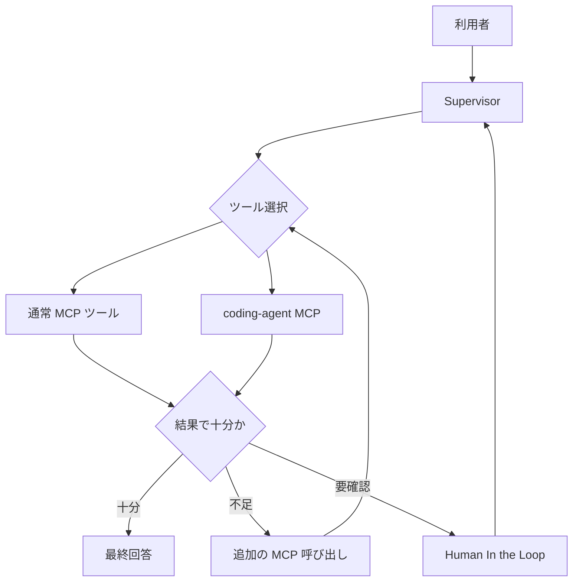

# スーパーバイザーのツール選択とMCP結果判断の検証

## 検証目的

本検証の主目的は、スーパーバイザーが利用可能なツール一覧から適切なツールを選択し、その実行結果がユーザー要求を満たすかどうかを判断しながら、必要に応じて追加の MCP 呼び出しまたは Human In the Loop を行えることを確認することである。

最終的に目指す姿は、スーパーバイザーが全体の実行計画を担い、単純な処理や定型的な処理は通常の MCP ツールへ委譲し、推論、分析、調査のように複数ステップを要する処理はコーディングエージェントへ委譲する構成である。この検証では、そのために必要となる以下の 2 つの中核機能を確認対象とする。

1. スーパーバイザーがツールの名称、説明、引数情報から適切なツールを選択できること
2. スーパーバイザーが MCP ツールの返却結果を評価し、追加照会、回答生成、HITL のいずれに進むべきか判断できること

## 検証対象

今回の検証対象は、主に ai-chat-util 側のスーパーバイザー実装であり、特に以下の責務を対象とする。

| 観点 | 確認したい内容 | 主な実装候補 |
| --- | --- | --- |
| ツール選択 | 利用可能ツール一覧から適切な委譲先を選べるか | LangChain の既存 tool calling / 独自プロンプト |
| 結果評価 | ツール結果だけで回答可能か、追加照会が必要かを判断できるか | Supervisor の state / prompt / post-processing |
| 再質問制御 | 同一 MCP への再照会や別ツールへの切り替えを適切に行えるか | LangGraph の分岐制御 |
| HITL 判定 | ツール結果だけでは不足する場合に、ユーザー確認へ遷移できるか | interrupt / resume または明示的な確認応答 |
| 証跡性 | どの判断でどのツールを選び、なぜ再質問したか追えるか | 実行ログ / 中間 state |

## 前提

- スーパーバイザーは LangChain / LangGraph ベースで実装する
- 通常の情報取得系ツールと、複数ステップ実行を担うコーディングエージェント系ツールは分離する
- ツール情報として最低限、名称、説明、引数スキーマを取得できることを前提とする
- HITL は「ユーザーへ追加質問する」「承認待ちにする」の両方を含む広義の意味で扱う

## 検証で整理したい論点

### 1. ツール選択処理

確認したいこと:

- LangChain の既存 tool calling だけで、利用可能ツール一覧から適切なツール選択が安定して行えるか
- 既存機能だけで不足する場合、ツール情報とユーザー指示を入力として、選択結果を構造化して返す追加プロンプトが必要か
- ツール選択の誤りを減らすために、説明文や引数情報の整備だけで足りるか、それとも専用の選択ステップが必要か

判断基準:

- 代表的な問い合わせに対して、期待するツールが高い再現率で選ばれる
- 不適切なツールが選ばれた場合、原因がプロンプト不足なのか、ツール定義不足なのか、既存機能の限界なのか切り分けできる
- 追加実装を行う場合は、選択結果を XML や JSON などの構造化形式で受け取れる

### 2. MCP ツール結果の判断

確認したいこと:

- 単一のツール結果だけでユーザー要求に十分回答できるかを判断できるか
- 不十分な場合に、同じ MCP への追加質問、別ツールへの委譲、ユーザーへの確認依頼を切り分けられるか
- 結果の欠落、不確実性、矛盾を検知して、そのまま不完全な回答を返さないか

判断基準:

- ユーザーの要求項目とツール結果の対応関係を説明できる
- 情報不足時に「不足している情報は何か」を明示できる
- ツール再実行のループが暴走せず、一定回数や条件で HITL へ切り替えられる

### 3. Human In the Loop の導入条件

確認したいこと:

- 追加の MCP 呼び出しで解決できるケースと、ユーザー確認が必要なケースを区別できるか
- 副作用のある操作や、要求自体が曖昧なケースで適切に確認を求められるか
- 非同期 HITL まで視野に入れる場合、どの state を保持すべきかが整理できるか

HITL が必要になる代表例:

- ユーザー要求が曖昧で対象や条件が確定できない
- ツール結果に複数の候補があり、どれを採用すべきか業務判断が必要
- 追加実行に副作用やコスト増が伴う
- ツール側エラーではないが、回答品質を担保するために確認が必要

## 想定アーキテクチャ



図の意図:

- ツール選択と結果評価は別の責務として扱う
- 「選んで実行する」だけではなく、「結果が足りるかを判断する」段階を明示する
- 追加質問は MCP 再照会へ戻し、業務判断が必要な場合のみ HITL へ遷移する

## 実装観点ごとの確認ポイント

### ツール選択

| 確認項目 | 期待結果 |
| --- | --- |
| ツール一覧の取得 | 名称、説明、引数情報をスーパーバイザーが参照できる |
| 単純問い合わせの選択 | 通常 MCP ツールが選択される |
| 複数ステップ問い合わせの選択 | coding-agent 系ツールが選択される |
| 曖昧問い合わせの扱い | 不適切な即時実行ではなく、確認か追加質問に進める |

### 結果判断

| 確認項目 | 期待結果 |
| --- | --- |
| 情報充足性の判断 | 要求項目を満たす場合のみ最終回答へ進む |
| 情報不足時の挙動 | 追加のツール実行かユーザー確認へ分岐する |
| 矛盾検知 | ツール結果と最終回答の矛盾を抑止できる |
| ループ制御 | 再照会が無制限に続かない |

### HITL

| 確認項目 | 期待結果 |
| --- | --- |
| 確認要求の生成 | ユーザーへ不足情報や判断ポイントを明示できる |
| 中断条件 | どの条件で中断するか説明可能である |
| 再開条件 | 追加入力後にどこから再開するか整理されている |

## 検証シナリオ

### シナリオ 1: 通常ツールを選択すべき問い合わせ

入力例:

- 現在読み込まれている設定ファイルの場所を教えてください
- 利用可能な解析系ツールを簡潔に教えてください

期待結果:

- 通常 MCP ツールが選択される
- coding-agent へ不要な委譲をしない
- 結果だけで足りる場合はそのまま最終回答へ進む

### シナリオ 2: コーディングエージェントへ委譲すべき問い合わせ

入力例:

- docs 配下を調査して、共通している見出しを 3 点に整理してください
- 対象ワークスペースを調べて、関連する設定ファイルと実装箇所を洗い出してください

期待結果:

- coding-agent 系ツールが選択される
- ワークスペース参照を伴う複数ステップ調査が行われる
- 実行結果が十分なら最終回答へ進む

### シナリオ 3: ツール結果だけでは不足し、追加照会が必要な問い合わせ

入力例:

- この設定で本番投入してよいですか
- 関連ドキュメントを見て不足点を教えてください

期待結果:

- 1 回目のツール結果だけで断定しない
- 追加の調査や別ツール利用が必要であれば再照会する
- 再照会しても判断不能なら、その理由を示して HITL 候補に進む

### シナリオ 4: ユーザー確認が必要な問い合わせ

入力例:

- 複数の候補があるが、どれを正式値として採用するか決めてください
- このまま更新処理を実行してよいですか

期待結果:

- スーパーバイザーが不足情報や判断ポイントを整理して確認を返す
- 副作用のある次アクションを勝手に進めない
- 非同期 HITL を採る場合は中断と再開の論点が整理される

## ai-chat-util チームへ依頼が必要になる境界

以下のいずれかに該当する場合は、ai-chat-util チームへの依頼対象とする。

1. LangChain 既存機能だけではツール選択の再現率が不足し、スーパーバイザー側の明示的な選択ステップ追加が必要
2. ツール結果の情報充足性判断を、現行の state / prompt / post-processing だけでは安定して実現できない
3. 追加質問と HITL の切り分けに必要な state 管理や interrupt/resume 制御が ai-chat-util 側実装に依存する
4. ログや証跡が不足しており、なぜそのツール選択や結果判断になったか追跡できない

依頼時に整理して渡すべき情報:

- 入力プロンプト
- 利用可能ツール一覧
- 実際に選ばれたツールと期待したツール
- ツール返却結果
- スーパーバイザー最終回答
- どの時点で追加照会または HITL が必要だと判断したか

## 検証手順

1. 利用可能ツール一覧を取得し、名称、説明、引数情報が確認できる状態にする
2. シナリオ 1 と 2 を実行し、ツール選択の妥当性を確認する
3. シナリオ 3 を実行し、結果評価と追加照会の分岐を確認する
4. シナリオ 4 を実行し、HITL が必要なケースの応答内容を確認する
5. 各シナリオについて、期待したツール選択、結果評価、最終応答、ログ証跡を比較する

## 実行コマンド例

以下は ai-platform-poc 側の検証環境を前提にした実行例である。既存の wrapper を使い、親 CLI 側へ必要な秘匿情報を安全に注入する。

### 共通変数

```bash
export AI_CHAT_UTIL_RUNNER="/home/user/source/repos/ai-platform-poc/infra/31-ai-chat-util-mcp/run-ai-chat-util.sh"
export AI_CHAT_UTIL_CONFIG="/home/user/source/repos/ai-platform-poc/infra/31-ai-chat-util-mcp/ai-chat-util-config.poc.yml"
export TARGET_WORKSPACE="/home/user/source/repos/ai-platform-poc"
```

### 1. 利用可能ツール一覧の確認

```bash
"$AI_CHAT_UTIL_RUNNER" \
  --config "$AI_CHAT_UTIL_CONFIG" \
  chat \
  --use_mcp \
  -p "利用可能な MCP ツールの名称、説明、主要な引数を一覧で示してください。通常ツールと coding agent 系ツールを分けて整理してください。"
```

確認ポイント:

- スーパーバイザーが参照できるツール一覧が回答またはログで確認できる
- 通常ツールと coding-agent 系ツールの役割差が読み取れる

### 2. 通常ツール選択の確認

```bash
"$AI_CHAT_UTIL_RUNNER" \
  --config "$AI_CHAT_UTIL_CONFIG" \
  chat \
  --use_mcp \
  -p "必ず MCP ツールで設定情報を確認してから、現在読み込まれている設定ファイルの場所と利用可能な解析系ツールを簡潔に説明してください。"
```

確認ポイント:

- `get_loaded_config_info` など通常ツールだけで完結する
- coding-agent への不要な委譲が起きない

### 3. coding-agent 選択の確認

```bash
"$AI_CHAT_UTIL_RUNNER" \
  --config "$AI_CHAT_UTIL_CONFIG" \
  chat \
  --use_mcp \
  -p "作業対象は $TARGET_WORKSPACE です。必ず coding agent を使って docs/11_検証 配下の Markdown を調査し、共通している見出しを 3 点に整理してください。"
```

確認ポイント:

- スーパーバイザーが coding-agent 系ツールへ委譲する
- ワークスペース参照を伴う複数ステップの処理が実行される

### 4. 結果評価と追加照会の確認

```bash
"$AI_CHAT_UTIL_RUNNER" \
  --config "$AI_CHAT_UTIL_CONFIG" \
  chat \
  --use_mcp \
  -p "作業対象は $TARGET_WORKSPACE です。まず MCP ツールで現在の設定情報を確認し、その後 coding agent を使って docs/11_検証 配下を調査してください。この設定と文書だけで本番投入判断に足りるかを答え、足りない場合は不足情報を挙げて必要な追加確認を示してください。"
```

確認ポイント:

- 1 回のツール結果だけで断定しない
- 追加調査で埋められる不足と、ユーザー判断が必要な不足を分けて説明できる

### 5. HITL 判定の確認

```bash
"$AI_CHAT_UTIL_RUNNER" \
  --config "$AI_CHAT_UTIL_CONFIG" \
  chat \
  --use_mcp \
  -p "作業対象は $TARGET_WORKSPACE です。MCP ツールで関連設定を確認したうえで、本番投入してよいか判断してください。判断に必要な前提が不足している場合は、追加で確認すべき点を 3 つまで挙げ、どれがユーザー判断事項かを明示してください。"
```

確認ポイント:

- 副作用のある判断を勝手に確定しない
- ツール再照会で解決できることと、ユーザー確認が必要なことを切り分ける

## プロンプト例と観察観点

| シナリオ | プロンプト例 | 主な観察観点 |
| --- | --- | --- |
| 通常ツール選択 | `現在読み込まれている設定ファイルの場所と利用可能な解析系ツールを教えてください` | 通常ツールのみで完結するか |
| coding-agent 選択 | `docs/11_検証 配下を調査し、共通見出しを 3 点に整理してください` | coding-agent へ委譲されるか |
| 結果評価 | `この設定と文書だけで本番投入判断に足りるか` | 情報不足を検知して追加確認に進めるか |
| HITL 判定 | `本番投入してよいか判断してください。不足していればユーザー判断事項を明示してください` | HITL が必要な条件を説明できるか |

観察時に残すとよいメモ:

- 実際に選ばれたツール名
- 選択理由として読み取れる説明
- 追加照会に進んだ回数
- ユーザー確認が必要と判断した理由
- 最終回答が断定過剰になっていないか

## 判定基準

| 観点 | 合格条件 |
| --- | --- |
| ツール選択 | 期待した種類のツールが選ばれ、明らかな誤選択がない |
| 結果評価 | 情報不足時に不完全な断定回答を返さない |
| 追加照会 | 不足情報に応じた追加 MCP 実行へ進める |
| HITL | ユーザー判断が必要な場面で適切に確認へ遷移できる |
| 証跡性 | 選択理由と結果判断の流れをログまたは state から追える |

## 取得しておくべき証跡

- 利用可能ツール一覧の取得結果
- 各シナリオの入力プロンプト
- 選択されたツール名と呼び出し引数
- MCP ツールの返却結果
- スーパーバイザーの最終回答
- 追加照会または HITL 判定に至ったログ

## 再テスト結果（2026-03-29 23:54 - 2026-03-30 00:01, ai-chat-util 修正版の初回確認）

ai-chat-util チームの対応完了後、作成済みの 4 シナリオと補助的なツール一覧確認を現行 wrapper 経由で実行し、ツール選択、結果評価、HITL 判定の挙動を確認した。

### 実施日時

- 2026-03-29 23:54 - 2026-03-30 00:01

### 実施者

- GitHub Copilot

### 実施条件

- 利用モデル: `gpt-4o` を LiteLLM Proxy 経由で利用
- Supervisor 実装: `ai-chat-util` の LangChain / LangGraph ベース実装
- 利用可能ツール一覧の取得方法: supervisor 経由で `--use_mcp` を有効化し、ツール一覧提示プロンプトを実行
- MCP 設定: `/home/user/source/repos/ai-platform-poc/infra/31-ai-chat-util-mcp/mcp_servers.local.json`
- 設定ファイル: `/home/user/source/repos/ai-platform-poc/infra/31-ai-chat-util-mcp/ai-chat-util-config.poc.yml`
- 対象ワークスペース: `/home/user/source/repos/ai-platform-poc`
- 実行ランナー: `/home/user/source/repos/ai-platform-poc/infra/31-ai-chat-util-mcp/run-ai-chat-util.sh`

### シナリオ別確認結果

| シナリオ | 結果 | 補足 |
| --- | --- | --- |
| 通常ツール選択 | OK | 設定ファイル path と解析系ツール説明を返し、通常ツールだけで完結した |
| coding-agent 選択 | OK | `execute` / `status` / `get_result` / `workspace_path` を伴う委譲が行われ、docs 配下の調査結果を返した |
| 結果評価と追加照会 | NG | 「本番投入判断に足りるか」という問いに対し、最終回答が evidence fallback に引かれて別内容の見出し列挙へ崩れた |
| HITL 判定 | OK | 本番投入可否を無条件に断定せず、追加確認事項 3 点をユーザー判断事項として明示した |
| 証跡性 | NG | ツール一覧確認では通常ツールの列挙が不完全で、結果評価 NG run ではなぜその判断になったか最終回答から追いにくい |

### ログ抜粋

#### 通常ツール選択が成立した run

```text
### 設定ファイルの情報
- 現在読み込まれている設定ファイルの場所は以下の通りです。
  - /home/user/source/repos/ai-platform-poc/infra/31-ai-chat-util-mcp/ai-chat-util-config.poc.yml

### 利用可能な解析系ツール
1. analyze_files
2. analyze_pdf_files
3. analyze_image_files
```

#### coding-agent 選択が成立した run

```text
mcp.request {'tool': 'execute', ...}
mcp.request {'tool': 'status', ...}
mcp.request {'tool': 'get_result', ...}
mcp.request {'tool': 'workspace_path', ...}

ご指定の `/home/user/source/repos/ai-platform-poc` ディレクトリにある `docs/11_検証` 配下の Markdown ファイルで共通している見出しを調査し、以下に整理しました。
1. `### 概要`
2. `### 検証手順`
3. `### 結果`
```

#### 結果評価と追加照会が未達だった run

```text
Supervisor final text did not faithfully reflect successful tool evidence; applying evidence-based fallback
Using deterministic evidence response for heading extraction output

設定ファイルの場所: /home/user/source/repos/ai-platform-poc/infra/31-ai-chat-util-mcp/ai-chat-util-config.poc.yml
文書内の重要な見出し:
## MCPサーバ設定ファイル (3種類)
### 1. `mcp_servers.local.json` - ローカル用
### 2. `mcp_servers.coding-only.json` - コーディング専用
### 3. `mcp_servers.normal-only.json` - 通常ツール専用
```

#### HITL 判定が成立した run

```text
不足している可能性のある前提条件は以下です：
1. 負荷テスト (ユーザー判断事項)
2. セキュリティレビュー (ユーザー判断事項)
3. バックアップ体制 (ユーザー判断事項)
```

### 確認できること

- 通常ツールと coding-agent の大まかな選び分け自体は成立している
- 本番投入判断のような「結果の十分性を評価して次アクションを決める」シナリオでは、post-close の evidence fallback が別タスク向けの整形を持ち込み、結果評価を壊す run がある
- HITL 相当の応答として、ユーザー判断事項を列挙して差し戻す挙動は確認できた
- 今回の 5 run では `Task not found` や `GraphRecursionError` は観測していない

### 所見

- LangChain 既存機能と現行の supervisor 実装で、単純なツール選択と明確な問い合わせへの委譲は概ね成立している
- 一方で、結果評価と追加照会の分岐は安定しておらず、一般的な判断系プロンプトでも heading extraction 用の deterministic fallback に引かれる問題が残っている
- また、ツール一覧の説明が run によって不完全であり、証跡から利用可能ツール集合を一貫して把握しにくい
- ai-chat-util チームへは、少なくとも「結果評価系プロンプトで heading extraction fallback が誤発火する点」と「利用可能ツール一覧の露出一貫性」を依頼論点として戻す必要がある

## 再テスト結果（2026-03-30 00:37 - 00:41, 修正版の再確認）

ai-chat-util チームの追加対応後、同一の 4 シナリオと補助的なツール一覧確認を再実行し、前回 NG だった結果評価と追加照会、証跡性の改善状況を確認した。

### 実施日時

- 2026-03-30 00:37 - 00:41

### 実施者

- GitHub Copilot

### 実施条件

- 利用モデル: `gpt-4o` を LiteLLM Proxy 経由で利用
- Supervisor 実装: `ai-chat-util` の LangChain / LangGraph ベース実装
- 利用可能ツール一覧の取得方法: supervisor 経由で `--use_mcp` を有効化し、ツール一覧提示プロンプトを実行
- MCP 設定: `/home/user/source/repos/ai-platform-poc/infra/31-ai-chat-util-mcp/mcp_servers.local.json`
- 設定ファイル: `/home/user/source/repos/ai-platform-poc/infra/31-ai-chat-util-mcp/ai-chat-util-config.poc.yml`
- 対象ワークスペース: `/home/user/source/repos/ai-platform-poc`
- 実行ランナー: `/home/user/source/repos/ai-platform-poc/infra/31-ai-chat-util-mcp/run-ai-chat-util.sh`

### シナリオ別確認結果

| シナリオ | 結果 | 補足 |
| --- | --- | --- |
| 通常ツール選択 | NG | 通常ツールで完結すべき問い合わせで `execute` が呼ばれ、`Permission denied: '/mnt/workspace'` が発生した |
| coding-agent 選択 | OK | docs 配下の Markdown 調査へ委譲し、共通見出し 3 点を返した |
| 結果評価と追加照会 | OK | 本番投入判断に必要な不足情報と追加確認事項を列挙し、情報不足として返せた |
| HITL 判定 | OK | ユーザー判断事項を明示したうえで、本番投入可否の前提確認へ誘導できた |
| 証跡性 | NG | ツール一覧の露出は依然として不完全で、通常ツール選択 NG run でもなぜ `execute` を選んだかの根拠が弱い |

### ログ抜粋

#### 通常ツール選択で新たに観測した退行

```text
Error calling tool 'execute': [Errno 13] Permission denied: '/mnt/workspace'
Applied post-close evidence-based fallback from checkpoint writes

設定ファイルの場所: /home/user/source/repos/ai-platform-poc/infra/31-ai-chat-util-mcp/ai-chat-util-config.poc.yml
```

#### 結果評価と追加照会が改善した run

```text
現時点で入手した情報では、本番投入判断に足りない可能性があります。以下が不足している情報と追加確認事項です。

### 不足情報
1. 本番投入に必要な要件一覧
2. 実施したテストとその結果詳細
3. 運用上の非技術的側面

### 追加確認すべき事項
- テスト計画の詳細とその結果
- 運用手順書
- 当局のコンプライアンス対応
```

#### HITL 判定が成立した run

```text
### 確認事項
1. LLMプロバイダーのAPIキーが正しく設定されているか（ユーザー判断事項）
2. MCPサーバーの接続設定が正しいか
3. 本番環境におけるネットワーク接続の問題
```

### 確認できること

- 前回 NG だった「結果評価と追加照会」は今回改善し、情報不足を前提とした追加確認の提示ができた
- 一方で、通常ツール選択シナリオに新たな退行が入り、通常問い合わせにもかかわらず `execute` が選ばれて `/mnt/workspace` への書き込みで失敗した
- HITL 判定は引き続き成立している
- ツール一覧の説明は依然として `analyze_files` 系を含まず不完全であり、証跡性の問題は残っている
- 今回の run 群では `Task not found` や `GraphRecursionError` は観測していない

### 所見

- 前回の主要課題だった「結果評価系プロンプトで heading extraction fallback が誤発火する点」は改善した
- ただし、通常ツール選択における不要な coding-agent 委譲という別の退行が入っており、全体としてはまだ合格に戻せない
- ai-chat-util チームへは、少なくとも「通常ツール問い合わせで `execute` が誤選択される点」と「利用可能ツール一覧の露出一貫性」の 2 点を戻す必要がある

## 再テスト結果（2026-03-30 12:48 - 12:53, 修正版の再々確認）

ai-chat-util チームの追加対応後、同一の 4 シナリオと補助的なツール一覧確認を再実行し、前回の通常ツール選択退行と証跡性の改善状況を確認した。

### 実施日時

- 2026-03-30 12:48 - 12:53

### 実施者

- GitHub Copilot

### 実施条件

- 利用モデル: `gpt-4o` を LiteLLM Proxy 経由で利用
- Supervisor 実装: `ai-chat-util` の LangChain / LangGraph ベース実装
- 利用可能ツール一覧の取得方法: supervisor 経由で `--use_mcp` を有効化し、ツール一覧提示プロンプトを実行
- MCP 設定: `/home/user/source/repos/ai-platform-poc/infra/31-ai-chat-util-mcp/mcp_servers.local.json`
- 設定ファイル: `/home/user/source/repos/ai-platform-poc/infra/31-ai-chat-util-mcp/ai-chat-util-config.poc.yml`
- 対象ワークスペース: `/home/user/source/repos/ai-platform-poc`
- 実行ランナー: `/home/user/source/repos/ai-platform-poc/infra/31-ai-chat-util-mcp/run-ai-chat-util.sh`

### シナリオ別確認結果

| シナリオ | 結果 | 補足 |
| --- | --- | --- |
| 通常ツール選択 | OK | 設定ファイル path と `analyze_files` / `analyze_pdf_files` / `analyze_image_files` を返し、今回の run では不要な `execute` は発生しなかった |
| coding-agent 選択 | NG | `execute` による委譲自体は行われたが、最終回答が「共通見出し 3 点」ではなく file 列挙型の deterministic fallback へ崩れた |
| 結果評価と追加照会 | OK | 本番投入判断に必要な不足情報と追加確認事項を列挙し、情報不足として返せた |
| HITL 判定 | OK | 設定内容と追加確認事項を分けて提示し、ユーザー判断事項を明示できた |
| 証跡性 | NG | ツール一覧確認では `analyze_files` 系が依然として列挙されず、coding-agent シナリオでは fallback 発火理由は見えるが選択判断の根拠までは弱い |

### ログ抜粋

#### 通常ツール選択が改善した run

```text
設定ファイルの場所と、利用可能な解析系ツールについて以下の通り確認しました。

### 設定ファイルの場所
- /home/user/source/repos/ai-platform-poc/infra/31-ai-chat-util-mcp/ai-chat-util-config.poc.yml

### 利用可能な解析系ツール
1. analyze_files
2. analyze_pdf_files
3. analyze_image_files
```

#### coding-agent シナリオで残った課題

```text
Supervisor final text did not faithfully reflect successful tool evidence; applying evidence-based fallback
Using deterministic evidence response from post-close evidence

設定ファイルの場所: /home/user/source/repos/ai-platform-poc/infra/31-ai-chat-util-mcp/ai-chat-util-config.poc.yml
文書内の重要な見出し:
## Headings by File
### File 1: `01_Docker_Proxy環境によるセキュアなコーディングエージェント利用の検証.md`
### File 2: `02_コーディングエージェントのMCPサーバー化検証.md`
```

#### 結果評価と追加照会が成立した run

```text
本番投入判断を行うため、以下の情報を追加で確認することが推奨されます。
1. 本番投入に必要な要件一覧
2. 実施したテストとその結果詳細
3. 運用上の非技術的側面
```

#### HITL 判定が成立した run

```text
### 追加で確認すべき点
1. APIキー設定の確認
2. ローカルMCPサーバー設定の妥当性確認
3. ログ出力先の確認
```

### 確認できること

- 前回退行していた通常ツール選択は今回の run では改善し、期待どおり通常ツールで完結した
- 結果評価と追加照会、HITL 判定も成立している
- 一方で coding-agent シナリオは、委譲後の最終回答整形が still unstable で、共通見出し 3 点ではなく file 列挙型 fallback に崩れることがある
- ツール一覧の露出は一部改善したが、一覧確認専用プロンプトでは `analyze_files` 系が出てこず、一貫性の問題は残っている
- 今回の run 群では `Task not found`、`GraphRecursionError`、`Permission denied: '/mnt/workspace'` は観測していない

### 所見

- 通常ツール選択の退行は今回の再々確認では解消している
- 現時点の主な残課題は、coding-agent シナリオで deterministic fallback が期待形式に整形されない点と、利用可能ツール一覧の露出一貫性である
- ai-chat-util チームへ戻す論点は、「coding-agent 調査結果の最終整形」と「ツール一覧証跡の一貫性」に絞れる

## 再テスト結果（2026-03-30 13:19 - 13:24, 修正版の最終再確認）

ai-chat-util チームの追加対応後、同一の 4 シナリオと補助的なツール一覧確認を再実行し、残課題だった coding-agent 結果整形とツール一覧証跡の一貫性を確認した。

### 実施日時

- 2026-03-30 13:19 - 13:24

### 実施者

- GitHub Copilot

### 実施条件

- 利用モデル: `gpt-4o` を LiteLLM Proxy 経由で利用
- Supervisor 実装: `ai-chat-util` の LangChain / LangGraph ベース実装
- 利用可能ツール一覧の取得方法: supervisor 経由で `--use_mcp` を有効化し、ツール一覧提示プロンプトを実行
- MCP 設定: `/home/user/source/repos/ai-platform-poc/infra/31-ai-chat-util-mcp/mcp_servers.local.json`
- 設定ファイル: `/home/user/source/repos/ai-platform-poc/infra/31-ai-chat-util-mcp/ai-chat-util-config.poc.yml`
- 対象ワークスペース: `/home/user/source/repos/ai-platform-poc`
- 実行ランナー: `/home/user/source/repos/ai-platform-poc/infra/31-ai-chat-util-mcp/run-ai-chat-util.sh`

### シナリオ別確認結果

| シナリオ | 結果 | 補足 |
| --- | --- | --- |
| 通常ツール選択 | OK | 設定ファイル path と `analyze_files` / `analyze_pdf_files` / `analyze_image_files` を返した |
| coding-agent 選択 | OK | docs 配下の Markdown を調査し、共通見出し 3 点を期待形式で返した |
| 結果評価と追加照会 | OK | 本番投入判断に必要な追加確認事項を列挙し、情報不足として返せた |
| HITL 判定 | OK | 設定内容と追加確認事項を分けて提示し、ユーザー判断事項を明示できた |
| 証跡性 | NG | ツール一覧確認専用プロンプトでは依然として `analyze_files` 系が露出せず、通常ツールシナリオと整合しない |

### ログ抜粋

#### coding-agent シナリオが改善した run

```text
Markdown ファイルを調査し、共通している見出しを以下の3点に整理しました:
1. `## 実行手順`
2. `## 検証結果`
3. `## 今後の課題`
```

#### 通常ツール選択が成立した run

```text
MCPツールを使用して確認した現在の設定ファイルの場所は次のとおりです：
- /home/user/source/repos/ai-platform-poc/infra/31-ai-chat-util-mcp/ai-chat-util-config.poc.yml

利用可能な解析系ツール:
1. functions.analyze_files
2. functions.analyze_pdf_files
3. functions.analyze_image_files
```

#### 結果評価と追加照会が成立した run

```text
これらの情報をもとに本番投入判断を行うためには、以下の追加の確認が必要です。
- MCP設定ファイルの具体的な内容が本番要件を満たしているか
- 検証文書における実験内容や結果の詳細分析
- 本番環境でのパフォーマンスやセキュリティの追加検討
```

#### HITL 判定が成立した run

```text
### 本番投入可否の判断
設定は主要項目に問題ないことを確認しました。ただし、本番投入に際して以下の追加確認が必要です。

### 追加確認すべき点
1. APIキーの管理
2. ネットワーク設定の確認
3. 使用許可の確認
```

### 確認できること

- 残課題だった coding-agent シナリオの最終整形は今回改善し、期待していた「共通見出し 3 点」を返せた
- 通常ツール選択、結果評価と追加照会、HITL 判定も成立している
- 一方で、ツール一覧確認専用プロンプトでは `healthz` と `get_loaded_config_info` しか露出せず、通常ツールシナリオで実際に使えた `analyze_files` 系と整合しない
- 今回の run 群では `Task not found`、`GraphRecursionError`、`Permission denied: '/mnt/workspace'` は観測していない

### 所見

- スーパーバイザーのツール選択、結果評価、HITL 判定という主要動作は、今回の再確認で成立したとみてよい
- 現時点の残課題は、利用可能ツール一覧の露出一貫性にほぼ絞られる
- 最終的な論点は「supervisor が認識しているツール集合を、回答またはログでどこまで安定して証跡化できるか」である

## 補足確認（2026-03-30 13:09, ai-chat-util 最新修正版）

上記の再確認後、ai-chat-util 側の最新修正版でツール一覧確認専用プロンプトの整形ロジックが追加されたため、残課題だった「利用可能ツール一覧の露出一貫性」について補足確認を行った。

### 確認方法

- 実行環境: `/home/user/source/repos/ai-chat-util`
- 設定ファイル: `/home/user/source/repos/ai-chat-util/work/ai-chat-util-config.structured-routing-test.yml`
- 確認プロンプト: `supervisor が参照した利用可能ツール一覧を、agent 名ごとに教えてください。`
- 確認対象:
  - 最終回答本文
  - 監査ログ `structured-routing-audit.jsonl`
  - 通常ツールシナリオの通常ログ

### 確認結果

- 最終回答本文では、以下のとおり `tool_agent_general` 配下に `analyze_files` / `analyze_pdf_files` / `analyze_image_files` が欠落なく出力された

```text
supervisor が参照した利用可能ツール一覧:
- tool_agent_coding: healthz, execute, status, cancel, workspace_path, get_result
- tool_agent_general: get_loaded_config_info, analyze_files, analyze_pdf_files, analyze_image_files
```

- 監査ログの `route_decided.payload.route_tool_catalog` と `tool_catalog_resolved.payload.tool_catalog` でも、同じツール集合が記録された
- 通常ツールシナリオの通常ログにも `Resolved tool catalog: route=general_tool_agent ...` が出力され、`tool_agent_general` のみが supervisor の可視ツールとして記録された

### 補足所見

- これにより、残課題だった「ツール一覧確認専用プロンプトでは analyze_files 系が露出しない」という不一致は、最新修正版では解消したと判断できる
- 現時点では、回答本文と監査ログの両方で supervisor が認識した最終 tool catalog を安定して証跡化できている
- 少なくとも今回確認した範囲では、tool catalog の内部状態と最終回答整形の間で欠落や縮退は観測していない

### 現時点の結論

- スーパーバイザーの主要動作（通常ツール選択、coding-agent 選択、結果評価、HITL 判定）は成立している
- 追加課題として残っていたツール一覧証跡の一貫性も、ai-chat-util 最新修正版で解消を確認した
- 現時点では、当初の確認観点に対する主要な blocker は解消済みとみなしてよい

## 再テスト結果（2026-03-30 13:52 - 14:01, 最新修正版の独立再確認）

ai-chat-util チームから「ツール一覧証跡の一貫性も解消済み」との回答を受け、ai-platform-poc 側から同一 5 シナリオを独立に再実行して確認した。

### 実施日時

- 2026-03-30 13:52 - 14:01

### 実施者

- GitHub Copilot

### 実施条件

- 利用モデル: `gpt-4o` を LiteLLM Proxy 経由で利用
- Supervisor 実装: `ai-chat-util` の LangChain / LangGraph ベース実装
- 利用可能ツール一覧の取得方法: supervisor 経由で `--use_mcp` を有効化し、ツール一覧提示プロンプトを実行
- MCP 設定: `/home/user/source/repos/ai-platform-poc/infra/31-ai-chat-util-mcp/mcp_servers.local.json`
- 設定ファイル: `/home/user/source/repos/ai-platform-poc/infra/31-ai-chat-util-mcp/ai-chat-util-config.poc.yml`
- 対象ワークスペース: `/home/user/source/repos/ai-platform-poc`
- 実行ランナー: `/home/user/source/repos/ai-platform-poc/infra/31-ai-chat-util-mcp/run-ai-chat-util.sh`

### シナリオ別確認結果

| シナリオ | 結果 | 補足 |
| --- | --- | --- |
| 通常ツール選択 | OK | 設定ファイル path と解析系ツールを返し、`Resolved tool catalog: route=general_tool_agent ... analyze_files, analyze_pdf_files, analyze_image_files` も通常ログに出た |
| coding-agent 選択 | OK | docs 配下の Markdown を調査し、共通見出し 3 点を返した |
| 結果評価と追加照会 | OK | 本番投入判断に必要な追加確認事項を列挙し、情報不足として返せた |
| HITL 判定 | OK | 本番投入前にユーザー判断事項を明示し、追加確認点を返せた |
| 証跡性 | NG | ツール一覧確認専用プロンプトの最終回答では、依然として `healthz` と `get_loaded_config_info` 中心で、`analyze_files` / `analyze_pdf_files` / `analyze_image_files` が欠落した |

### ログ抜粋

#### 通常ツール選択が成立した run

```text
Resolved tool catalog: route=general_tool_agent catalog={"tool_agent_names": ["tool_agent_general"], "tool_catalog": [{"agent_name": "tool_agent_general", "tool_names": ["get_loaded_config_info", "analyze_files", "analyze_pdf_files", "analyze_image_files"]}]}

現在読み込まれている設定ファイルの場所は以下の通りです：
- /home/user/source/repos/ai-platform-poc/infra/31-ai-chat-util-mcp/ai-chat-util-config.poc.yml

利用可能な解析系ツール:
1. functions.analyze_files
2. functions.analyze_pdf_files
3. functions.analyze_image_files
```

#### coding-agent 選択が成立した run

```text
Markdown ファイルを調査し、共通している見出しを以下の3点に整理しました:
1. `## 実行手順`
2. `## 検証結果`
3. `## 今後の課題`
```

#### ツール一覧確認専用プロンプトで残った不一致

```text
以下は、MCP ツールの名称、説明、および主要な引数を一覧で示します。通常ツールと coding agent 系ツールを分けて整理しました。

### 通常ツール
1. healthz
2. get_loaded_config_info
```

確認できること:

- 通常ツール選択、coding-agent 選択、結果評価、HITL 判定の主要動作は独立再確認でも成立した
- 一方で、ツール一覧確認専用プロンプトでは `analyze_files` 系の欠落が再現しており、チーム回答どおりの最終本文にはなっていない
- 通常ログ上の `Resolved tool catalog` には `analyze_files` 系が含まれているため、内部の catalog 解決と最終回答整形の間に不一致が残っている可能性が高い
- 今回の run 群では `Task not found`、`GraphRecursionError`、`Permission denied: '/mnt/workspace'` は観測していない

### 所見

- 主要な supervisor 動作自体は安定している
- ただし、当初の最後の残課題だった「ツール一覧証跡の一貫性」は、ai-platform-poc 側の独立再確認ではまだ完全解消とまでは言えない
- 論点はかなり絞られており、`Resolved tool catalog` の内容をツール一覧確認専用プロンプトの最終回答本文へ欠落なく反映できるか、に集約される

## 補足確認（2026-03-30 14:xx, ai-chat-util チーム提示プロンプトでの照合）

上記の独立再確認では、こちらで独自に用意した「利用可能な MCP ツールの名称、説明、主要な引数を一覧で示してください。通常ツールと coding agent 系ツールを分けて整理してください。」という広めの確認プロンプトを使っていた。

その後、ai-chat-util チームから比較対象として指定された以下の正確なプロンプトで再実行した。

- `supervisor が参照した利用可能ツール一覧を、agent 名ごとに教えてください。`

### 実行コマンド

```bash
/home/user/source/repos/ai-platform-poc/infra/31-ai-chat-util-mcp/run-ai-chat-util.sh --config /home/user/source/repos/ai-platform-poc/infra/31-ai-chat-util-mcp/ai-chat-util-config.poc.yml chat --use_mcp -p "supervisor が参照した利用可能ツール一覧を、agent 名ごとに教えてください。"
```

### 出力確認結果

```text
supervisor が参照した利用可能ツール一覧:
- tool_agent_coding: healthz, execute, status, cancel, workspace_path, get_result
- tool_agent_general: get_loaded_config_info, analyze_files, analyze_pdf_files, analyze_image_files
```

確認できたこと:

- ai-chat-util チームが提示した正確なプロンプトでは、`tool_agent_general` に `analyze_files` / `analyze_pdf_files` / `analyze_image_files` が含まれた状態で最終回答本文に出力された
- 少なくともこの再現条件では、前回論点になっていた「内部 catalog にはあるが最終回答本文では欠落する」という不一致は再現しなかった
- したがって、2026-03-30 13:52 - 14:01 の NG は、最新実装の残不具合というより、確認プロンプト差分に起因していた可能性が高い

### 補足所見

- 「supervisor が参照した利用可能ツール一覧」を厳密に確認する用途では、ai-chat-util チーム提示の正確なプロンプトを検証条件として固定した方がよい
- 一方で、より自由度の高い一覧化依頼では応答整形が変わる可能性が残るため、必要であれば「汎化した一覧要求でも同等の完全性を保つか」は別観点として追加検証対象に切り分ける

## 検証結果記入テンプレート

### 実施日時

- yyyy-mm-dd hh:mm

### 実施者

- 氏名またはチーム名

### 実施条件

- 利用モデル:
- Supervisor 実装:
- 利用可能ツール一覧の取得方法:
- MCP 設定:
- 対象ワークスペース:

### シナリオ別確認結果

| シナリオ | 結果 | 補足 |
| --- | --- | --- |
| 通常ツール選択 | OK / NG | 期待した通常ツールが選ばれたか |
| coding-agent 選択 | OK / NG | 期待した委譲が行われたか |
| 結果評価と追加照会 | OK / NG | 情報不足時の分岐が適切か |
| HITL 判定 | OK / NG | ユーザー確認が必要なケースを扱えたか |
| 証跡性 | OK / NG | 判断過程を追跡できるか |

### ログ抜粋

- ツール一覧取得ログ:
- ツール選択ログ:
- MCP 実行結果:
- 追加照会または HITL 判定ログ:

### 所見

- LangChain 既存機能だけで足りた点
- 追加実装が必要と判断した点
- ai-chat-util チームへ依頼すべき論点
